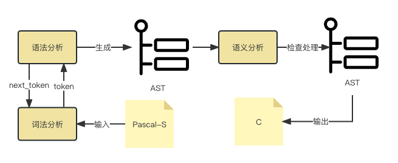
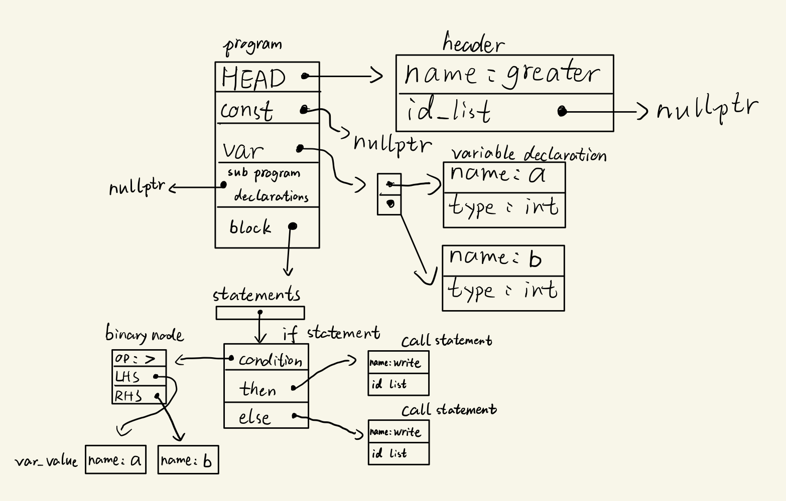
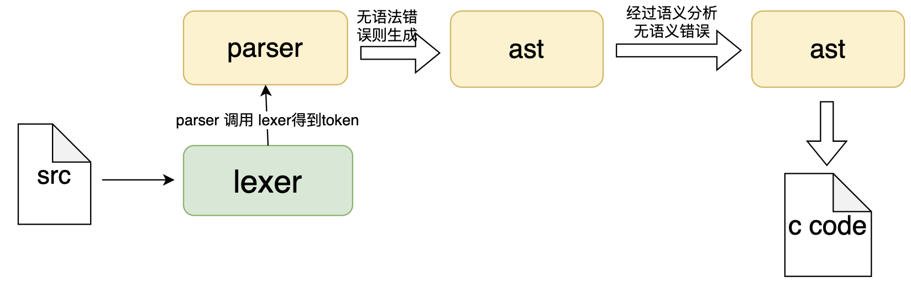

# Pascal2C

[toc]

## 1 任务说明

本项目需要设计实现一个编译器，该编译器的源语言为pascal-S语言，目标语言为C语言，要求完成以下功能

- 将合法的pascal源代码转化为等价的c语言代码。
- 若输入存在语法错误，能指出语法错误的位置并提供描述。
- 若出现类型不匹配、函数参数不匹配等错误，编译器能指出错误位置并描述。

任务示例源程序如下

```pascal
program ADD;
var 
	a,b, res : real;
procedure ReadOprand;
  begin
    read(a,b)
  end;
  
function add(a,b : real) : real ;
	begin
		add = a + b
	end;

begin
	ReadOprand;
	write(add(a,b))
end.
```

翻译后的目标代码示例如下

```c
#include <stdio.h>

double a,b;

void ReadOprand(){
  scanf("%lf%lf",&a,&b);
}

double add(double a,double b){
  double res;
  res = a + b;
  return res;
}

int main(){
  ReadOprand();
  add(a,b)
  return 0;
}
```

---

## 2 模块划分

本项目实现的编译器包含如下几个模块:

- **词法分析器**(`lexer`)：用于将输入的字符序列转换为一个个的词法单元（token）。在编译器中，词法分析器是编译器的第一步，用于将源代码转换为一个个的词法单元，供后续的语法分析器使用。
- **语法分析器**(`parser`)：以token为输入，解析Pascal-S中的各种语法结构，如表达式、语句、常量声明、变量声明、子查询定义等。在对符合语法的输入进行解析后生成对应的抽象语法树(AST)，该抽象语法树能完整的表达源码包含的信息，语法分析器生成AST后将交由语义分析模块处理。
- **语义分析**：该模块以AST为输入，通过AST检查输入源码中是否存在语义错误，如类型错误、函数参数不匹配等。该模块将检查处理过后的AST交给代码生成模块。
- **代码生成**：该模块以语义分析输出的AST作为输入，通过遍历AST生成对应的C语言代码。

编译器模块架构图如下所示



---

## 3 需求

在对编译器各个具体的模块进行设计实现前首先应该分析各个部分的需求，即要完成什么功能，在需求分析妥当后才能做出良好的设计。

### 3.1 词法分析

#### 3.1.1 输入输出规范

词法分析器的输入是 Pascal-S 源码, 输出是 token 序列.

#### 3.1.2 词法单元

##### 注释

Pascal-S 语言采用块注释, 以 `{` 开始, 以 `}` 结束. 例如:

```pascal
{ This is a comment. }
```

注释可以嵌套, 例如:

```pascal
{ This is a comment. { This is a nested comment. } }
```

注释不会影响词法分析器的输出.

##### 标识符

标识符是 Pascal-S 语言中的变量名, 函数名, 过程名等. 标识符由字母, 数字和下划线组成, 且必须以字母或下划线开头. 标识符不区分大小写, 最大长度为 32 个字符.

```pascal
a
a1
_a1b2c3d4e5f6g7h8i9j0k1l2m3n4o5p6q_
```

标识符输出 token `ID`, 对应的属性为标识符的名称.

在实现中, 使用 `strval` 保存标识符的名称.

##### 整型数

整型数是 Pascal-S 语言中的非负整数. 整型数由数字组成, 且必须以数字开头. 整型数的精度为 32 位.

```pascal
0
13994
```

整型数输出 token `INTENGER`, 对应的属性为整型数的值.

在实现中, 使用 `intval` 保存整型数的值.

##### 实数

实数是 Pascal-S 语言中的非负浮点数. 实数由整数部分和小数部分组成, 两个部分可以省略一个, 但不能都省略. 小数部分可以省略, 但是小数点必须保留. 实数支持科学计数法, 例如: `1.2e3` 表示 `1.2 * 10^3`. Pascal-S 中实数为双精度浮点数.

```pascal
0.0
13994.
13994.01e-3
.123e4
```

实数输出 token `REAL`, 对应的属性为实数的值.

在实现中, 使用 `realval` 保存实数的值.

##### 关键字

Pascal-S 关键字列表如下:

```pascal
and array begin case const div do downto else end
file for function goto if in label mod nil not of
or packed procedure program record repeat set then
to type until var while with
```

关键字输出对应的 token, 例如 `and` 输出 token `AND`.

##### 符号

Pascal-S 语言中的符号列表如下:

```pascal
+
-  
*  
/  
=  
<  
>  
[
]
.  
,  
:  
;  
^
(
)
<> NEQOP
<= LEOP
>= GEOP
:= ASSIGNOP
.. DOTDOT
```

符号输出对应的 token, 例如 `+` 输出 token `'+'`; `<>` 输出 token `NEQOP`.

#### 3.1.3 记录行数与列数

词法分析器还额外输出每个 token 的行数和列数, 便于后续的语法分析器进行报错.

词法分析器使用 `lineno` 和 `colno` 来记录当前的行数和列数.

#### 3.1.4 记录错误

词法分析器在遇到错误时, 会输出特殊的 token `ERROR`, 并将错误类型保存在 `yyerrno` 中. 程序不会输出到 stdin.

---

### 3.2 语法分析

语法分析是编译器的重要组成部分，它的主要任务是分析 Pascal-S 的语法，并生成对应的抽象语法树（AST）。具体来说需要完成以下功能。

* 识别和分析 Pascal-S 语法中的各种语法结构；
* 生成符合 Pascal-S 语法规范的抽象语法树（AST），包括程序的各个部分及其之间的关系；
* 对语法错误进行处理，以便能够继续分析后续的语法元素。

本文档旨在定义Pascal语言编译器的语法分析器的需求，包括语法结构、语法错误处理、文法、分析方法以及拓展需求等。


#### 3.2.1 语法结构

Pascal-S 具有以下语法结构：

* 变量声明：使用 `var` 关键字定义变量，例如：

  ```pascal
  var a, b, c: integer;
  ```

* 常量声明：使用 `const` 关键字定义常量，例如：

  ```pascal
  const max = 100;
  ```

* 数组：使用 `array` 关键字定义数组，例如：

  ```pascal
  var a: array[1..10] of integer;
  ```

* 过程和函数：使用 `procedure` 和 `function` 关键字定义过程和函数，例如：

  ```pascal
  procedure SayHello;
  begin
      writeln('Hello, World!');
  end;
  
  function Add(a, b: integer): integer;
  begin
      Add := a + b;
  end;
  ```

* 控制结构：包括条件语句 `if-then-else`，循环语句 `for` ，例如：

  ```pascal
  if a > b then
      writeln('a is greater than b')
  else
      writeln('a is not greater than b');
  
  for i := 1 to 10 do
      writeln(i);
  ```

#### 3.2.2 语法错误处理

对于可能出现的语法错误，语法分析器应能及时发现并报告错误。发现错误后，语法分析器应能尝试修复错误并恢复语法分析过程，例如添加缺失的分号、括号等，或将错误的语法元素替换为正确的语法元素，以便尽可能多地分析代码。

例如，在分析下面的代码时：

```pascal
if a == b then
	c := d
```

缺少分号将导致语法错误，语法分析器可以自动在第二行的末尾添加分号以修复错误，并继续分析后文：

```pascal
if a == b then
 	c := d;
```

#### 3.2.3 文法

需要进行语法分析的pascal-S的语法对应的文法表示为

```
programstruct -> program_head ；program_body .
program_head -> program id ( idlist ) | program id
program_body -> const_declarations var_declarations subprogram_declarations compound_statement

idlist -> id | idlist , id

const_declarations -> ε | const const_declaration ;
const_declaration -> id = const_value | const_declaration ; id = const_value
const_value -> + num | - num | num | 'letter'

var_declarations -> ε | var var_declaration ;
var_declaration -> idlist : type | var_declaration ; idlist : type
type -> basic_type | array [ period ] of basic_type
basic_type -> integer | real | boolean | char
period -> digits .. digits | period ， digits .. digits

subprogram_declarations -> ε | subprogram_declarations subprogram ;
subprogram -> subprogram_head ; subprogram_body
subprogram_head -> procedure id formal_parameter 
									| function id formal_parameter : basic_type

formal_parameter -> ε | ( parameter_list )
parameter_list -> parameter | parameter_list ; parameter
parameter -> var_parameter | value_parameter
var_parameter -> var value_parameter
value_parameter -> idlist : basic_type

subprogram_body -> const_declarations var_declarations compound_statement
compound_statement -> begin statement_list end
statement_list -> statement | statement_list ; statement

statement -> ε | variable assignop expression 
						| func_id assignop expression 
						| procedure_call 
						| compound_statement 
						| if expression then statement else_part 
						| for id assignop expression to expression do statement 
						| read ( variable_list ) 
						| write ( expression_list )
						
variable_list -> variable | variable_list , variable
variable -> id id_varpart
id_varpart -> ε | [ expression_list ]

procedure_call -> id | id ( expression_list )
else_part -> ε | else statement

expression_list -> expression | expression_list , expression
expression -> simple_expression | simple_expression relop simple_expression
simple_expression -> term | simple_expression addop term
term -> factor | term mulop factor
factor -> num 
				| variable 
				| ( expression ) 
				| id ( expression_list ) 
				| not factor 
				| uminus factor
```

上述文法是pascal的一个子集，在完成基础需求后可以考虑对文法进行拓展，如添加对`record`和`pointer`的支持等等。

#### 3.2.4 分析方法

在对pascal-S语言的分析方法的选择上，我们采用递归下降手写语法分析的形式来完成pascal-S到ast的转换工作。

选择手写语法分析器来解析 Pascal-S 语言的原因主要有以下几点：

首先，手写语法分析器和使用工具生成语法分析器相比，具有更高的灵活性和可定制性。虽然使用工具生成语法分析器可以节省开发时间和精力，但需要按照固定的模式进行开发，灵活性相对较低。

其次，在需求方面，手写语法分析器可以提供更好的错误处理和错误恢复能力。在pascal-S的解析过程中可能会出现各种错误和异常情况。手写语法分析器可以根据特定的需求进行错误处理，例如提供更具体的错误信息、支持错误恢复等。这样可以提高编译器的容错性，减少出错的可能性，并且更好地支持编程语言的开发和调试。

此外，手写语法分析器通常具有更好的可读性和可维护性。手写语法分析器的代码通常比自动生成的语法分析器更易于阅读和理解。这样可以提高代码的可维护性，并且更方便进行调试和修改。

综上所述，选择手写语法分析器来解析 Pascal-S 语言可以更好地满足特定的需求，提供更好的错误处理和错误恢复能力，具有更好的可读性和可维护性。虽然手写语法分析器的实现和维护需要一定的编程经验和技能，但是这种方法可以更好地支持编程语言的开发和调试，从而提高编程效率和质量。


#### 3.2.5 拓展需求

需要支持更多地语法规则和语法元素，以便能够分析更复杂的程序结构和语法：

* 支持 `while` 循环语句，例如：

  ```pascal
  while x < 100 do
  begin
      x := x * 2;
  end;
  ```

* 支持 `goto` 跳转语句，例如：

  ```pascal
  goto label1;
  label1:
  writeln('Jump to label1');
  ```

* 支持使用 `record` 关键字定义记录，例如：

  ```pascal
  type Person = record
      name: string;
      age: integer;
  end;
  ```

* 支持使用 ^ 符号定义指针类型，并支持使用指针实现引用调用，例如：

  ```pascal
  var p: ^Integer;
  
  procedure IncrementPointer(p: ^Integer);
  begin
      p^ := p^ + 1;
  end;
  ```

---

### 3.3 语义分析

该部分接受语法分析生成的AST，检查改AST是否符合语义，并将检查通过的AST输出给代码生成部分。

该部分主要完成以下功能：

- 需要检查类型错误，如赋值时类型不匹配、传参时类型不匹配。
- 检查变量是否在当前作用域内可用。
- 设计符号表来完成上述工作。
- 进行错误处理：报出**ERROR**错误停止编译，或者**更改AST**报出**WARNING**错误继续编译。

具体分析如下：

#### 3.3.1 检查类型错误

本节解决AST中的类型错误，处理隐式类型转换。

##### 	 赋值类型不匹配 

​	本节检查AST中赋值类型不匹配问题。

​	当在AST中扫描到赋值节点时，将其左值和右值的类型进行对比。其中右值的各子表达式的类型均扩大为其子表达式类型的最大值，右值的最终类型为其子表达式类型的最大值。若左值类型不小于右值类型则通过，否则报错。其中存在类型大小关系的类型极其关系如下：

```pascal
boolean<shortint=byte<integer=word<longint=single<real<double<extended
```

##### 	传参类型不匹配

​	本节检查AST中传参类型不匹配问题。

​	当在AST中扫描到`call statement`节点时，将其形参和实参的类型进行对比。其中形参的各子表达式的类型均扩大为其子表达式类型的最大值，形参的最终类型为其子表达式类型的最大值。若实参类型不小于形参类型则通过，否则报错。其中类型及大小关系如**1.1**中所述。

#### 3.3.2 检查变量是否在当前作用域内可用

本节解决AST中错误调用的问题。

当在AST中发现变量调用时，在符号表中检查当前可用符号集合，其可能结果如下：

1. 存在该符号，且非符号定义语句：正常通过；
2. 存在该符号，且当前语句定义该符号：报命名冲突错误；
3. 不存在该符号，且当前语句定义该符号：正常通过；
4. 不存在该符号，且非定义语句：报未定义变量错误。

---

### 3.4 代码生成

代码生成接受AST作为输入，输出C语言代码，该部分针对不同的AST节点需要分别设定不同的代码生成规则。

#### 3.4.1 表达式

代码生成模块需要在遍历AST树中的`expression`节点时生成对应的C语言表达式，在该部分需要注意如下几种节点生成代码：

- 变量值
- 函数值
- 常量值
- 立即数
- `prefix`运算
- `binary`运算

#### 3.4.2 常量、变量定义

在pascal中常量和变量定义可能出现在几种地方

1. 程序头声明结束后，子程序声明开始前。
2. 子程序声明后，块语句开始前。

对于以上1位置的声明，应当生成对应的C语言全局变量声明；对于2位置的声明，应当在C语言对应函数开头生成变量声明。对于常量定义，生成的C语言中要带有const关键字修饰。

#### 3.4.3 语句

Pascal-S 中有如下几种语句:

- read语句
- write语句
- if语句
- for语句
- 赋值语句
- 块语句

AST的定义会囊括这些类型的语句，代码生成模块需要针对不同语句生成不同的C语言代码。

#### 3.4.4 子程序

pascal中的子程序包括过程和函数，再将相关的AST翻译成C代码时需要注意以下几点

- 根据pascal子程序头生成C函数原型，需要注意参数传递方式(引用传递、值传递)、返回值、参数列表。
- 常量和变量声明的翻译。
- 子程序体的翻译。

#### 3.4.5 程序

程序程序头和由以上提到的各个部分组成，若上面各个部分的功能实现，则程序的翻译也已经完成。

---

## 4 总体设计

该项目设计实现的编译器整体模块设计如图所示


### 4.1 词法分析

#### 4.1.1 总体设计

我们使用 Flex 来实现词法分析器。

Flex 是一个用于生成词法分析器的工具，它可以将用户定义的正则表达式和处理规则转换为词法分析器程序。Flex 生成的词法分析器是一个 C 语言程序，可以直接编译为可执行文件。

Flex 通常结构如下：

```lex
%{
Declarations
%}
Definitions
%%
Rules
%%
User Subroutines
```

其中, `Declarations` 和 `User Subroutines` 部分与普通的 C 语言类似. `Definitions` 部分用于定义词法单元的正则表达式，`Rules` 部分用于定义词法单元的处理规则。

对于 token 列表, 我们使用一个头文件 `token.h` 来定义 token 的类型, 这个头文件也进一步被 parser 使用.

#### 4.1.2 接口概览

- `yylex()`: 词法分析器的主函数, 用于从 stdin 中读取一个 token, 返回 token 的类型.
- `yyval`: 用于保存 token 的属性, 例如整型数的值, 实数的值.
- `yylineno`: 用于保存当前 token 的行数.
- `yycolno`: 用于保存当前 token 的列数.
- `yyerrno`: 用于保存错误类型.
- `yytext`: 用于保存当前 token 的文本.
- `YYERRMSG`: 用于保存错误类型对应的错误信息.

---

### 4.2 语法分析

#### 4.2.1 输入和输出

- **输入**:在语法分析阶段，语法分析器将以词法分析器处理pascal源代码得到的`token`作为输入，如

  ```pascal
  program greater;
  var a,b: integer;
  begin
  	read(a,b)
  	if a > b then write(a)
  	else write(b)
  end.
  ```

  对于上面这段源代码，语法分析器的输入将形如如下的`token`作为语法分析器的输入

  ```
  PROGRAM  ID(greater)  VAR  ID(a)  ID(b)  ':'  INTEGER
  BEGIN  READ   '('  ID(a)  ','   ID(b)   ')'
  IF   ID(a)   '>'   THEN   ID(write)  '('  ID(a)   ')'
  ELSE  ID(write)   ID(b)
  ```

- **输出**:若输入满足pascal-S语法，则语法分析器将产生一颗能表示源程序结构的抽象语法树，如对于上面的输入，可能产生一颗形如下图的语法树

  

#### 4.2.2 处理流程

| 系统事件名称                             | 用例           | 参数说明                              |
| ---------------------------------------- | -------------- | ------------------------------------- |
| SyntaxAnalysis(tokens)                   | 语法分析       | 1. tokens:vector\<Token>              |
| ParseProgramHead(tokens, pos)            | 分析程序头     | 1. tokens:vector\<Token>; 2. pos:int; |
| ParseProgramBody(tokens, pos)()          | 分析程序主体   | 1. tokens:vector\<Token>; 2. pos:int; |
| ParseConstDeclarations(tokens, pos)      | 分析常量声明   | 1. tokens:vector\<Token>; 2. pos:int; |
| ParseVarDeclarations(tokens, pos)        | 分析变量声明   | 1. tokens:vector\<Token>; 2. pos:int; |
| ParseSubprogramDeclarations(tokens, pos) | 分析子程序     | 1. tokens:vector\<Token>; 2. pos:int; |
| ParseSubprogramHead(tokens, pos)         | 分析子程序头   | 1. tokens:vector\<Token>; 2. pos:int; |
| ParseSubprogramBody(tokens, pos)         | 分析子程序主体 | 1. tokens:vector\<Token>; 2. pos:int; |
| ParseCompoundStatements(tokens, pos)     | 分析复合语句   | 1. tokens:vector\<Token>; 2. pos:int; |


---

### 4.3 语义分析

为了在AST上进行语义分析，需要建立符号表，并在遍历AST时在符号表中创建相应的条目。

#### 4.3.1 符号表设计

本节说明符号表设计相关工作。

##### 4.3.1.1 符号表逻辑结构设计

符号表逻辑结构包括变量/函数的名称、类型。对于变量，记录其是否为数组，若是数组则记录维数及每维的上下界；对于函数，记录其参数个数及类别。

符号表逻辑结构依附于AST的实现。每个作用域拥有自己的符号表，在当前符号表中查询不到的符号将递归向父亲查询。

参考结构如下：


##### 4.3.1.2 符号表物理结构设计

计划采用哈希表实现符号表。具体表示变量/函数的数据结构需要与语法分析对接。

#### 4.3.2 符号表管理

- 查询操作：在哈希表中查询；未查询到则递归向上查询。若查询不到则调用错误处理部分。
- 插入操作：在哈希表中插入。
- 定位操作：在进入当前作用域时执行，新建一个哈希表代表当前作用域。
- 重定位操作：在退出当前作用域时执行，删除哈希表中所有记录并释放内存使用。

---

### 4.4 代码生成

对于具体的语句翻译设计，有如下讨论：

1. 程序体

```pascal
	program name (filelist...);
	{ defination here }

	begin { main program block starts }
	...
	end. { the end of main program block }
```

作为`Pascal`程序的标识与入口，可将其翻译为C语言中`main()`。需要注意的是在该块定义的变量为全局变量。另外可能需要语义分析阶对主程序块进行额外标注，以实现在C语言中对入口函数的翻译。

2. 定义语句

```pascal
var A_variable, B_variable ... : variable_type;
```

`Pascal`语言的变量定义语句，它与C语言的最大区别在于定义变量标识符的后置，这同样可能需要在AST中进行标记。

3. 常量语句

```pascal
const identifier = constant_value;
```

`Pascal`中的常量定义语句并不显式的声明常量的类型，这需要语义分析阶段进行类型分析工作。

4. 数组类型

```pascal
type array-identifier = array[index-type] of element-type;
```

`Pascal`中的数组类型与C语言有较大区别，他的索引值拥有一个独立的类型，它可以是除实数以外的任何标量数据类型。值得一提的是可以是负数和`Pascal`独特的区间类型`Period(Subrange)`。因此初步考虑，在处理数组类型时，可能需要语义分析阶段额外标记区间类型的开始值和数组长度,便于处理C语言数组指针的偏移。E.g.:

```pascal
	var a : array[-10..100] of integer;
	writeln(a[-5]);
```

= Translate To =>

```c
	int a[110];
	printf("%d\n" , (a-(-10))[-5]);
```

5. 函数/过程

```pascal
	{function defination}
	function name(argument(s): type1; argument(s): type2; ...): function_type;
	{local declarations}

	begin
	...
	name := expression;  {return value}
	end;
```

```pascal
	{procedure defination}
	procedure name(argument(s): type1, argument(s): type2, ... );
	{local declarations}
	begin
	...
	end;
```

`Pascal`中的函数与过程相类似，其中定义的变量为局部变量。另外`Pascal`中局部变量和全局变量的优先级关系和作用域关系一致，可以直接进行翻译。

6. 基本类型

```pascal
	integer | real | boolean | char
```

对于给定的`Pascal-S`的基本类型:

* `integer`为4 Bytes,等价于C语言中的`signed int`；
* `real`为单精度浮点值,等价为C语言中的`float`；
* `boolean`为布尔值，只有`true`和`false`两种值，但是在原生C中并没有这一数据类型，可以考虑引入`<stdbool.h>`或者改为映射到整数;
* `char`为一个字节，等价于C中同名类型。

7. 参数列表与引用传参

```pascal
procedure min3(x, y, z: integer; var m: integer); 
{ Finds the minimum of the 3 values }

begin
   if x < y then
      m := x
   else
      m := y;

   if z < m then
      m := z;
end; { end of procedure findMin }  

```

在上述过程的例子中，展示了`Pascal`使用复制传参和引用传参的方式。显然，该过程原型可以翻译成如下的C语言代码：

```c
void min3(int x , int y , int z , int &m);
```

这可能需要依赖语法分析阶段在处理参数列表语法时，分析并区分出复制传参的符号列表和引用传参的符号列表。

8. For-to-do循环

```pascal
	for variable-name := initial_value to [downto] final_value do 
```

对于for循环的翻译比较固定，它可以使用下面的C形式进行代换：

```c
	for(type variable-name = initial_value ; variable-name <=final_value ; i++)
	for(type variable-name = initial_value ; variable-name >= final_value ; i--)
```

需要注意的是

* 迭代变量的类型需要在语法分析阶段确定，必须是顺序类型的标量，例如整型或字符型，不能为实型。
* 在使用for-to-do时，初始值和结束值必须满足选择的迭代模式，否则循环不会执行
* 不能在循环体内修改索引值，否则会造成编译错误。
* 不能更改开始与结束值。

9. IO or Library

```pascal
	read() | write() | ...
```

这是比较棘手的一部分，涉及到输入输出有关的函数调用，`Pascal`与C语言的库函数有较大差别，这里无法确定一个标准的形式，需要结合实际情况分析。

---

## 5 测试

### 5.1 词法分析

#### 测试用例1

输入： 

```
program HelloWorld;

var
  x: integer;
  y: real;

begin
  x := 10;
  y := 3.14;
  writeln('Hello, World!');
  writeln('The value of x is ', x);
  writeln('The value of y is ', y:2:2);
end.
```

输出：

```
TokenType: PROGRAM, Line: 1, Column: 1
TokenType: IDENTIFIER, Attribute: 'HelloWorld', Line: 1, Column: 9
TokenType: SEMICOLON, Line: 1, Column: 19
TokenType: VAR, Line: 3, Column: 1
TokenType: IDENTIFIER, Attribute: 'x', Line: 4, Column: 3
TokenType: COLON, Line: 4, Column: 4
TokenType: INTEGER, Line: 4, Column: 6
TokenType: SEMICOLON, Line: 4, Column: 13
TokenType: IDENTIFIER, Attribute: 'y', Line: 5, Column: 3
TokenType: COLON, Line: 5, Column: 4
TokenType: REAL, Line: 5, Column: 6
TokenType: SEMICOLON, Line: 5, Column: 10
TokenType: BEGIN, Line: 7, Column: 1
TokenType: IDENTIFIER, Attribute: 'x', Line: 8, Column: 3
TokenType: ASSIGN, Line: 8, Column: 6
TokenType: INTEGER_CONST, Attribute: '10', Line: 8, Column: 9
TokenType: SEMICOLON, Line: 8, Column: 11
TokenType: IDENTIFIER, Attribute: 'y', Line: 9, Column: 3
TokenType: ASSIGN, Line: 9, Column: 6
TokenType: REAL_CONST, Attribute: '3.14', Line: 9, Column: 9
TokenType: SEMICOLON, Line: 9, Column: 13
TokenType: WRITELN, Line: 10, Column: 3
TokenType: LEFT_PAREN, Line: 10, Column: 9
TokenType: STRING_CONST, Attribute: 'Hello, World!', Line: 10, Column: 10
TokenType: RIGHT_PAREN, Line: 10, Column: 24
TokenType: SEMICOLON, Line: 10, Column: 25
TokenType: WRITELN, Line: 11, Column: 3
TokenType: LEFT_PAREN, Line: 11, Column: 9
TokenType: STRING_CONST, Attribute: 'The value of x is ', Line: 11, Column: 10
TokenType: COMMA, Line: 11, Column: 29
TokenType: IDENTIFIER, Attribute: 'x', Line: 11, Column: 31
TokenType: RIGHT_PAREN, Line: 11, Column: 32
TokenType: SEMICOLON, Line: 11, Column: 33
TokenType: WRITELN, Line: 12, Column: 3
TokenType: LEFT_PAREN, Line: 12, Column: 9
TokenType: STRING_CONST, Attribute: 'The value of y is ', Line: 12, Column: 10
TokenType: COMMA, Line: 12, Column: 29
TokenType: IDENTIFIER, Attribute: 'y', Line: 12, Column: 31
TokenType: COLON, Line: 12, Column: 32
TokenType: INTEGER_CONST, Attribute: '2', Line: 12, Column: 34
TokenType: COLON, Line: 12, Column: 35
TokenType: INTEGER_CONST, Attribute: '2', Line: 12, Column: 37
TokenType: RIGHT_PAREN, Line: 12, Column: 38
TokenType: SEMICOLON, Line: 12, Column: 39
TokenType: END, Line: 13, Column: 1
TokenType: DOT, Line: 13, Column: 5
```

#### 测试用例2

输入:

```pascal
program ErrorExample;

var
  1x: integer; // Error: identifier can't start with a number
  y: integer;

begin
  1x := 12345678901234567890; // Error: integer is too long
  y := 100;
  { This is a comment with no closing delimiter EOF
  // Error: comment not terminated before the end of the file end.
```

输出:

```
TokenType: PROGRAM, Line: 1, Column: 1
TokenType: IDENTIFIER, Attribute: 'ErrorExample', Line: 1, Column: 9
TokenType: SEMICOLON, Line: 1, Column: 21
TokenType: VAR, Line: 3, Column: 1
TokenType: ERROR, Attribute: '1x', Line: 4, Column: 3
TokenType: COLON, Line: 4, Column: 4
TokenType: INTEGER, Line: 4, Column: 6
TokenType: SEMICOLON, Line: 4, Column: 14
TokenType: IDENTIFIER, Attribute: 'y', Line: 5, Column: 3
TokenType: COLON, Line: 5, Column: 5
TokenType: INTEGER, Line: 5, Column: 7
TokenType: SEMICOLON, Line: 5, Column: 14
TokenType: ERROR, Errno: 1, Line: 7, Column: 3
TokenType: ASSIGN, Line: 7, Column: 6
TokenType: ERROR, Errno: 2, Line: 7, Column: 9
TokenType: SEMICOLON, Line: 7, Column: 31
TokenType: IDENTIFIER, Attribute: 'y', Line: 8, Column: 3
TokenType: ASSIGN, Line: 8, Column: 6
TokenType: INTEGER_CONST, Attribute: '100', Line: 8, Column: 9
TokenType: SEMICOLON, Line: 8, Column: 12
TokenType: LEFT_BRACE, Line: 9, Column: 3
TokenType: ERROR, Errno: 3, Line: 9, Column: 4
```

---

### 5.2 语法分析

#### 5.2.1 测试目标

语法分析模块需要将各种程序结构解析成对应的AST树，包括如下一些部分

- program header 的解析。
- const declaration的解析。
- var declaration的解析。
- expression的解析。
- statement的解析。
- procedure的解析。
- function的解析。

各个部分的解析采用手写递归下降的方式来实现，每种语言结构的解析都有对应的方法/函数来完成解析成AST的操作。为了保证代码的正确性，需要对上面提到的各个部分均进行充分的测试。

#### 5.2.2 单元测试用例

对于parser的各个小功能需要分别进行测试以保证整体功能的正确性，在做测试时需要竟可能的保证覆盖率。

##### program header

program header是pascal程序起始部分，声明了程序名和程序参数，设计各种测试样例如下

```pascal
program MyProgram;  {不带id list}

program MyProgram(input);  {id list中有一个id}

program MyProgram(input,output,logfile);  {id list中有多个id}

MyProgram;        {语法错误，没有program关键字 期望报错:filename:line:column: syntax error:expect program}

MyProgram(a,b,c);  { 同上 }

program MyProgram(a,b,);    {语法错误}

program MyProgram(a ;       {语法错误}
```

##### const declarations

该部分为program header后接的部分或子程序原型后接的部分，声明全局作用域或局部作用域下的常量。设计测试用例如下

```pascal
const a = 'b';

const a = 1; b = -2; ch = 'b';

const a; b = -2; ch = 'a';     { 语法错误 }

const ;                        { 语法错误 }
```

##### variable declarations

在程序开头或子程序开头常量声明(如果有的话)之后可以接变量声明，对变量声明解析设计测试如下

```pascal
var a, b: integer;
		x, y: real; ch: char;
		mx: array [3..9] of integer;

var a:integer;
		b:integer;
		arr: array [1..2 , 3..4 , 5..9] of real;
		
var a,b integer;      {语法错误}

var c : array [1...3] of integer;   { 语法错误 }

var c : array [1..10,] of integer ;  { 语法错误 }

var c : array [1..10] integer;       { 语法错误 }

var a;                               { 语法错误 }
```

##### expression

表达式解析是递归下降解析中最有难度的部分，需要考虑运算符的结合性、优先级、括号等。设计表达式解析的测试样例如下

```pascal
123

1.234

true

false

abc

cde[2]

efg(1,2.3)

not true

not false

1 + 2 * 3

(1 + 2) * (4 - 2 + a[3]) - add(1,1) <= 34 and 3 > 5 or -(7 * 4) > -288

1 +- 4   {语法错误}

1+(3*(4-(5+5))    {语法错误，括号匹配错误}
```

##### statement

目前支持好几种语句的解析，设计测试样例如下

```pascal
a := <expr>      {expr采用表达式测试时使用的表达式}

add := oprand1 + oprand2  {add 为函数名}

say_hello                 {调用procedure}

say_hello_to(a)           {调用function}

if a > b then <statement>

if a < b then <statement> else <statement>

for a := <expr> to <expr> do <statement>

read(a,b)

write(c+d,add(e,f))

begin
	<statement>;
	<statement>;
	...
	<statement>
end
```

##### procedure

procedure包括过程原型声明、常量声明、变量声明、过程体这几部分，其中常量声明、变量声明、过程体解析的测试在前面部分已经设计过，在这部分专注于过程原型声明的解析上，设计测试样例如下

```pascal
procedure go(a,b : integer);

procedure hello;

procedure abc(var a,b : integer; var c,d : real);

procedure cde(a : integer; var d : real);

procedure efg(var d : real; a,b :integer);
```

##### function

function和procedure类似，同样我们设计的测试样例专注于原型声明上，设计测试用例如下

```pascal
function go(a,b : integer) : integer;

function hello : real;

function abc(var a,b : integer; var c,d : real) : real;

function cde(a : integer; var d : real) boolean ;

function efg(var d : real; a,b :integer) real;
```

---

#### 5.2.3 综合测试

做完各个部分的单元测试后，需要将各个部分整合为一个完整的parser，然后做集成测试，生成完整的AST，设计一个综合测试用例如下

```pascal
program merge_sort;

const
    n = 10;

var
    mas: array [1..n] of integer;
    i: integer;

procedure MergeSort(a, c: integer);
var
    x, j, i, n1, n2: integer;
    rez: array[1..1000] of integer;
begin
    if c <= a then 
        exit 
    else 
    begin
        x := (a + c) div 2;
        MergeSort(a, x);
        MergeSort(x + 1, c);
        n1 := a;
        n2 := x + 1;
        for i := a to c do 
        begin
            if (n1 < x + 1) and ((n2 > c) or (mas[n1] < mas[n2])) then
            begin
                rez[i] := mas[n1];
                inc(n1);
            end 
            else 
            begin
                rez[i] := mas[n2];
                inc(n2);
            end;
        end;
        for j := a to c do
            mas[j] := rez[j];
    end; 
end;

begin
    for i := 1 to n do
        mas[i] := random(20);
    writeln(mas);
    MergeSort(1, n);
    writeln(mas);
end.
```

---

### 5.3 语义分析

在保证输入AST有效的前提下，可将输入代码转换为AST观察输出进行测试。

输入1：

```pascal
program Test1;
var
  x: integer;
  y: real;
begin
  x := 10;
  y := 3.14;
  y := x;
end
```

结果1：

通过，无输出。

输入2：

```pascal
program Test2;
var
  x: integer;
  y: real;
begin
  x := 10;
  y := 3.14;
  x := y;
end
```

结果2：

通过，输出以下提示：

```pascal
[WARNING]:隐式类型转换可能导致溢出
```

输入3：

```pascal
program Test3;
var
  x: integer;
  y: real;
begin
  x := 10;
  y := 3.14;
  z := y;
end
```

结果3：

不通过，输出以下提示:

```pascal
[ERROR]:未定义的变量名
```

---

### 5.4 代码生成

为了方便测试，在前三部分测试完毕后，直接以pascal源代码作为输入，生成AST来测试代码生成模块，测试样例如下

```pascal
program merge_sort;

const
    n = 10;

var
    mas: array [1..n] of integer;
    i: integer;

procedure MergeSort(a, c: integer);
var
    x, j, i, n1, n2: integer;
    rez: array[1..1000] of integer;
begin
    if c <= a then 
        exit 
    else 
    begin
        x := (a + c) div 2;
        MergeSort(a, x);
        MergeSort(x + 1, c);
        n1 := a;
        n2 := x + 1;
        for i := a to c do 
        begin
            if (n1 < x + 1) and ((n2 > c) or (mas[n1] < mas[n2])) then
            begin
                rez[i] := mas[n1];
                inc(n1);
            end 
            else 
            begin
                rez[i] := mas[n2];
                inc(n2);
            end;
        end;
        for j := a to c do
            mas[j] := rez[j];
    end; 
end;

begin
    for i := 1 to n do
        mas[i] := random(20);
    writeln(mas);
    MergeSort(1, n);
    writeln(mas);
end.
```

### 5.5 测试方法

本项目考虑采用google test或类似的测试框架进行代码的测试。

### 5.6 集成测试

在分别完成各个模块的测试后，将各个模块组合起来，直接测试能否将Pascal转化为C语言，若该部分测试通过，则本项目基本完成。


## 任务初步安排

由于本组人数7人，属于是特别多，所以尽量将任务划分多一点，避免三四个人做同一块任务导致混乱。初步考虑分配如下几个任务

- 词法分析:将Pascal源码转化为token流，由语法分析程序调用词法分析器得到token。
- 语法分析:以词法分析器的输出作为输入，生成中间表达形式，建议中间表达形式为AST（抽象语法树）,因为该表示比较直观简单(大概吧)。
- 语义分析:以AST为输入，检查是否有类型错误，检查是否有当前作用域下使用了该作用域下没有的变量的错误，输出还是AST.
- 生成C代码:以上一步输出的AST为输入，输出C代码。



## 词法分析

该任务**一人**完成，需求：

1. 记录输入的文件名、当前token的行号、列号。
2. 设计好需要的token
   1. token的形式(建议是宏)
   2. token_value的形式:提供token对应的原始字符串，如解析到一个变量  var1，则提供"var1"，同时可以考虑解析出具体值，如整数123，直接提供123这一数值。可以使用union，具体如何设计交给接收该任务的成员。
3. 接口定义:在具体实现前先定义好接口，即先定义好token token_value，和函数、类、方法的原型，这部分要和做语法分析的成员交流达成共识，定义好接口后可以同时开工。接口有变化一定要及时说明。
4. 实现方法选择:手写或生成。
6. 考虑可能出现的词法错误。


接下该任务的先写一份词法分析器需求分析和设计和测试方法，不要求具体实现，但接口的雏形要有。

---

## 语法分析

该任务**两人**完成，需求

1. 写明pascal-S的语法。
2. 错误处理:碰到语法错误报错直接退出程序，或者继续解析最后输出碰到的全部语法错误。
3. 定义好AST的各个节点，该部分与做类型检查的成员要达成一致，一定要能完整的表达出源代码所有的信息。
4. 实现:手写或生成。


本来语义分析也可以在语法分析这完成，但小组成员较多，故语法分析部分只检查语法生成AST树，不做语义分析的工作。接下该任务的写一下需求分析和初步设计和测试方法，其中AST节点定义额外重要。

---

## 语义分析

**两人**完成，需求

1. 需要检查类型错误，如赋值时类型不匹配、传参时类型不匹配。

2. 检查变量是否在当前作用域内可用。
3. 需要设计符号表来完成上述工作。
4. 输出的AST形式设计:和语法分析输出采用同样的AST结构，或者略微有改变？该设计要和代码生成的成员商量并达成一致。
5. 错误处理方式:碰到第一个错误退出或检查完全部错误。


接下该任务的写需求分析、设计和测试方法，重要的是最后的输出AST定义，一定要能和代码生成的对接上。

---

## 代码生成

**两人**完成，需求

1. 对各类AST节点，如何生成C代码。


写需求分析、设计、测试方法。
