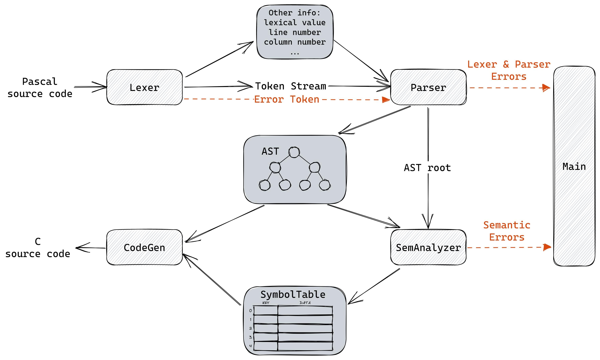

## 3 需求

需要实现的 Pascal-S 至 c 语言的编译器包括词法分析器、语法分析器、语义分析器、目标代码生成器四个模块。本文档旨在定义 Pascal-S 编译器的需求，包括输入输出规范、词法单元、语法结构、语法错误处理、文法、分析方法以及拓展需求等。

整体数据流图如下：




### 3.1 词法分析

#### 3.1.1 输入输出规范

词法分析器的输入是 Pascal-S 源码, 输出是 token 序列.

#### 3.1.2 词法单元

##### 注释

Pascal-S 语言采用块注释, 以 `{` 开始, 以 `}` 结束. 例如:

```pascal
{ This is a comment. }
```

注释可以嵌套, 例如:

```pascal
{ This is a comment. { This is a nested comment. } }
```

注释不会影响词法分析器的输出.

##### 标识符

标识符是 Pascal-S 语言中的变量名, 函数名, 过程名等. 标识符由字母, 数字和下划线组成, 且必须以字母或下划线开头. 标识符不区分大小写, 最大长度为 32 个字符.

```pascal
a
a1
_a1b2c3d4e5f6g7h8i9j0k1l2m3n4o5p6q_
```

词法分析器需要输出token并保存对应的属性.

##### 整型数

整型数是 Pascal-S 语言中的非负整数. 整型数由数字组成, 且必须以数字开头. 整型数的精度为 32 位.

```pascal
0
13994
```

词法分析器需要输出token并计算保存对应的属性.

##### 实数

实数是 Pascal-S 语言中的非负浮点数. 实数由整数部分和小数部分组成, 两个部分可以省略一个, 但不能都省略. 小数部分可以省略, 但是小数点必须保留. 实数支持科学计数法, 例如: `1.2e3` 表示 `1.2 * 10^3`. Pascal-S 中实数为双精度浮点数.

```pascal
0.0
13994.
13994.01e-3
.123e4
```

词法分析器需要输出token并计算保存对应的属性.

##### 关键字

Pascal-S 关键字列表如下:

```pascal
and array begin case const div do downto else end
file for function goto if in label mod nil not of
or packed procedure program record repeat set then
to type until var while with
```

词法分析器需要输出token.

##### 符号

Pascal-S 语言中的符号列表如下:

```pascal
+
-  
*  
/  
=  
<  
>  
[
]
.  
,  
:  
;  
^
(
)
<> NEQOP
<= LEOP
>= GEOP
:= ASSIGNOP
.. DOTDOT
```

词法分析器应输出对应的 token.

##### 字符串

字符串是 Pascal-S 语言中的字符串常量. 字符串由单引号包围, 且单引号不能出现在字符串中. 字符串中可以包含转义字符, 例如: `\n` 表示换行符, `\t` 表示制表符, `\'` 表示单引号. 字符串最大长度为 256 个字符.

```pascal
'Hello, World!'
'Hello, World!\n'
'\''
```

词法分析器需要输出token并保存对应的属性. 要求将转义字符转换为对应的 ASCII 码.

#### 3.1.3 记录行数与列数

词法分析器还额外输出每个 token 的行数和列数, 便于后续的语法分析器进行报错.

#### 3.1.4 记录错误

词法分析器在遇到错误时, 会输出特殊的 token `ERROR`, 并保存错误类型. 程序不会输出到 stdin.

---

### 3.2 语法分析

语法分析是编译器的重要组成部分，它的主要任务是分析 Pascal-S 的语法，并生成对应的抽象语法树（AST）。具体来说需要完成以下功能。

* 识别和分析 Pascal-S 语法中的各种语法结构；
* 生成符合 Pascal-S 语法规范的抽象语法树（AST），包括程序的各个部分及其之间的关系；
* 对语法错误进行处理，以便能够继续分析后续的语法元素。

本文档旨在定义Pascal语言编译器的语法分析器的需求，包括语法结构、语法错误处理、文法、分析方法以及拓展需求等。


#### 3.2.1 语法结构

Pascal-S 具有以下语法结构：

* 变量声明：使用 `var` 关键字定义变量，例如：

  ```pascal
  var a, b, c: integer;
  ```

* 常量声明：使用 `const` 关键字定义常量，例如：

  ```pascal
  const max = 100;
  ```

* 数组：使用 `array` 关键字定义数组，例如：

  ```pascal
  var a: array[1..10] of integer;
  ```

* 过程和函数：使用 `procedure` 和 `function` 关键字定义过程和函数，例如：

  ```pascal
  procedure SayHello;
  begin
      writeln('Hello, World!');
  end;
  
  function Add(a, b: integer): integer;
  begin
      Add := a + b;
  end;
  ```

* 控制结构：包括条件语句 `if-then-else`，循环语句 `for` ，例如：

  ```pascal
  if a > b then
      writeln('a is greater than b')
  else
      writeln('a is not greater than b');
  
  for i := 1 to 10 do
      writeln(i);
  ```

#### 3.2.2 语法错误处理

对于可能出现的语法错误，语法分析器应能及时发现并报告错误。发现错误后，语法分析器应能尝试修复错误并恢复语法分析过程，例如添加缺失的分号、括号等，或将错误的语法元素替换为正确的语法元素，以便尽可能多地分析代码。

例如，在分析下面的代码时：

```pascal
if a == b then
	c := d
```

缺少分号将导致语法错误，语法分析器可以自动在第二行的末尾添加分号以修复错误，并继续分析后文：

```pascal
if a == b then
 	c := d;
```

#### 3.2.3 文法

需要进行语法分析的pascal-S的语法对应的文法表示为

```
programstruct -> program_head ；program_body .
program_head -> program id ( idlist ) | program id
program_body -> const_declarations var_declarations subprogram_declarations compound_statement

idlist -> id | idlist , id

const_declarations -> ε | const const_declaration ;
const_declaration -> id = const_value | const_declaration ; id = const_value
const_value -> + num | - num | num | 'letter'

var_declarations -> ε | var var_declaration ;
var_declaration -> idlist : type | var_declaration ; idlist : type
type -> basic_type | array [ period ] of basic_type
basic_type -> integer | real | boolean | char
period -> digits .. digits | period ， digits .. digits

subprogram_declarations -> ε | subprogram_declarations subprogram ;
subprogram -> subprogram_head ; subprogram_body
subprogram_head -> procedure id formal_parameter 
									| function id formal_parameter : basic_type

formal_parameter -> ε | ( parameter_list )
parameter_list -> parameter | parameter_list ; parameter
parameter -> var_parameter | value_parameter
var_parameter -> var value_parameter
value_parameter -> idlist : basic_type

subprogram_body -> const_declarations var_declarations compound_statement
compound_statement -> begin statement_list end
statement_list -> statement | statement_list ; statement

statement -> ε | variable assignop expression 
						| func_id assignop expression 
						| procedure_call 
						| compound_statement 
						| if expression then statement else_part 
						| for id assignop expression to expression do statement 
						| read ( variable_list ) 
						| write ( expression_list )
						
variable_list -> variable | variable_list , variable
variable -> id id_varpart
id_varpart -> ε | [ expression_list ]

procedure_call -> id | id ( expression_list )
else_part -> ε | else statement

expression_list -> expression | expression_list , expression
expression -> simple_expression | simple_expression relop simple_expression
simple_expression -> term | simple_expression addop term
term -> factor | term mulop factor
factor -> num 
				| variable 
				| ( expression ) 
				| id ( expression_list ) 
				| not factor 
				| uminus factor
```

上述文法是pascal的一个子集，在完成基础需求后可以考虑对文法进行拓展，如添加对`record`和`pointer`的支持等等。

#### 3.2.4 分析方法

在对pascal-S语言的分析方法的选择上，我们采用递归下降手写语法分析的形式来完成pascal-S到ast的转换工作。

选择手写语法分析器来解析 Pascal-S 语言的原因主要有以下几点：

首先，手写语法分析器和使用工具生成语法分析器相比，具有更高的灵活性和可定制性。虽然使用工具生成语法分析器可以节省开发时间和精力，但需要按照固定的模式进行开发，灵活性相对较低。

其次，在需求方面，手写语法分析器可以提供更好的错误处理和错误恢复能力。在pascal-S的解析过程中可能会出现各种错误和异常情况。手写语法分析器可以根据特定的需求进行错误处理，例如提供更具体的错误信息、支持错误恢复等。这样可以提高编译器的容错性，减少出错的可能性，并且更好地支持编程语言的开发和调试。

此外，手写语法分析器通常具有更好的可读性和可维护性。手写语法分析器的代码通常比自动生成的语法分析器更易于阅读和理解。这样可以提高代码的可维护性，并且更方便进行调试和修改。

综上所述，选择手写语法分析器来解析 Pascal-S 语言可以更好地满足特定的需求，提供更好的错误处理和错误恢复能力，具有更好的可读性和可维护性。虽然手写语法分析器的实现和维护需要一定的编程经验和技能，但是这种方法可以更好地支持编程语言的开发和调试，从而提高编程效率和质量。


#### 3.2.5 拓展需求

需要支持更多地语法规则和语法元素，以便能够分析更复杂的程序结构和语法：

* 支持 `while` 循环语句，例如：

  ```pascal
  while x < 100 do
  begin
      x := x * 2;
  end;
  ```

* 支持 `goto` 跳转语句，例如：

  ```pascal
  goto label1;
  label1:
  writeln('Jump to label1');
  ```

* 支持使用 `record` 关键字定义记录，例如：

  ```pascal
  type Person = record
      name: string;
      age: integer;
  end;
  ```

* 支持使用 ^ 符号定义指针类型，并支持使用指针实现引用调用，例如：

  ```pascal
  var p: ^Integer;
  
  procedure IncrementPointer(p: ^Integer);
  begin
      p^ := p^ + 1;
  end;
  ```

---

### 3.3 语义分析

该部分接受语法分析生成的AST，检查改AST是否符合语义，并将检查通过的AST输出给代码生成部分。

该部分主要完成以下功能：

- 需要检查类型错误，如赋值时类型不匹配、传参时类型不匹配。
- 检查变量是否在当前作用域内可用。
- 设计符号表来完成上述工作。
- 进行错误处理：报出**ERROR**错误停止编译，或者**更改AST**报出**WARNING**错误继续编译。

具体分析如下：

#### 3.3.1 检查类型错误

本节解决AST中的类型错误，处理隐式类型转换。

##### 	 赋值类型不匹配 

​	本节检查AST中赋值类型不匹配问题。

​	当在AST中扫描到赋值节点时，将其左值和右值的类型进行对比。其中右值的各子表达式的类型均扩大为其子表达式类型的最大值，右值的最终类型为其子表达式类型的最大值。若左值类型不小于右值类型则通过，否则报错。其中存在类型大小关系的类型极其关系如下：

```pascal
boolean<shortint=byte<integer=word<longint=single<real<double<extended
```

##### 	传参类型不匹配

​	本节检查AST中传参类型不匹配问题。

​	当在AST中扫描到`call statement`节点时，将其形参和实参的类型进行对比。其中形参的各子表达式的类型均扩大为其子表达式类型的最大值，形参的最终类型为其子表达式类型的最大值。若实参类型不小于形参类型则通过，否则报错。其中类型及大小关系如**1.1**中所述。

#### 3.3.2 检查变量是否在当前作用域内可用

本节解决AST中错误调用的问题。

当在AST中发现变量调用时，在符号表中检查当前可用符号集合，其可能结果如下：

1. 存在该符号，且非符号定义语句：正常通过；
2. 存在该符号，且当前语句定义该符号：报命名冲突错误；
3. 不存在该符号，且当前语句定义该符号：正常通过；
4. 不存在该符号，且非定义语句：报未定义变量错误。

---

### 3.4 代码生成

代码生成接受AST作为输入，输出C语言代码，该部分针对不同的AST节点需要分别设定不同的代码生成规则。

#### 3.4.1 表达式

代码生成模块需要在遍历AST树中的`expression`节点时生成对应的C语言表达式，在该部分需要注意如下几种节点生成代码：

- 变量值
- 函数值
- 常量值
- 立即数
- `prefix`运算
- `binary`运算

#### 3.4.2 常量、变量定义

在pascal中常量和变量定义可能出现在几种地方

1. 程序头声明结束后，子程序声明开始前。
2. 子程序声明后，块语句开始前。

对于以上1位置的声明，应当生成对应的C语言全局变量声明；对于2位置的声明，应当在C语言对应函数开头生成变量声明。对于常量定义，生成的C语言中要带有const关键字修饰。

#### 3.4.3 语句

Pascal-S 中有如下几种语句:

- read语句
- write语句
- if语句
- for语句
- 赋值语句
- 块语句

AST的定义会囊括这些类型的语句，代码生成模块需要针对不同语句生成不同的C语言代码。

#### 3.4.4 子程序

pascal中的子程序包括过程和函数，再将相关的AST翻译成C代码时需要注意以下几点

- 根据pascal子程序头生成C函数原型，需要注意参数传递方式(引用传递、值传递)、返回值、参数列表。
- 常量和变量声明的翻译。
- 子程序体的翻译。

#### 3.4.5 程序

程序程序头和由以上提到的各个部分组成，若上面各个部分的功能实现，则程序的翻译也已经完成。