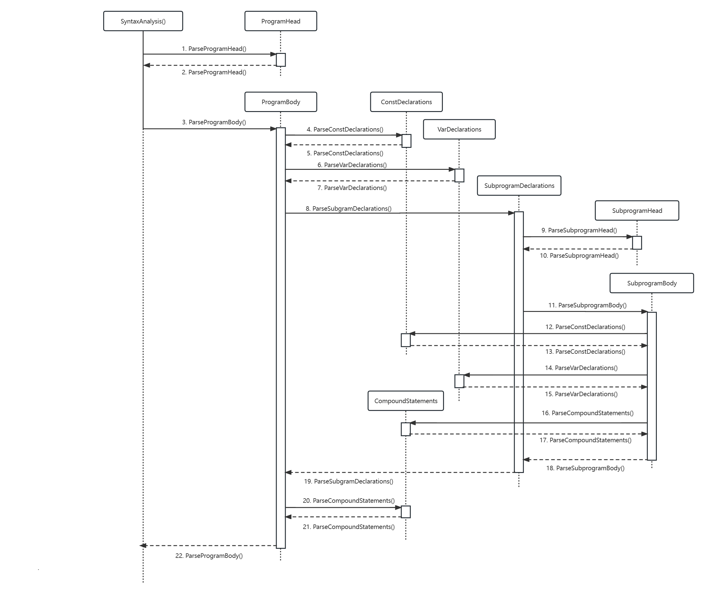

# 详细设计

## 词法分析

### 数据结构说明


### 函数、方法说明


### 算法描述


---

## 语法分析

### AST 树 

#### 功能描述

存储 AST 树，作为语法分析的输出，交给语义分析进一步处理

#### 接口描述（描述其他模块可能使用到的接口函数）

##### class Program

  | 描述       | 接口                                                 | 参数 | 返回值 | 异常 |
  | ---------- | ---------------------------------------------------- | ---- | ------ | ---- |
  | 获取程序头 | const shared_ptr\<ProgramHead> &program_head() const | 无   | 程序头 | 无   |

#### 数据结构定义（为类定义里的函数（除了get和set这类简单函数）和数据成员加上注释，直接复制过来）

为了完整表示源程序的所有信息，我们为pascal各种语法结构设计了相应的AST节点，各个类的定义均放在`pascal2c::ast`命名空间中，具体定义如下文所述

##### class Program
  AST 树根节点，存有指向 `ProgramHead`、`ProgramBody`的指针

```c++
    // Program -> ProgramHead; ProgramBody.
    //
    // eg. program f(a, b); var a, b; begin a := 1; b := 2; end.
    class Program
    {
    public:
        // param:
        //     program_head is the shared pointer of ProgramHead
        //     program_body is the shared pointer of ProgramBody
        Program(shared_ptr<ProgramHead> program_head, shared_ptr<ProgramBody> program_body)
            : program_head_(std::move(program_head)), program_body_(std::move(program_body)) {}

        inline const shared_ptr<ProgramHead> &program_head() const { return program_head_; }

        inline const shared_ptr<ProgramBody> &program_body() const { return program_body_; }

        // for test use
        // param:
        //     level is the level of indentation that should be applied to the returned string
        // return:
        //     a string represents the statement
        const string ToString(const int &level) const;

    private:
        shared_ptr<ProgramHead> program_head_; // eg. program f(a, b)
        shared_ptr<ProgramBody> program_body_; // eg. var a, b; begin a := 1; b := 2; end.
    };
```
##### class ProgramHead

存储程序头部信息，存有程序名和程序输入参数列表

```c++
    // ProgramHead -> program id(IdList) | program id
    //
    // eg. program f(a, b)
    // eg. program f
    class ProgramHead
    {
    public:
        // param:
        //     id is the program name
        //     id_list is the parameters of the program
        ProgramHead(const string &id, shared_ptr<IdList> id_list)
            : id_(id), id_list_(std::move(id_list)) {}

        // param:
        //     id is the program name
        explicit ProgramHead(const string &id) : id_(id) {}

        inline const string &id() const { return id_; }

        inline const shared_ptr<IdList> &id_list() const { return id_list_; }

        // check if the program has parameters   
        // return:
        //     true if the program has parameters
        inline const bool &HasIdList() const { return id_list_ != nullptr; }

        // for test use
        // param:
        //     level is the level of indentation that should be applied to the returned string
        // return:
        //     a string represents the statement
        const string ToString(const int &level) const;

    private:
        string id_;                  // program name, eg. f
        shared_ptr<IdList> id_list_; // parameters, can be empty, eg. (a, b)
    };
```

##### class ProgramBody

存储程序体信息，存有常数声明列表，变量声明列表，子程序列表以及程序内容

```c++
    // ProgramBody -> (const const_declarations | EMPTY)
    //                (var var_declarations | EMPTY)
    //                (subprogram_declarations | EMPTY)
    //                (statement_list | EMPTY)
    // const_declarations -> ConstDeclaration | (const_declarations ; ConstDeclaration)
    // var_declarations -> VarDeclaration | var_declarations ; VarDeclaration
    // subprogram_declarations -> Subprogram | subprogram_declarations ; Subprogram
    // statement_list -> statement | statement_list ; statement
    //
    // eg. const a = 1; b = 2; var c, d : integer; procedure p; begin end; begin end
    class ProgramBody
    {
    public:
        inline const vector<shared_ptr<ConstDeclaration>> &const_declarations() const { return const_declarations_; }

        inline const vector<shared_ptr<VarDeclaration>> &var_declarations() const { return var_declarations_; }

        inline const vector<shared_ptr<Subprogram>> &subprogram_declarations() const { return subprogram_declarations_; }

        inline const vector<shared_ptr<Statement>> &statement_list() const { return statement_list_; }

        inline void AddConstDeclaration(shared_ptr<ConstDeclaration> const_declaration)
        {
            const_declarations_.push_back(std::move(const_declaration));
        }

        inline void AddVarDeclaration(shared_ptr<VarDeclaration> var_declaration)
        {
            var_declarations_.push_back(std::move(var_declaration));
        }

        inline void AddSubprogram(shared_ptr<Subprogram> subprogram)
        {
            subprogram_declarations_.push_back(std::move(subprogram));
        }

        inline void AddStatement(shared_ptr<Statement> statement) { statement_list_.push_back(std::move(statement)); }

        // for test use
        // param:
        //     level is the level of indentation that should be applied to the returned string
        // return:
        //     a string represents the statement
        const string ToString(const int &level) const;

    private:
        vector<shared_ptr<ConstDeclaration>> const_declarations_; // can be empty, eg. const a = 1; b = 2;
        vector<shared_ptr<VarDeclaration>> var_declarations_;     // can be empty, eg. var c, d : integer;
        vector<shared_ptr<Subprogram>> subprogram_declarations_;  // can be empty, eg. procedure p; begin end;
        vector<shared_ptr<Statement>> statement_list_;            // can be empty, eg. begin end
    };
```

##### class ConstDeclaration

存储常量声明信息， 存有常量名称和值

```c++
    // ConstDeclaration -> id= (IntegerValue | RealValue | UnaryExpr | CharValue)
    //
    // eg. a=1, b=2.0, c=-1, d='a'
    class ConstDeclaration
    {
    public:
        // param:
        //     id is the identifier
        //     const_value is the value of the identifier
        ConstDeclaration(const string &id, shared_ptr<Expression> const_value)
            : id(id), const_value(std::move(const_value)) {}

        inline const string &id() const { return id; }

        inline const shared_ptr<Expression> &const_value() const { return const_value; }

        // for test use
        // param:
        //     level is the level of indentation that should be applied to the returned string
        // return:
        //     a string represents the statement
        const string ToString(const int &level) const;

    private:
        string id;                          // the identifier, eg. a
        shared_ptr<Expression> const_value; // IntegerValue | RealValue | UnaryExpr | CharValue, eg. 1, 2.0, -1, 'a'
    };
```

##### class VarDeclaration

存储变量声明信息，存有类型名，变量名。

```c++
    // VarDeclaration -> IdList : Type
    //
    // eg. a, b, c : integer
    // eg. d, e : array [1..10] of integer
    class VarDeclaration
    {
    public:
        // param:
        //     id_list is a list of identifiers
        //     type is the type of the identifiers
        VarDeclaration(shared_ptr<IdList> id_list, shared_ptr<Type> type)
            : id_list(std::move(id_list)), type(std::move(type)) {}

        inline const shared_ptr<IdList> &id_list() const { return id_list; }

        inline const shared_ptr<Type> &type() const { return type; }

        // for test use
        // param:
        //     level is the level of indentation that should be applied to the returned string
        // return:
        //     a string represents the statement
        const string ToString(const int &level) const;

    private:
        shared_ptr<IdList> id_list; // a list of identifiers, eg. a, b, c
        shared_ptr<Type> type;      // the type of the identifiers, eg. integer
    };
```

##### class Subprogram

存储子程序信息，包含子程序头`SubprogramHead`和子程序体`SubprogramBody`

```c++
    // Subprogram -> SubprogramHead ; SubprogramBody
    //
    // eg. function f(a, b : integer) : integer;
    // eg. procedure p(var c, d : real);
    class Subprogram
    {
    public:
        // param:
        //     subprogram_head is the head of the subprogram
        //     subprogram_body is the body of the subprogram
        Subprogram(shared_ptr<SubprogramHead> subprogram_head, shared_ptr<SubprogramBody> subprogram_body)
            : subprogram_head(std::move(subprogram_head)), subprogram_body(std::move(subprogram_body)) {}

        inline const shared_ptr<SubprogramHead> &subprogram_head() const { return subprogram_head; }

        inline const shared_ptr<SubprogramBody> &subprogram_body() const { return subprogram_body; }

        // for test use
        // param:
        //     level is the level of indentation that should be applied to the returned string
        // return:
        //     a string represents the statement
        const string ToString(const int &level) const;

    private:
        shared_ptr<SubprogramHead> subprogram_head; // eg. function f(a, b : integer) : integer;
        shared_ptr<SubprogramBody> subprogram_body; // eg. begin ... end;
    };
```

##### class SubprogramHead

存储子程序头信息，子程序可能为 function 或 procedure。存有子程序名，子程序参数以及返回值类型。

```c++
    // SubprogramHead -> function id (EMPTY | parameters) : (TOK_INTEGER | TOK_REAL | TOK_BOOLEAN | TOK_CHAR) | procedure id (EMPTY | parameters)
    // parameters -> Parameter | parameters ; Parameter
    //
    // eg. function f(a, b : integer) : integer
    // eg. procedure p(var c, d : real)
    class SubprogramHead
    {
    public:
        // param:
        //     id is the name of the subprogram
        //     return_type is the return type of the subprogram, -1 means procedure
        SubprogramHead(const string &id, const int &return_type = -1)
            : id_(id), return_type_(return_type) {}

        inline const string &id() const { return id_; }

        // return:
        //     the return type of the subprogram, -1 means procedure
        inline const int &return_type() const { return return_type_; }

        inline const vector<shared_ptr<Parameter>> &parameters() const { return parameters_; }

        inline void AddParameter(shared_ptr<Parameter> parameter) { parameters_.push_back(std::move(parameter)); }

        inline void set_return_type(const int &return_type) { return_type_ = return_type; }

        // for test use
        // param:
        //     level is the level of indentation that should be applied to the returned string
        // return:
        //     a string represents the statement
        const string ToString(const int &level) const;

    private:
        string id_;                                // name of the subprogram, eg. f, p
        int return_type_;                          // -1 means procedure, eg. integer, real
        vector<shared_ptr<Parameter>> parameters_; // can be empty, eg. a, b : integer
    };
```

##### class SubprogramBody

存储子程序体信息，存有常数声明列表，变量声明列表以及子程序内容

```c++
    // SubprogramBody -> (const const_declarations | EMPTY)
    //                   (var var_declarations | EMPTY)
    //                   (statement_list | EMPTY)
    // const_declarations -> id=ConstValue | const_declarations ; id=ConstValue
    // var_declarations -> IdList : Type | var_declarations ; IdList : Type
    // statement_list -> statement | statement_list ; statement
    //
    // eg. const a = 1; b = 2; var c, d : integer; begin end
    class SubprogramBody
    {
    public:
        inline const vector<shared_ptr<ConstDeclaration>> &const_declarations() const { return const_declarations_; }

        inline const vector<shared_ptr<VarDeclaration>> &var_declarations() const { return var_declarations_; }

        inline const vector<shared_ptr<Statement>> &statement_list() const { return statement_list_; }

        inline void AddConstDeclaration(shared_ptr<ConstDeclaration> const_declaration)
        {
            const_declarations_.push_back(std::move(const_declaration));
        }

        inline void AddVarDeclaration(shared_ptr<VarDeclaration> var_declaration)
        {
            var_declarations_.push_back(std::move(var_declaration));
        }

        inline void AddStatement(shared_ptr<Statement> statement) { statement_list_.push_back(std::move(statement)); }

        // for test use
        // param:
        //     level is the level of indentation that should be applied to the returned string
        // return:
        //     a string represents the statement
        const string ToString(const int &level) const;

    private:
        vector<shared_ptr<ConstDeclaration>> const_declarations_; // can be empty, eg. const a = 1; b = 2;
        vector<shared_ptr<VarDeclaration>> var_declarations_;     // can be empty, eg. var c, d : integer;
        vector<shared_ptr<Statement>> statement_list_;            // can be empty, eg. begin end
    };
```

##### class Parameter

存储子程序参数信息，参数可以为值或引用，存有参数名列表，参数类型以及是否为引用。

```c++
    // Parameter -> var_parameter | value_parameter
    // var_parameter -> var value_parameter
    // value_parameter -> id_list : (TOK_INTEGER | TOK_REAL | TOK_BOOLEAN | TOK_CHAR)
    //
    // eg. a, b : integer
    // eg. var c, d : real
    class Parameter
    {
    public:
        // param:
        //     is_var is true if the parameter is var parameter
        //     id_list is a list of identifiers
        //     type is the type of the identifiers
        Parameter(const bool &is_var, shared_ptr<IdList> id_list, const int &type)
            : is_var_(is_var), id_list_(std::move(id_list)), type_(type) {}

        inline const bool &is_var() const { return is_var_; }

        inline const shared_ptr<IdList> &id_list() const { return id_list_; }

        inline const int &type() const { return type_; }

        // for test use
        // param:
        //     level is the level of indentation that should be applied to the returned string
        // return:
        //     a string represents the statement
        const string ToString(const int &level) const;

    private:
        bool is_var_;                // true if the parameter is var parameter
        shared_ptr<IdList> id_list_; // a list of identifiers, eg. a, b
        int type_;                   // TOK_INTEGER | TOK_REAL | TOK_BOOLEAN | TOK_CHAR, eg. integer, real, boolean, char
    };
```

##### class IdList

存储标志符列表

```c++
    // IdList -> id | IdList , id
    //
    // eg. a, b, c
    class IdList
    {
    public:
        // param:
        //     id is the identifier
        // return:
        //     the id at the index
        inline const string &operator[](const int &index) const { return id_list_[index]; }

        // return:
        //     the number of identifiers
        inline const int Size() const { return id_list_.size(); }

        inline void AddId(const string &id) { id_list_.push_back(id); }

        // for test use
        // param:
        //     level is the level of indentation that should be applied to the returned string
        // return:
        //     a string represents the statement
        const string ToString(const int &level) const;

    private:
        vector<string> id_list_; // a list of identifiers, eg. a, b, c
    };
```

##### class Type

存储类型信息，类型可以为普通类型（integer, real, bool, char）或数组类型，存有基础类型（lexer 输出的 `TOK_INTEGER_TYPE`, `TOK_REAL_TYPE`, `TOK_BOOLEAN_TYPE`, `TOK_CHAR_TYPE`）、是否为数组，若为数组还应包括数组下标范围。

包含 struct `Period`，存储数组下标，存有下标上界和下界。

```c++
    // Type -> (TOK_INTEGER_TYPE | TOK_REAL_TYPE | TOK_BOOLEAN_TYPE | TOK_CHAR_TYPE) | array [Period] of (TOK_INTEGER_TYPE | TOK_REAL_TYPE | TOK_BOOLEAN_TYPE | TOK_CHAR_TYPE)
    // Period -> digits ... digits | period , digits ... digits
    //
    // eg. integer, real, boolean, char
    // eg. array [1..10] of integer, array [1..10, 20..30] of real
    class Type
    {
    public:
        // digits_1 is the lower bound, digits_2 is the upper bound
        //
        // e.g. 1..10
        struct Period
        {
            int digits_1;
            int digits_2;
        };

        // param:
        //     is_array is true if the type is array type
        Type(const bool &is_array) : is_array_(is_array) {}

        // param:
        //     is_array is true if the type is array type
        //     basic_type is the basic type of the array, eg. integer, real, boolean, char
        Type(const bool &is_array, const int &basic_type)
            : is_array_(is_array), basic_type_(basic_type) {}

        inline const bool &is_array() const { return is_array_; }

        inline const int &basic_type() const { return basic_type_; }

        inline const vector<Period> &periods() const { return periods_; }

        inline void AddPeriod(const int &digits_1, const int &digits_2)
        {
            periods_.push_back({digits_1, digits_2});
        }

        // for test use
        // param:
        //     level is the level of indentation that should be applied to the returned string
        // return:
        //     a string represents the statement
        const string ToString(const int &level) const;

    private:
        bool is_array_;          // true if the type is array type
        int basic_type_;         // TOK_INTEGER_TYPE | TOK_REAL_TYPE | TOK_BOOLEAN_TYPE | TOK_CHAR_TYPE, eg. integer, real, boolean, char
        vector<Period> periods_; // can be empty, eg. [1..10, 20..30]
    };
```

##### class Statement

该类表示一种pascal中的语句，为各种`Statement`的基类，定义如下

```c++
// base type of statement
class Statement {
public:
    // for test use
    // param:
    //     level is the level of indentation that should be applied to the returned string
    // return:
    //     a string represents the statement
    virtual std::string ToString(int level) const = 0;
    // to get exact statement type of the statement
    // return:
    //     exact type of statement
    virtual StatementType GetType() const = 0;
};
```

其中`StatementType`为枚举类型，其定义如下

```c++
// to identify what type a statement is
enum StatementType{
    ASSIGN_STATEMENT = 1,
    CALL_STATEMENT = 2,
    COMPOUND_STATEMENT = 3,
    IF_STATEMENT = 4,
    FOR_STATEMENT = 5,
};
```

##### class AssignStatement

该类表示一条pascal中的赋值语句，定义如下

```c++
// var_ := expr_
// var_ can be: var_name    var_name[expr_list]  func_id
class AssignStatement : public Statement {
public:
    // basic constructor
    // param:
    //     var is used to initialize the class member var_
    //     expr is used to initialize the class member expr_
    AssignStatement(std::shared_ptr<Variable> var,std::shared_ptr<Expression> expr) : var_(std::move(var)),expr_(
            std::move(expr)) {}

    inline StatementType GetType() const override { return ASSIGN_STATEMENT; }

    std::string ToString(int level) const override;
private:
    std::shared_ptr<Variable> var_;      // lhs of the assign statement
    std::shared_ptr<Expression> expr_;   // rhs of the assign statement
};
```

其中`Variable`类型和`Expression`类型放在后文解释。

##### class CallStatement

该类表示一条pascal中调用子程序(procedure或者function)的语句，定义如下

```c++
// represents procedure and function call
// name_ is procedure name or function name
// expr_list_ is the arguments of procedure or function
// expr_list_ can be empty
// write and read are treated as CallStatement as built-in function
class CallStatement : public Statement {
public:
    CallStatement(std::string name, vector<std::shared_ptr<Expression> > expr_list) :
            name_(std::move(name)), expr_list_(std::move(expr_list)) {}

    explicit CallStatement(std::string name) : name_(std::move(name)) {}

    inline StatementType GetType() const override { return CALL_STATEMENT; }

    std::string ToString(int level) const override;
private:
    std::string name_;   // procedure name or function name

    vector<std::shared_ptr<Expression> > expr_list_; // can be empty:  e.g. procedure_name;   func();
};
```

##### class CompoundStatement

该类表示pascal中以`begin`和`end`包围的一系列语句，定义如下

```c++
// a series of statements
// begin
//    statement1 ;
//    statement2 ;
//    ...
// end
class CompoundStatement: public Statement {
public:
    explicit CompoundStatement(vector<std::shared_ptr<Statement> > statements) : statements_(std::move(statements)) {}

    inline StatementType GetType() const override { return COMPOUND_STATEMENT; }

    std::string ToString(int level) const override;
private:
    vector<std::shared_ptr<Statement> > statements_;  // vector of statement
};
```

##### class  IfStatement

该类表示pascal中的`if`语句，定义如下

```c++
// if condition_ then
//      then_
// else
//      else_
class IfStatement : public Statement {
public:
    IfStatement(std::shared_ptr<Expression> cond,std::shared_ptr<Statement> then,
                std::shared_ptr<Statement> else_part)
                : condition_(std::move(cond)),then_(std::move(then)),else_(std::move(else_part)) {}

    inline StatementType GetType() const override { return IF_STATEMENT; }

    std::string ToString(int level) const override;
private:
    std::shared_ptr<Expression> condition_;    // condition expression
    std::shared_ptr<Statement>  then_;         // then part of if statement
    std::shared_ptr<Statement>  else_;         // else part of if statement, can be empty
};
```

##### class ForStatement

该类表示一条pascal中的`for`语句，定义如下

```c++
// for id_ := from_ to to_ do statement_
class ForStatement : public Statement {
public:
    ForStatement(std::shared_ptr<Expression> from,std::shared_ptr<Expression> to,
                 std::shared_ptr<Statement>  statement)
                 : from_(std::move(from)),to_(std::move(to)),statement_(std::move(statement)) {}

    inline StatementType GetType() const override { return FOR_STATEMENT; }

    std::string ToString(int level) const override;
private:
    std::string id_;
    std::shared_ptr<Expression> from_;
    std::shared_ptr<Expression> to_;
    std::shared_ptr<Statement>  statement_;
};
```

##### class Expression

该类表示pascal中一条合法的表达式，由于pascal中表达式有很多个部分构成、有很多种表达式，故统一用一个`Expression`类来做表达式的基类，该类定义如下

```c++
// base class for expression
class Expression {
public:
    // for test use
    // param:
    //     level is the level of indentation that should be applied to the returned string
    // return:
    //     a string represents the statement
    virtual std::string ToString(int level) const = 0;

    // get the exact type of the expression
    // return:
    //     one of ExprType
    virtual ExprType GetType() const = 0;
};
```

其中`ExprType`的定义如下

```c++
enum ExprType{
    INT = 0,
    REAL = 1,
    CHAR = 2,
    BOOLEAN = 3,
    VARIABLE = 4,
    CALL = 5,
    BINARY = 6,
    UNARY = 7,
};
```

##### class IntegerValue

单独的整数可以作为合法的pascal表达式，定义表示一个整数的节点如下

```c++
// leaf node of an expression
// this node represents an integer value in pascal
// e.g. 123  482
// value_ stores the value of the integer
class IntegerValue : public Expression {
public:
    explicit IntegerValue(int value) : value_(value) {}

    std::string ToString(int level) const override;
    inline ExprType GetType() const override {return INT;}

private:
    int value_;
};
```

##### Class RealValue

单独的实数可以作为合法的pascal表达式，定义表示一个实数的节点如下

```c++
// leaf node of an expression
// this node represents a real value in pascal
// e.g. 12.34
// value_ stores the value of the real number
class RealValue : public Expression {
public:
    explicit RealValue(double value) : value_(value) {}

    std::string ToString(int level) const override;
    inline ExprType GetType() const override {return REAL;}

private:
    double value_;
};
```

##### class CharValue

该类表示一个字符，形如`'a'`，表示该类型值的节点如下

```c++
// leaf node
// represent a boolean value
// e.g. true  false
// value_ store the value
class BooleanValue : public Expression {
public:
    explicit BooleanValue(bool value) : value_(value) {}

    std::string ToString(int level) const override;
    inline ExprType GetType() const override {return BOOLEAN;}

private:
    bool value_;
};
```

##### class BooleanValue

该类表示一个`bool`值，可以为`true`或`false`，定义如下

```c++
// leaf node
// represent a boolean value
// e.g. true  false
// value_ store the value
class BooleanValue : public Expression {
public:
    explicit BooleanValue(bool value) : value_(value) {}

    std::string ToString(int level) const override;
    inline ExprType GetType() const override {return BOOLEAN;}

private:
    bool value_;
};
```

##### class CallValue

该类表示调用一个函数产生的值，如`add(1,2)`，其中`add`为一个函数，返回值为整数。该类节点定义如下

```c++
// represent a function call
// e.g. add(3+4,5)
// params_ is a vector of expressions used as parameters of the function
// params_ can be empty
class CallValue : public Expression {
public:
    explicit CallValue(std::string func_name) : func_name_(std::move(func_name)) {}
    CallValue(std::string func_name,vector<std::shared_ptr<Expression> > params) : func_name_(std::move(func_name)),params_(
            std::move(params)) {}
    void AddParam(std::shared_ptr<Expression> expr);

    std::string ToString(int level) const override;
    inline ExprType GetType() const override {return CALL;}

private:
    std::string func_name_;
    vector<std::shared_ptr<Expression> > params_;
};
```

##### class Variable

该类表示一个pascal变量，如`a count num[3] v[i+1,j]`具体定义如下

```c++
// represent variable in pascal
// e.g. count  num[3+i]  pos[3,4]
// in the example of pos[3,4] the elements of expr_list_ is 3 and 4
// expr_list_ can be empty
class Variable : public Expression {
public:
    explicit Variable(std::string id) : id_(std::move(id)) {}
    Variable(std::string id,vector<std::shared_ptr<Expression> > expr_list) : id_(std::move(id)),expr_list_(
            std::move(expr_list)) {}

    void AddExpr(std::shared_ptr<Expression> expr);

    std::string ToString(int level) const override;
    inline ExprType GetType() const override {return VARIABLE;}

private:
    std::string id_;
    vector<std::shared_ptr<Expression> > expr_list_;
};
```

##### class BinaryExpr

该类表示一个二元运算表达式，具体定义如下

```c++
// represent binary expression
// e.g. 3 + 4 + 5    3 * ((6 + 7) - 2)
// in the example of 3 + 4 + 5, lhs_ is 3 + 4 ,rhs_ is 5 and op_ is '+'
class BinaryExpr : public Expression {
public:
    BinaryExpr(int op, std::shared_ptr<Expression> lhs, std::shared_ptr<Expression> rhs) :
            op_(op), lhs_(std::move(lhs)), rhs_(std::move(rhs)) {}

    std::string ToString(int level) const override;
    inline ExprType GetType() const override {return BINARY;}

private:
    int op_;                 // operator
    std::shared_ptr<Expression> lhs_, rhs_; // two operands
};
```

##### class UnaryExpr

该类表示一个一元运算，如`-3  not true  not abc`等等，具体定义如下

```c++
// represent unary expression
// e.g. -3
// in the above example, op_ is '-' and factor is 3
class UnaryExpr : public Expression {
public:
    UnaryExpr(int op, std::shared_ptr<Expression> factor) : op_(op), factor_(std::move(factor)) {}

    std::string ToString(int level) const override;
    inline ExprType GetType() const override {return UNARY;}

private:
    int op_;
    std::shared_ptr<Expression> factor_;
};
```

### Parser

#### 功能描述

以token为输入，解析Pascal-S中的各种语法结构，如表达式、语句、常量声明、变量声明、子查询定义等。在对符合语法的输入进行解析后生成对应的抽象语法树(AST)，该抽象语法树能完整的表达源码包含的信息，语法分析器生成AST后将交由语义分析模块处理。


#### 接口描述

##### class Parser
| 描述                                               | 接口             | 参数                    | 返回值      | 异常                                                       |
| -------------------------------------------------- | ---------------- | ----------------------- | ----------- | ---------------------------------------------------------- |
| 给定输入文件指针，返回一个针对特定文件的Parser实例 | Parser(FILE *in) | FILE *in : 输入文件指针 | Parser实例  | 无                                                         |
| 分析整个输入文件，得到整颗AST                      | ParseProgram()   | 无                      | Program指针 | 若存在语法错误，则会将所有的错误信息保存在一个成员变量中。 |

#### Parser定义

parser类的定义如下

```c++
class Parser{
public:
    // param:
    //     in is the input file
    explicit Parser(FILE *in);
private:
    int token_,next_token_;                      // current token and next token
  	// if an lex error occur, error number will be stored in this variable
    int lexer_errno_;     
  	// token value
    YYSTYPE tok_value_,next_tok_value_;
    int line_,next_line_;                        // line number of token in the input file
    int column_,next_column_;                      // column number of token in the input file
    std::string text_,next_text_;
  
    vector<std::string> err_msg_;     // error massages
};
```

`Parser`的构造函数接收一个`FILE *`，即输入文件。各个成员变量作用:

- `token_`:当前token
- `lexer_errno_`:若获取下一个token时出现了词法错误，则该变量存着错误号
- `line_`:当前token在源文件的行数
- `column_`:当前token在源文件中的列数
- `text_`:当前token对应的字符串
- `err_msg_`:当出现语法错误时，错误信息均存在这里面

成员中形如`next_***_`的变量为下一个token对应的信息，再做语法分析时有时多看一个token对确定产生式有帮助，故有`next_***_`成员变量。

#### 算法描述（还不完善）

我们采用递归下降的方式来实现语法分析，对于每种语法成分，均编写对应方法进行解析，在这个过程中还会用到一些辅助方法，具体方法描述如下表

|             方法              |                                                   描述                                                    |
| :---------------------------: | :-------------------------------------------------------------------------------------------------------: |
|        ParseProgram()         |                                                 语法分析                                                  |
|      ParseProgramHead()       |                                                分析程序头                                                 |
|      ParseProgramBody()       |                                               分析程序主体                                                |
|   ParseConstDeclarations()    |                                               分析常量声明                                                |
|    ParseVarDeclarations()     |                                               分析变量声明                                                |
| ParseSubprogramDeclarations() |                                                分析子程序                                                 |
|     ParseSubprogramHead()     |                                               分析子程序头                                                |
|     ParseSubprogramBody()     |                                              分析子程序主体                                               |
|   ParseCompoundStatement()    |                                               分析复合语句                                                |
|       ParseStatement()        |                                解析任意一种`statement`，返回Statement指针                                 |
|      ParseIfStatement()       |                                     解析`if`语句，返回`Statement`指针                                     |
|      ParseForStatement()      |                                    解析`for`语句，返回`Statement`指针                                     |
| ParseAssignAndCallStatement() | 解析赋值语句或函数、过程调用语句，返回`Statement`指针。两种语句放在一起解析是因为两种语句均以`TOK_ID`开头 |
|          ParseExpr()          |                                   解析一个表达式，返回`Expression`指针                                    |
|      ParseExpr(int prec)      |          解析运算符等级不小于`prec`的表达式，用该函数可以简化表达式解析难度，正确处理结合性问题           |
|        ParsePrimary()         |                            解析一个表达式的基本单元，如整数、实数、函数调用等                             |



进行**错误处理**时，将采取如下策略:

- 在较低层的解析方法中碰到语法错误时抛出异常
- 在较高层的解析方法调用底层解析函数时捕获异常，将错误信息存入`err_msg_`
- 继续解析的两种处理策略:
  - 碰到异常后，跳过若干`token`直到碰到想要的`token`
  - 碰到异常后，忽略一些`token`接着解析

如`ParseExpr`和`ParseStatement`在碰到语法错误时直接抛出异常，`ParseCompoundStatement`调用`ParseStatement`来解析一系列语句，若捕获异常，则记录下异常，并不断跳过`token`直到遇到`;`或者可能的语句开头的`token`再接着进行解析。`ParseCompoundStatement`在碰到缺少`begin`的错误时，记录错误并忽略`begin`直接进行statement的解析操作。


---

## 语义分析

### 符号表设计

#### 数据结构说明


#### 函数、方法说明


### ast 处理

---

## 代码生成

### 数据结构说明

### 函数、方法说明

### 算法说明

