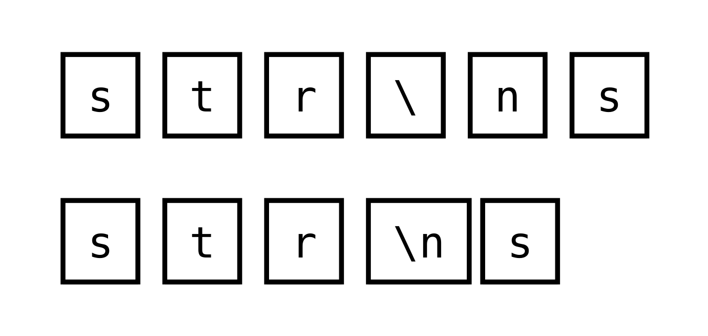
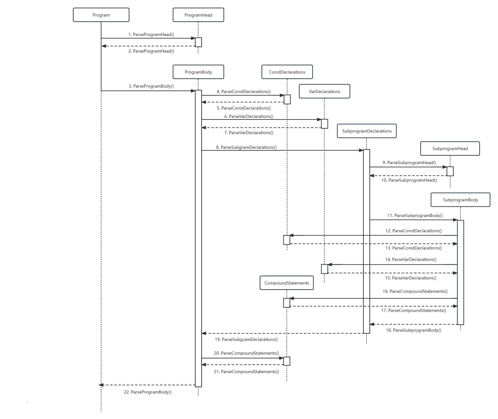
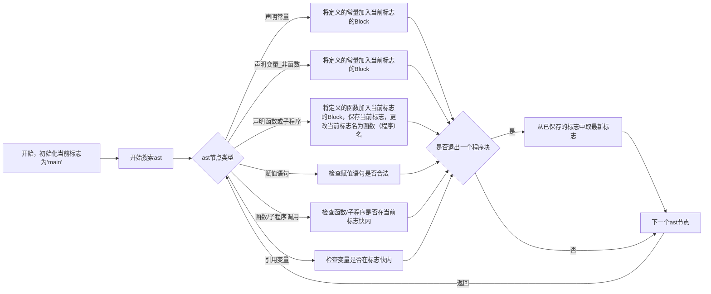
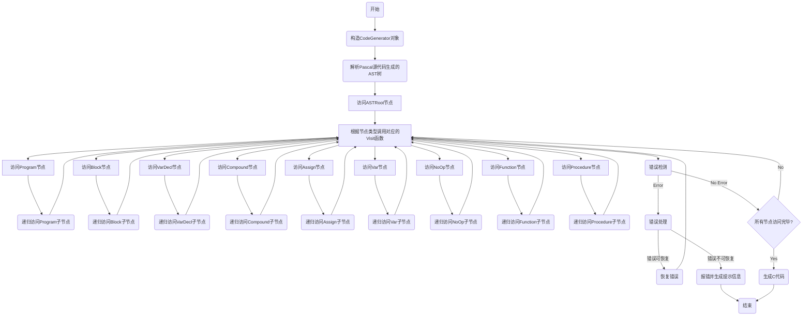

# 详细设计

## 词法分析

### 数据结构说明

- TOKEN: `yylex()` 的返回值，类型是 int, 表示 token 的类型. 单字符的 token 的类型就是字符本身, 例如 `+` 对应 int 值为 `'+'`; 多字符的 token 的类型是一个预定义的宏, 例如 `PROGRAM` 对应 int 值为 `TOK_PROGRAM`. 多字符的预定义宏的值从 257 开始, 自动分配.
- yylval: token 的词法属性, 类型为 `union { uint32_t intval; double realval; char strval[MAX_STR_LEN]; }`. `intval` 保存整型数的值, `realval` 保存实数的值, `strval` 保存字符串的值.
- yylineno: 行号, 类型为 int, 从 1 开始计数.
- yycolno: 列号, 类型为 int, 从 1 开始计数.
- yyerrno: 错误类型, 类型为 int, 用于保存最后一次的错误类型.
- yytext: token 的文本, 类型为 char*, 用于 TOK_ID 的词法属性.
- YYERRMSG: 错误信息, 类型为 char**, 保存错误类型对应的错误信息.

### 函数、方法说明

```c
// 这个宏会在每次识别出一个 token 时执行, 用于维护列号计数器
#define YY_USER_ACTION {yycolno = yycolno_next; yycolno_next += yyleng;}
// ...
// 设定词法分析器遇到 EOF 后直接退出
int yywrap() {
    return 1;
}
// ...
// 返回 token 的字符串描述, 方便输出和调试
char* TokenToString(int token) {
    static char* tokenNames[] = {
        // ...
    };
    return tokenNames[token];
}
```

### 算法描述

#### 处理注释

使用 Flex 提供的词法分析环境, 遇到 `{` 时注释开始, 深度加一, 遇到 `}` 时注释结束, 深度减一, 当深度为 0 时注释结束.

```
    // 声明注释状态
%x COMMENT

    // 开始注释, 初始化 cmt_level
"{"                    {BEGIN(COMMENT); cmt_level = 1;}
    // 嵌套注释, 深度加一
<COMMENT>"{"           {++cmt_level;}
    // 更新列号计数器
<COMMENT>\n            {yycolno_next = 1;}
    // 遇到 EOF, 报错
<COMMENT><<EOF>>       {yyerrno = ERR_EOF_IN_COMMENT; BEGIN(INITIAL); return TOK_ERROR;}
    // 遇到 } 时, 深度减一, 当深度为 0 时注释结束
<COMMENT>"}"           {--cmt_level; if (cmt_level == 0) BEGIN(INITIAL);}
    // 忽略注释中的其他字符
<COMMENT>.
```

#### 处理字符串

1. 遇到单引号（'），进入STRING状态，初始化字符串。
2. 在STRING状态下：
    - 遇到换行符或文件结尾，报告未正常结束的字符串错误。
    - 遇到非转义字符，将它们追加到字符串中。
    - 遇到转义序列，将对应的实际字符追加到字符串中。
    - 遇到其他转义字符，将原始的内容追加到字符串中。
4. 遇到单引号（'），返回到初始状态。



```
%x STRING

"'"                {BEGIN(STRING); yylval.strval[0] = '\0';}
<STRING>\n         {yycolno_next = 1; yyerrno = ERR_UNTERMINATED_STRING; BEGIN(INITIAL); return TOK_ERROR;}
<STRING><<EOF>>    {yyerrno = ERR_UNTERMINATED_STRING; BEGIN(INITIAL); return TOK_ERROR;}
<STRING>[^\\']     {strcat(yylval.strval, yytext);}
<STRING>\\n        {strcat(yylval.strval, "\n");}
<STRING>\\t        {strcat(yylval.strval, "\t");}
<STRING>\\r        {strcat(yylval.strval, "\r");}
<STRING>\\'        {strcat(yylval.strval, "'");}
<STRING>\\.        {strcat(yylval.strval, yytext);}
<STRING>"'"        {BEGIN(INITIAL); return TOK_STRING;}
```

#### 处理关键字

直接匹配, 例如 `and {return TOK_AND;}`.

#### 处理标识符

使用正则表达式匹配字母开头, 中间包含字母和数字的字符串. 标识符的值已经在 `yytext` 中, 只需要返回 `TOK_ID` 即可.

```
alpha             [A-Za-z_]
alpha_num         ({alpha}|{digit})
identifier        {alpha}{alpha_num}*

{identifier}         {return TOK_ID;}
```

#### 处理整数

使用正则表达式匹配十进制整数, 并将其转换为整型数. 如果整数过大, 则报错. 用 `strtoul` 函数将字符串转换为整型数, 并将结果保存在 `yylval.intval` 中.

```
digit             [0-9]
unsigned_integer  {digit}+

{unsigned_integer} {
    if (strlen(yytext) > MAX_INT_LEN) {
        yyerrno = ERR_INTEGER_TOO_LARGE;
        return TOK_ERROR;
    }
    yylval.intval = strtoul(yytext, NULL, 10);
    return TOK_INTEGER;
}
```

#### 处理浮点数

使用正则表达式匹配十进制浮点数, 并将其转换为浮点数. 用 `strtod` 函数将字符串转换为浮点数, 并将结果保存在 `yylval.realval` 中.

```
exponent          e[+-]?{digit}+
u                 {unsigned_integer}
real              ({u}\.{u}?|{u}?\.{u}){exponent}?

{real} {
    yylval.realval = strtod(yytext, NULL);
    return TOK_REAL;
}
```

#### 处理运算符

若是单字符的运算符, 直接返回它的 char 值. 若是多字符的运算符, 返回对应的 token 值.

```
[+\-*/=<>\[\]\.,:;^()]   {return yytext[0];}
"<>"                {return TOK_NEQOP;}
"<="                {return TOK_LEOP;}
">="                {return TOK_GEOP;}
":="                {return TOK_ASSIGNOP;}
".."                {return TOK_DOTDOT;}
```

#### 忽略空白符

```
[ \t]*
```

#### 处理换行

重置列号计数器.

```
\n                 {yycolno_next = 1;}
```

#### 处理其他字符

报告未知字符错误.

```
.                  {yyerrno = ERR_ILLEGAL_INPUT; return TOK_ERROR;}
```

---

## 语法分析

### AST 树 

#### 功能描述

存储 AST 树，作为语法分析的输出，交给语义分析进一步处理

#### 接口描述

##### class Program

  | 描述       | 接口                                                 | 参数 | 返回值 | 异常 |
  | ---------- | ---------------------------------------------------- | ---- | ------ | ---- |
  | 获取程序头 | const shared_ptr\<ProgramHead> &program_head() const | 无   | 程序头 | 无   |

#### 数据结构定义

为了完整表示源程序的所有信息，我们为pascal各种语法结构设计了相应的AST节点，各个类的定义均放在`pascal2c::ast`命名空间中，具体定义如下文所述

##### class Program
  AST 树根节点，存有指向 `ProgramHead`、`ProgramBody`的指针

```c++
    // Program -> ProgramHead; ProgramBody.
    //
    // eg. program f(a, b); var a, b; begin a := 1; b := 2; end.
    class Program
    {
    public:
        // param:
        //     program_head is the shared pointer of ProgramHead
        //     program_body is the shared pointer of ProgramBody
        Program(shared_ptr<ProgramHead> program_head, shared_ptr<ProgramBody> program_body)
            : program_head_(std::move(program_head)), program_body_(std::move(program_body)) {}

        inline const shared_ptr<ProgramHead> &program_head() const { return program_head_; }

        inline const shared_ptr<ProgramBody> &program_body() const { return program_body_; }

        // for test use
        // param:
        //     level is the level of indentation that should be applied to the returned string
        // return:
        //     a string represents the statement
        const string ToString(const int &level) const;

    private:
        shared_ptr<ProgramHead> program_head_; // eg. program f(a, b)
        shared_ptr<ProgramBody> program_body_; // eg. var a, b; begin a := 1; b := 2; end.
    };
```
##### class ProgramHead

存储程序头部信息，存有程序名和程序输入参数列表

```c++
    // ProgramHead -> program id(IdList) | program id
    //
    // eg. program f(a, b)
    // eg. program f
    class ProgramHead
    {
    public:
        // param:
        //     id is the program name
        //     id_list is the parameters of the program
        ProgramHead(const string &id, shared_ptr<IdList> id_list)
            : id_(id), id_list_(std::move(id_list)) {}

        // param:
        //     id is the program name
        explicit ProgramHead(const string &id) : id_(id) {}

        inline const string &id() const { return id_; }

        inline const shared_ptr<IdList> &id_list() const { return id_list_; }

        // check if the program has parameters   
        // return:
        //     true if the program has parameters
        inline const bool &HasIdList() const { return id_list_ != nullptr; }

        // for test use
        // param:
        //     level is the level of indentation that should be applied to the returned string
        // return:
        //     a string represents the statement
        const string ToString(const int &level) const;

    private:
        string id_;                  // program name, eg. f
        shared_ptr<IdList> id_list_; // parameters, can be empty, eg. (a, b)
    };
```

##### class ProgramBody

存储程序体信息，存有常数声明列表，变量声明列表，子程序列表以及程序内容

```c++
    // ProgramBody -> (const const_declarations | EMPTY)
    //                (var var_declarations | EMPTY)
    //                (subprogram_declarations | EMPTY)
    //                (statement_list | EMPTY)
    // const_declarations -> ConstDeclaration | (const_declarations ; ConstDeclaration)
    // var_declarations -> VarDeclaration | var_declarations ; VarDeclaration
    // subprogram_declarations -> Subprogram | subprogram_declarations ; Subprogram
    // statement_list -> statement | statement_list ; statement
    //
    // eg. const a = 1; b = 2; var c, d : integer; procedure p; begin end; begin end
    class ProgramBody
    {
    public:
        inline const vector<shared_ptr<ConstDeclaration>> &const_declarations() const { return const_declarations_; }

        inline const vector<shared_ptr<VarDeclaration>> &var_declarations() const { return var_declarations_; }

        inline const vector<shared_ptr<Subprogram>> &subprogram_declarations() const { return subprogram_declarations_; }

        inline const vector<shared_ptr<Statement>> &statement_list() const { return statement_list_; }

        inline void AddConstDeclaration(shared_ptr<ConstDeclaration> const_declaration)
        {
            const_declarations_.push_back(std::move(const_declaration));
        }

        inline void AddVarDeclaration(shared_ptr<VarDeclaration> var_declaration)
        {
            var_declarations_.push_back(std::move(var_declaration));
        }

        inline void AddSubprogram(shared_ptr<Subprogram> subprogram)
        {
            subprogram_declarations_.push_back(std::move(subprogram));
        }

        inline void AddStatement(shared_ptr<Statement> statement) { statement_list_.push_back(std::move(statement)); }

        // for test use
        // param:
        //     level is the level of indentation that should be applied to the returned string
        // return:
        //     a string represents the statement
        const string ToString(const int &level) const;

    private:
        vector<shared_ptr<ConstDeclaration>> const_declarations_; // can be empty, eg. const a = 1; b = 2;
        vector<shared_ptr<VarDeclaration>> var_declarations_;     // can be empty, eg. var c, d : integer;
        vector<shared_ptr<Subprogram>> subprogram_declarations_;  // can be empty, eg. procedure p; begin end;
        vector<shared_ptr<Statement>> statement_list_;            // can be empty, eg. begin end
    };
```

##### class ConstDeclaration

存储常量声明信息， 存有常量名称和值

```c++
    // ConstDeclaration -> id= (IntegerValue | RealValue | UnaryExpr | CharValue)
    //
    // eg. a=1, b=2.0, c=-1, d='a'
    class ConstDeclaration
    {
    public:
        // param:
        //     id is the identifier
        //     const_value is the value of the identifier
        ConstDeclaration(const string &id, shared_ptr<Expression> const_value)
            : id(id), const_value(std::move(const_value)) {}

        inline const string &id() const { return id; }

        inline const shared_ptr<Expression> &const_value() const { return const_value; }

        // for test use
        // param:
        //     level is the level of indentation that should be applied to the returned string
        // return:
        //     a string represents the statement
        const string ToString(const int &level) const;

    private:
        string id;                          // the identifier, eg. a
        shared_ptr<Expression> const_value; // IntegerValue | RealValue | UnaryExpr | CharValue, eg. 1, 2.0, -1, 'a'
    };
```

##### class VarDeclaration

存储变量声明信息，存有类型名，变量名。

```c++
    // VarDeclaration -> IdList : Type
    //
    // eg. a, b, c : integer
    // eg. d, e : array [1..10] of integer
    class VarDeclaration
    {
    public:
        // param:
        //     id_list is a list of identifiers
        //     type is the type of the identifiers
        VarDeclaration(shared_ptr<IdList> id_list, shared_ptr<Type> type)
            : id_list(std::move(id_list)), type(std::move(type)) {}

        inline const shared_ptr<IdList> &id_list() const { return id_list; }

        inline const shared_ptr<Type> &type() const { return type; }

        // for test use
        // param:
        //     level is the level of indentation that should be applied to the returned string
        // return:
        //     a string represents the statement
        const string ToString(const int &level) const;

    private:
        shared_ptr<IdList> id_list; // a list of identifiers, eg. a, b, c
        shared_ptr<Type> type;      // the type of the identifiers, eg. integer
    };
```

##### class Subprogram

存储子程序信息，包含子程序头`SubprogramHead`和子程序体`SubprogramBody`

```c++
    // Subprogram -> SubprogramHead ; SubprogramBody
    //
    // eg. function f(a, b : integer) : integer;
    // eg. procedure p(var c, d : real);
    class Subprogram
    {
    public:
        // param:
        //     subprogram_head is the head of the subprogram
        //     subprogram_body is the body of the subprogram
        Subprogram(shared_ptr<SubprogramHead> subprogram_head, shared_ptr<SubprogramBody> subprogram_body)
            : subprogram_head(std::move(subprogram_head)), subprogram_body(std::move(subprogram_body)) {}

        inline const shared_ptr<SubprogramHead> &subprogram_head() const { return subprogram_head; }

        inline const shared_ptr<SubprogramBody> &subprogram_body() const { return subprogram_body; }

        // for test use
        // param:
        //     level is the level of indentation that should be applied to the returned string
        // return:
        //     a string represents the statement
        const string ToString(const int &level) const;

    private:
        shared_ptr<SubprogramHead> subprogram_head; // eg. function f(a, b : integer) : integer;
        shared_ptr<SubprogramBody> subprogram_body; // eg. begin ... end;
    };
```

##### class SubprogramHead

存储子程序头信息，子程序可能为 function 或 procedure。存有子程序名，子程序参数以及返回值类型。

```c++
    // SubprogramHead -> function id (EMPTY | parameters) : (TOK_INTEGER | TOK_REAL | TOK_BOOLEAN | TOK_CHAR) | procedure id (EMPTY | parameters)
    // parameters -> Parameter | parameters ; Parameter
    //
    // eg. function f(a, b : integer) : integer
    // eg. procedure p(var c, d : real)
    class SubprogramHead
    {
    public:
        // param:
        //     id is the name of the subprogram
        //     return_type is the return type of the subprogram, -1 means procedure
        SubprogramHead(const string &id, const int &return_type = -1)
            : id_(id), return_type_(return_type) {}

        inline const string &id() const { return id_; }

        // return:
        //     the return type of the subprogram, -1 means procedure
        inline const int &return_type() const { return return_type_; }

        inline const vector<shared_ptr<Parameter>> &parameters() const { return parameters_; }

        inline void AddParameter(shared_ptr<Parameter> parameter) { parameters_.push_back(std::move(parameter)); }

        inline void set_return_type(const int &return_type) { return_type_ = return_type; }

        // for test use
        // param:
        //     level is the level of indentation that should be applied to the returned string
        // return:
        //     a string represents the statement
        const string ToString(const int &level) const;

    private:
        string id_;                                // name of the subprogram, eg. f, p
        int return_type_;                          // -1 means procedure, eg. integer, real
        vector<shared_ptr<Parameter>> parameters_; // can be empty, eg. a, b : integer
    };
```

##### class SubprogramBody

存储子程序体信息，存有常数声明列表，变量声明列表以及子程序内容

```c++
    // SubprogramBody -> (const const_declarations | EMPTY)
    //                   (var var_declarations | EMPTY)
    //                   (statement_list | EMPTY)
    // const_declarations -> id=ConstValue | const_declarations ; id=ConstValue
    // var_declarations -> IdList : Type | var_declarations ; IdList : Type
    // statement_list -> statement | statement_list ; statement
    //
    // eg. const a = 1; b = 2; var c, d : integer; begin end
    class SubprogramBody
    {
    public:
        inline const vector<shared_ptr<ConstDeclaration>> &const_declarations() const { return const_declarations_; }

        inline const vector<shared_ptr<VarDeclaration>> &var_declarations() const { return var_declarations_; }

        inline const vector<shared_ptr<Statement>> &statement_list() const { return statement_list_; }

        inline void AddConstDeclaration(shared_ptr<ConstDeclaration> const_declaration)
        {
            const_declarations_.push_back(std::move(const_declaration));
        }

        inline void AddVarDeclaration(shared_ptr<VarDeclaration> var_declaration)
        {
            var_declarations_.push_back(std::move(var_declaration));
        }

        inline void AddStatement(shared_ptr<Statement> statement) { statement_list_.push_back(std::move(statement)); }

        // for test use
        // param:
        //     level is the level of indentation that should be applied to the returned string
        // return:
        //     a string represents the statement
        const string ToString(const int &level) const;

    private:
        vector<shared_ptr<ConstDeclaration>> const_declarations_; // can be empty, eg. const a = 1; b = 2;
        vector<shared_ptr<VarDeclaration>> var_declarations_;     // can be empty, eg. var c, d : integer;
        vector<shared_ptr<Statement>> statement_list_;            // can be empty, eg. begin end
    };
```

##### class Parameter

存储子程序参数信息，参数可以为值或引用，存有参数名列表，参数类型以及是否为引用。

```c++
    // Parameter -> var_parameter | value_parameter
    // var_parameter -> var value_parameter
    // value_parameter -> id_list : (TOK_INTEGER | TOK_REAL | TOK_BOOLEAN | TOK_CHAR)
    //
    // eg. a, b : integer
    // eg. var c, d : real
    class Parameter
    {
    public:
        // param:
        //     is_var is true if the parameter is var parameter
        //     id_list is a list of identifiers
        //     type is the type of the identifiers
        Parameter(const bool &is_var, shared_ptr<IdList> id_list, const int &type)
            : is_var_(is_var), id_list_(std::move(id_list)), type_(type) {}

        inline const bool &is_var() const { return is_var_; }

        inline const shared_ptr<IdList> &id_list() const { return id_list_; }

        inline const int &type() const { return type_; }

        // for test use
        // param:
        //     level is the level of indentation that should be applied to the returned string
        // return:
        //     a string represents the statement
        const string ToString(const int &level) const;

    private:
        bool is_var_;                // true if the parameter is var parameter
        shared_ptr<IdList> id_list_; // a list of identifiers, eg. a, b
        int type_;                   // TOK_INTEGER | TOK_REAL | TOK_BOOLEAN | TOK_CHAR, eg. integer, real, boolean, char
    };
```

##### class IdList

存储标志符列表

```c++
    // IdList -> id | IdList , id
    //
    // eg. a, b, c
    class IdList
    {
    public:
        // param:
        //     id is the identifier
        // return:
        //     the id at the index
        inline const string &operator[](const int &index) const { return id_list_[index]; }

        // return:
        //     the number of identifiers
        inline const int Size() const { return id_list_.size(); }

        inline void AddId(const string &id) { id_list_.push_back(id); }

        // for test use
        // param:
        //     level is the level of indentation that should be applied to the returned string
        // return:
        //     a string represents the statement
        const string ToString(const int &level) const;

    private:
        vector<string> id_list_; // a list of identifiers, eg. a, b, c
    };
```

##### class Type

存储类型信息，类型可以为普通类型（integer, real, bool, char）或数组类型，存有基础类型（lexer 输出的 `TOK_INTEGER_TYPE`, `TOK_REAL_TYPE`, `TOK_BOOLEAN_TYPE`, `TOK_CHAR_TYPE`）、是否为数组，若为数组还应包括数组下标范围。

包含 struct `Period`，存储数组下标，存有下标上界和下界。

```c++
    // Type -> (TOK_INTEGER_TYPE | TOK_REAL_TYPE | TOK_BOOLEAN_TYPE | TOK_CHAR_TYPE) | array [Period] of (TOK_INTEGER_TYPE | TOK_REAL_TYPE | TOK_BOOLEAN_TYPE | TOK_CHAR_TYPE)
    // Period -> digits ... digits | period , digits ... digits
    //
    // eg. integer, real, boolean, char
    // eg. array [1..10] of integer, array [1..10, 20..30] of real
    class Type
    {
    public:
        // digits_1 is the lower bound, digits_2 is the upper bound
        //
        // e.g. 1..10
        struct Period
        {
            int digits_1;
            int digits_2;
        };

        // param:
        //     is_array is true if the type is array type
        Type(const bool &is_array) : is_array_(is_array) {}

        // param:
        //     is_array is true if the type is array type
        //     basic_type is the basic type of the array, eg. integer, real, boolean, char
        Type(const bool &is_array, const int &basic_type)
            : is_array_(is_array), basic_type_(basic_type) {}

        inline const bool &is_array() const { return is_array_; }

        inline const int &basic_type() const { return basic_type_; }

        inline const vector<Period> &periods() const { return periods_; }

        inline void AddPeriod(const int &digits_1, const int &digits_2)
        {
            periods_.push_back({digits_1, digits_2});
        }

        // for test use
        // param:
        //     level is the level of indentation that should be applied to the returned string
        // return:
        //     a string represents the statement
        const string ToString(const int &level) const;

    private:
        bool is_array_;          // true if the type is array type
        int basic_type_;         // TOK_INTEGER_TYPE | TOK_REAL_TYPE | TOK_BOOLEAN_TYPE | TOK_CHAR_TYPE, eg. integer, real, boolean, char
        vector<Period> periods_; // can be empty, eg. [1..10, 20..30]
    };
```

##### class Statement

该类表示一种pascal中的语句，为各种`Statement`的基类，定义如下

```c++
// base type of statement
class Statement {
public:
    // for test use
    // param:
    //     level is the level of indentation that should be applied to the returned string
    // return:
    //     a string represents the statement
    virtual std::string ToString(int level) const = 0;
    // to get exact statement type of the statement
    // return:
    //     exact type of statement
    virtual StatementType GetType() const = 0;
};
```

其中`StatementType`为枚举类型，其定义如下

```c++
// to identify what type a statement is
enum StatementType{
    ASSIGN_STATEMENT = 1,
    CALL_STATEMENT = 2,
    COMPOUND_STATEMENT = 3,
    IF_STATEMENT = 4,
    FOR_STATEMENT = 5,
};
```

##### class AssignStatement

该类表示一条pascal中的赋值语句，定义如下

```c++
// var_ := expr_
// var_ can be: var_name    var_name[expr_list]  func_id
class AssignStatement : public Statement {
public:
    // basic constructor
    // param:
    //     var is used to initialize the class member var_
    //     expr is used to initialize the class member expr_
    AssignStatement(std::shared_ptr<Variable> var,std::shared_ptr<Expression> expr) : var_(std::move(var)),expr_(
            std::move(expr)) {}

    inline StatementType GetType() const override { return ASSIGN_STATEMENT; }

    std::string ToString(int level) const override;
private:
    std::shared_ptr<Variable> var_;      // lhs of the assign statement
    std::shared_ptr<Expression> expr_;   // rhs of the assign statement
};
```

其中`Variable`类型和`Expression`类型放在后文解释。

##### class CallStatement

该类表示一条pascal中调用子程序(procedure或者function)的语句，定义如下

```c++
// represents procedure and function call
// name_ is procedure name or function name
// expr_list_ is the arguments of procedure or function
// expr_list_ can be empty
// write and read are treated as CallStatement as built-in function
class CallStatement : public Statement {
public:
    CallStatement(std::string name, vector<std::shared_ptr<Expression> > expr_list) :
            name_(std::move(name)), expr_list_(std::move(expr_list)) {}

    explicit CallStatement(std::string name) : name_(std::move(name)) {}

    inline StatementType GetType() const override { return CALL_STATEMENT; }

    std::string ToString(int level) const override;
private:
    std::string name_;   // procedure name or function name

    vector<std::shared_ptr<Expression> > expr_list_; // can be empty:  e.g. procedure_name;   func();
};
```

##### class CompoundStatement

该类表示pascal中以`begin`和`end`包围的一系列语句，定义如下

```c++
// a series of statements
// begin
//    statement1 ;
//    statement2 ;
//    ...
// end
class CompoundStatement: public Statement {
public:
    explicit CompoundStatement(vector<std::shared_ptr<Statement> > statements) : statements_(std::move(statements)) {}

    inline StatementType GetType() const override { return COMPOUND_STATEMENT; }

    std::string ToString(int level) const override;
private:
    vector<std::shared_ptr<Statement> > statements_;  // vector of statement
};
```

##### class  IfStatement

该类表示pascal中的`if`语句，定义如下

```c++
// if condition_ then
//      then_
// else
//      else_
class IfStatement : public Statement {
public:
    IfStatement(std::shared_ptr<Expression> cond,std::shared_ptr<Statement> then,
                std::shared_ptr<Statement> else_part)
                : condition_(std::move(cond)),then_(std::move(then)),else_(std::move(else_part)) {}

    inline StatementType GetType() const override { return IF_STATEMENT; }

    std::string ToString(int level) const override;
private:
    std::shared_ptr<Expression> condition_;    // condition expression
    std::shared_ptr<Statement>  then_;         // then part of if statement
    std::shared_ptr<Statement>  else_;         // else part of if statement, can be empty
};
```

##### class ForStatement

该类表示一条pascal中的`for`语句，定义如下

```c++
// for id_ := from_ to to_ do statement_
class ForStatement : public Statement {
public:
    ForStatement(std::shared_ptr<Expression> from,std::shared_ptr<Expression> to,
                 std::shared_ptr<Statement>  statement)
                 : from_(std::move(from)),to_(std::move(to)),statement_(std::move(statement)) {}

    inline StatementType GetType() const override { return FOR_STATEMENT; }

    std::string ToString(int level) const override;
private:
    std::string id_;
    std::shared_ptr<Expression> from_;
    std::shared_ptr<Expression> to_;
    std::shared_ptr<Statement>  statement_;
};
```

##### class Expression

该类表示pascal中一条合法的表达式，由于pascal中表达式有很多个部分构成、有很多种表达式，故统一用一个`Expression`类来做表达式的基类，该类定义如下

```c++
// base class for expression
class Expression {
public:
    // for test use
    // param:
    //     level is the level of indentation that should be applied to the returned string
    // return:
    //     a string represents the statement
    virtual std::string ToString(int level) const = 0;

    // get the exact type of the expression
    // return:
    //     one of ExprType
    virtual ExprType GetType() const = 0;
};
```

其中`ExprType`的定义如下

```c++
enum ExprType{
    INT = 0,
    REAL = 1,
    CHAR = 2,
    BOOLEAN = 3,
    VARIABLE = 4,
    CALL = 5,
    BINARY = 6,
    UNARY = 7,
};
```

##### class IntegerValue

单独的整数可以作为合法的pascal表达式，定义表示一个整数的节点如下

```c++
// leaf node of an expression
// this node represents an integer value in pascal
// e.g. 123  482
// value_ stores the value of the integer
class IntegerValue : public Expression {
public:
    explicit IntegerValue(int value) : value_(value) {}

    std::string ToString(int level) const override;
    inline ExprType GetType() const override {return INT;}

private:
    int value_;
};
```

##### Class RealValue

单独的实数可以作为合法的pascal表达式，定义表示一个实数的节点如下

```c++
// leaf node of an expression
// this node represents a real value in pascal
// e.g. 12.34
// value_ stores the value of the real number
class RealValue : public Expression {
public:
    explicit RealValue(double value) : value_(value) {}

    std::string ToString(int level) const override;
    inline ExprType GetType() const override {return REAL;}

private:
    double value_;
};
```

##### class CharValue

该类表示一个字符，形如`'a'`，表示该类型值的节点如下

```c++
// leaf node
// represent a boolean value
// e.g. true  false
// value_ store the value
class BooleanValue : public Expression {
public:
    explicit BooleanValue(bool value) : value_(value) {}

    std::string ToString(int level) const override;
    inline ExprType GetType() const override {return BOOLEAN;}

private:
    bool value_;
};
```

##### class BooleanValue

该类表示一个`bool`值，可以为`true`或`false`，定义如下

```c++
// leaf node
// represent a boolean value
// e.g. true  false
// value_ store the value
class BooleanValue : public Expression {
public:
    explicit BooleanValue(bool value) : value_(value) {}

    std::string ToString(int level) const override;
    inline ExprType GetType() const override {return BOOLEAN;}

private:
    bool value_;
};
```

##### class CallValue

该类表示调用一个函数产生的值，如`add(1,2)`，其中`add`为一个函数，返回值为整数。该类节点定义如下

```c++
// represent a function call
// e.g. add(3+4,5)
// params_ is a vector of expressions used as parameters of the function
// params_ can be empty
class CallValue : public Expression {
public:
    explicit CallValue(std::string func_name) : func_name_(std::move(func_name)) {}
    CallValue(std::string func_name,vector<std::shared_ptr<Expression> > params) : func_name_(std::move(func_name)),params_(
            std::move(params)) {}
    void AddParam(std::shared_ptr<Expression> expr);

    std::string ToString(int level) const override;
    inline ExprType GetType() const override {return CALL;}

private:
    std::string func_name_;
    vector<std::shared_ptr<Expression> > params_;
};
```

##### class Variable

该类表示一个pascal变量，如`a count num[3] v[i+1,j]`具体定义如下

```c++
// represent variable in pascal
// e.g. count  num[3+i]  pos[3,4]
// in the example of pos[3,4] the elements of expr_list_ is 3 and 4
// expr_list_ can be empty
class Variable : public Expression {
public:
    explicit Variable(std::string id) : id_(std::move(id)) {}
    Variable(std::string id,vector<std::shared_ptr<Expression> > expr_list) : id_(std::move(id)),expr_list_(
            std::move(expr_list)) {}

    void AddExpr(std::shared_ptr<Expression> expr);

    std::string ToString(int level) const override;
    inline ExprType GetType() const override {return VARIABLE;}

private:
    std::string id_;
    vector<std::shared_ptr<Expression> > expr_list_;
};
```

##### class BinaryExpr

该类表示一个二元运算表达式，具体定义如下

```c++
// represent binary expression
// e.g. 3 + 4 + 5    3 * ((6 + 7) - 2)
// in the example of 3 + 4 + 5, lhs_ is 3 + 4 ,rhs_ is 5 and op_ is '+'
class BinaryExpr : public Expression {
public:
    BinaryExpr(int op, std::shared_ptr<Expression> lhs, std::shared_ptr<Expression> rhs) :
            op_(op), lhs_(std::move(lhs)), rhs_(std::move(rhs)) {}

    std::string ToString(int level) const override;
    inline ExprType GetType() const override {return BINARY;}

private:
    int op_;                 // operator
    std::shared_ptr<Expression> lhs_, rhs_; // two operands
};
```

##### class UnaryExpr

该类表示一个一元运算，如`-3  not true  not abc`等等，具体定义如下

```c++
// represent unary expression
// e.g. -3
// in the above example, op_ is '-' and factor is 3
class UnaryExpr : public Expression {
public:
    UnaryExpr(int op, std::shared_ptr<Expression> factor) : op_(op), factor_(std::move(factor)) {}

    std::string ToString(int level) const override;
    inline ExprType GetType() const override {return UNARY;}

private:
    int op_;
    std::shared_ptr<Expression> factor_;
};
```

### Parser

#### 功能描述

以token为输入，解析Pascal-S中的各种语法结构，如表达式、语句、常量声明、变量声明、子查询定义等。在对符合语法的输入进行解析后生成对应的抽象语法树(AST)，该抽象语法树能完整的表达源码包含的信息，语法分析器生成AST后将交由语义分析模块处理。


#### 接口描述

##### class Parser
| 描述                                               | 接口             | 参数                    | 返回值      | 异常                                                       |
| -------------------------------------------------- | ---------------- | ----------------------- | ----------- | ---------------------------------------------------------- |
| 给定输入文件指针，返回一个针对特定文件的Parser实例 | Parser(FILE *in) | FILE *in : 输入文件指针 | Parser实例  | 无                                                         |
| 分析整个输入文件，得到整颗AST                      | ParseProgram()   | 无                      | Program指针 | 若存在语法错误，则会将所有的错误信息保存在一个成员变量中。 |

#### Parser定义

`Parser`的构造函数接收一个`FILE *`，即输入文件。各个成员变量作用:

- `token_`:当前token
- `lexer_errno_`:若获取下一个token时出现了词法错误，则该变量存着错误号
- `line_`:当前token在源文件的行数
- `column_`:当前token在源文件中的列数
- `text_`:当前token对应的字符串
- `err_msg_`:当出现语法错误时，错误信息均存在这里面

成员中形如`next_***_`的变量为下一个token对应的信息，再做语法分析时有时多看一个token对确定产生式有帮助，故有`next_***_`成员变量。

parser类的定义如下

```c++
class Parser{
public:
    // param:
    //     in is the input file
    explicit Parser(FILE *in);
private:
    int token_,next_token_;                      // current token and next token
  	// if an lex error occur, error number will be stored in this variable
    int lexer_errno_;     
  	// token value
    YYSTYPE tok_value_,next_tok_value_;
    int line_,next_line_;                        // line number of token in the input file
    int column_,next_column_;                      // column number of token in the input file
    std::string text_,next_text_;
  
    vector<std::string> err_msg_;     // error massages
};
```

#### 算法描述

我们采用递归下降的方式来实现语法分析，对于每种语法成分，均编写对应方法进行解析，在这个过程中还会用到一些辅助方法，具体方法描述如下表

|             方法              |                                                   描述                                                    |
| :---------------------------: | :-------------------------------------------------------------------------------------------------------: |
|        ParseProgram()         |                                                 语法分析                                                  |
|      ParseProgramHead()       |                                                分析程序头                                                 |
|      ParseProgramBody()       |                                               分析程序主体                                                |
|   ParseConstDeclarations()    |                                               分析常量声明                                                |
|    ParseVarDeclarations()     |                                               分析变量声明                                                |
| ParseSubprogramDeclarations() |                                                分析子程序                                                 |
|     ParseSubprogramHead()     |                                               分析子程序头                                                |
|     ParseSubprogramBody()     |                                              分析子程序主体                                               |
|   ParseCompoundStatement()    |                                               分析复合语句                                                |
|       ParseStatement()        |                                解析任意一种`statement`，返回Statement指针                                 |
|      ParseIfStatement()       |                                     解析`if`语句，返回`Statement`指针                                     |
|      ParseForStatement()      |                                    解析`for`语句，返回`Statement`指针                                     |
| ParseAssignAndCallStatement() | 解析赋值语句或函数、过程调用语句，返回`Statement`指针。两种语句放在一起解析是因为两种语句均以`TOK_ID`开头 |
|          ParseExpr()          |                                   解析一个表达式，返回`Expression`指针                                    |
|      ParseExpr(int prec)      |          解析运算符等级不小于`prec`的表达式，用该函数可以简化表达式解析难度，正确处理结合性问题           |
|        ParsePrimary()         |                            解析一个表达式的基本单元，如整数、实数、函数调用等                             |

主要的分析过程顺序图如下：



进行**错误处理**时，将采取如下策略:

- 在较低层的解析方法中碰到语法错误时抛出异常
- 在较高层的解析方法调用底层解析函数时捕获异常，将错误信息存入`err_msg_`
- 继续解析的两种处理策略:
  - 碰到异常后，跳过若干`token`直到碰到想要的`token`
  - 碰到异常后，忽略一些`token`接着解析

如`ParseExpr`和`ParseStatement`在碰到语法错误时直接抛出异常，`ParseCompoundStatement`调用`ParseStatement`来解析一系列语句，若捕获异常，则记录下异常，并不断跳过`token`直到遇到`;`或者可能的语句开头的`token`再接着进行析。`ParseCompoundStatement`在碰到缺少`begin`的错误时，记录错误并忽略`begin`直接进行statement的解析操作。

对于多数的语法结构解析，均可以根据产生式编写对应的一个解析该语法结构的方法来进行解析，但是对于**表达式解析**，若完全按照产生式来写会较为繁琐，因为表达式中有单目运算符、双目运算符、括号等很多元素，在解析时需要考虑运算符的优先级和结合性问题，若采用传统的方法，需要为每一个优先级的运算符写一个函数解析对应优先级，还要消除左递归，较繁琐，故在本项目中采用`pratt parser`的方式来进行表达式解析，对应伪代码如下

```
parse_expression()
    return parse_expression_1(parse_primary(), 0)

parse_expression_1(lhs, min_precedence)
    lookahead := peek next token
    while lookahead is a binary operator whose precedence is >= min_precedence
        op := lookahead
        advance to next token
        rhs := parse_primary ()
        lookahead := peek next token
        while lookahead is a binary operator whose precedence is greater
                 than op's, or a right-associative operator
                 whose precedence is equal to op's
            rhs := parse_expression_1 (rhs, precedence of op + (1 if lookahead precedence is greater, else 0))
            lookahead := peek next token
        lhs := the result of applying op with operands lhs and rhs
    return lhs
```


---

## 语义分析

### 符号表设计

#### 数据结构说明

- `enum ItemType;`表示检查类型所需的基本类型，包括INT、CHAR、BOOL等；
- `class SymbolTableItem;`记录检查表达式类型所需的信息，如表达式名、类型、参数等；
- `class SymbolTablePara;`表示表达式参数的所需信息。仅包含其类型、是否可传引用及是否为函数调用；
- `class SymbolTableBlock;`表示一个作用域对应的符号表。内有符号表的查询、插入方法以及一个表示访问链的指针；

在作用域的内部，采用map和set容器来完成符号表的查询、插入工作。

#### 函数、方法说明

- `SymbolTablePara`重载了`==`运算符以完成对`SymbolTableItem`的类型检查；
- `SymbolTableItem`重载了`==`运算符以完成对`SymbolTableItem`的类型检查；
- `SymbolTableItem`中`Name()`方法以提取对象的变量/函数名；
- `SymbolTableBlock`中`AddItem()`方法为向当前作用域的符号表中插入一个新的变量/函数；
- `SymbolTableBlock`中`Query()`方法为在当前作用域的符号表中查询该变量/函数是否存在；
- `std::shared_ptr<SymbolTableBlock>  Locate(std::shared_ptr<SymbolTableBlock> father);`为符号表的定位操作，从当前位置新建一个新的作用域；
- `std::shared_ptr<SymbolTableBlock> Relocate(std::shared_ptr<SymbolTableBlock> to_del);`为符号表的重定位操作，删除当前作用域并返回上一级作用域。

### 语义分析器设计

#### 数据结构说明

语义分析器中使用vector容器存储调用链，nowblockName存储当前程序块的名称。
nameTable中使用map容器存储程序块名称和符号表Block的对应关系。

#### 函数、方法说明

|        方法         |                            描述                             |
| :-----------------: | :---------------------------------------------------------: |
|  nameTable::Add();  |                    向name添加对应的block                    |
| nameTable::Query(); |                     查询name对应的block                     |
|       init();       |                       初始化语义分析                        |
|    BlockExit();     |                       退出当前程序块                        |
|     BlockIn();      |                  进入新程序块并命名为name                   |
|     XToItem();      | 转换pascal2c::ast中的X类为symbol_table中的SymbolTableItem类 |
|       DoX();        |                  处理pascal2c::ast中的X类                   |


### ast 处理

针对ast的分析算法大致处理如下图所示



目前支持的四个基本类型real,boolean,char,integer中，在赋值语句和调用传参是要求类型严格相等。其中，仅有real和integer可以进行四则运算，运算后结果为real。

其中分析完一个函数体则退出一个程序块。

---

## 代码生成

该环节的任务是将由Pascal代码生成的AST进行遍历, 生成对应的 C 代码. 将遵循以下详细设计步骤：

1. 定义需求：
   目标是创建Pascal2C项目的一个模块，该模块能够将 Pascal 源代码生成的AST转换为具有相同功能的 C 代码。转换后的代码应该与Pascal源代码有相同的表现。

1. 选择技术和工具：
   为了实现这个任务，选用C++14来处理 Pascal 源代码生成的AST树, 以及将其生成为对应的C代码。

1. 设计阶段：
   代码生成部分包括如下几个方面:

    a. 与语法分析和语义分析的 AST 接口

    为了方便各部分的并行开发, 设计一套AST接口, 与前面环节对输入的 Pascal 源代码进行词法分析和语法分析，生成的抽象语法树（AST）进行对接。

    b. AST 遍历与转换规则：

    为了将 Pascal 代码转换为等价的 C 代码，需要定义一系列的转换规则，这些规则将在 AST 上执行。例如：

    * 将 Pascal 的 `begin` 和 `end` 转换为 C 语言中的 `{` 和 `}`；
    * 将 Pascal 的 `:=` 转换为 C 语言中的 `=`；
    * 将 Pascal 的 `div` 和 `mod` 转换为 C 语言中的 `/` 和 `%`；
    * 将 Pascal 的数组下标从 1 开始转换为 C 语言中从 0 开始；
    * 将 Pascal 的 `record` 转换为 C 语言中的 `struct`。

    c. 代码生成：根据转换规则先序遍历 AST，并将每个节点转换为等价的 C 语言结构。在这个过
    程中，需要确保生成的代码具有良好的可读性, 例如合理的缩进、注释和变量命名, 并且能
    够产生与源Pascal代码相同的行为。

1. 测试和验证：
   使用GoogleTest编写测试用例，确保转换后的 C 代码具有与输入的 Pascal 代码相同的功能。对于不同的输入，检查转换后的 C 代码是否符合预期，并在时间允许的情况下提高其执行性能。

1. 文档和维护：
   为了确保代码的可维护性和可扩展性，需要编写详细的文档，包括设计决策、转换规则、已知限制和示例。同时，为了确保代码质量，需要遵循良好的编码实践，例如代码审查和持续集成。

1. 优化和改进：
   在实现了基本功能之后，可以对转换器进行优化和改进，以提高生成代码的性能和可读性。
   例如，可以使用优化算法来消除冗余代码、优化循环结构等。改进后, 确保仍旧能够通过测
   试, 以尽量确保改进的等价性.

1. 错误处理和恢复：
   在遍历AST树并生成C代码的过程中，需要考虑各种可能的错误情况，如语法错误、未定义的
   变量等。为了提高用户体验，当发生这些错误时，转换器将尝试恢复没有二义性的错误, 对
   其他的错误, 提供有关错误的详细信息和友好提示，以帮助用户识别和解决问题。

### 数据结构说明

首先介绍与前面的语法分析和语义分析部分接驳的AST接口的定义.

#### AST接口部分说明

```cpp
// ASTNode 是抽象语法树节点的基类，所有其他 AST 节点类型都应从这个类派生
class ASTNode {
  public:
    ASTNode(){};
    virtual ~ASTNode() = default;
};

// ASTRoot 是 ASTNode 的类型别名，表示抽象语法树的根节点
typedef ASTNode ASTRoot;

// Program 类表示 Pascal 程序的整体结构，包含程序的名称和一个指向 Block 类型的智能指针
class Program : public ASTNode {
  public:
    Program(const string &name, const std::shared_ptr<Block> &block)
        : name_(name), block_(block){};
    string getName() const { return name_; }
    const std::shared_ptr<Block> &GetBlock() const { return block_; }

  private:
    string name_;
    std::shared_ptr<Block> block_;
};

// Block 类表示 Pascal 代码中的一个代码块，包含一个用于存储声明语句的 ASTNode 类型的向量和一个表示复合语句的指向 Compound 类型的智能指针
class Block : public ASTNode {
  public:
    Block(const vector<std::shared_ptr<ASTNode>> &declarations,
          const std::shared_ptr<Compound> &compound_statement);
    const vector<std::shared_ptr<ASTNode>> &GetDeclarations() const {
        return declarations_;
    }
    const std::shared_ptr<Compound> &GetCompoundStatement() const {
        return compound_statement_;
    }

  private:
    vector<std::shared_ptr<ASTNode>> &declarations_;
    std::shared_ptr<Compound> compound_statement_;
};

// VarDecl 类表示一个变量声明，包含一个指向 Var 类型的智能指针（表示变量节点）和一个指向 Type 类型的智能指针（表示类型节点）
class VarDecl : public ASTNode {
  public:
    VarDecl(const std::shared_ptr<Var> &var_node,
            const std::shared_ptr<Type> &type_node)
        : var_node_(var_node), type_node_(type_node){};
    const std::shared_ptr<Var> &GetVarNode() const { return var_node_; }
    const std::shared_ptr<Type> &GetTypeNode() const { return type_node_; }

  private:
    std::shared_ptr<Var> var_node_;
    std::shared_ptr<Type> type_node_;
};

// Type 类表示变量的类型，包含一个指向 lexer::Token 类型的智能指针和一个表示类型的枚举值 lexer::TokenType
class Type : public ASTNode {
  public:
    Type(const std::shared_ptr<lexer::Token> token)
        : token_(token), type_(token->getType()){};
    const lexer::TokenType GetType() const { return type_; }

  private:
    std::shared_ptr<lexer::Token> token_;
    const lexer::TokenType type_;
};

// Compound 表示一个复合语句，它包含一个或多个语句或声明
class Compound : public ASTNode {
  public:
    Compound(){};
    explicit Compound(const std::vector<std::shared_ptr<ASTNode>> &children);
    void AddChild(std::shared_ptr<ASTNode> node);
    const vector<std::shared_ptr<ASTNode>> &GetChildren() const {
        return children_;
    }

  private:
    vector<std::shared_ptr<ASTNode>> children_;
};

// Assign 表示一个赋值语句，它包含左值、操作符（赋值符号）和右值
class Assign : public ASTNode {
  public:
    Assign(const std::shared_ptr<ASTNode> &left, const lexer::Token &token,
           const std::shared_ptr<ASTNode> &right)
        : left_(left), token_(token), right_(right){};
    const std::shared_ptr<ASTNode> &GetLeft() const { return left_; }
    const std::shared_ptr<ASTNode> &GetRight() const { return right_; }

  private:
    std::shared_ptr<ASTNode> left_;
    lexer::Token token_;
    std::shared_ptr<ASTNode> right_;
};

// Var 表示一个变量，它包含一个标识符（名称）和关联的 Token
class Var : public ASTNode {
  public:
    Var(const std::shared_ptr<lexer::Token> &token)
        : token_(token), value_(token->GetValue()){};
    const string GetValue() const { return value_; }

  private:
    std::shared_ptr<lexer::Token> token_;
    string value_;
};

// Term 表示一个表达式中的术语，这是一个基类，由其他具体的术语类型继承
class Term : public ASTNode {
  public:
    Term() {}
};

// Factor 表示一个表达式中的因子，这是一个基类，由其他具体的因子类型继承
class Factor : public ASTNode {
  public:
    Factor() {}
};

// Expr 表示一个表达式，它包含一个或多个子表达式
class Expr : public ASTNode {
  public:
    Expr() {}

  private:
    vector<std::shared_ptr<ASTNode>> children_;
};

// Num 表示一个数值，它包含一个数值 Token 和一个整数值
class Num : public ASTNode {
  public:
    Num(std::shared_ptr<lexer::Token> &token)
        : token_(token), value_(std::stoi(token->GetValue())) {}
    int getValue() const { return (value_); }

  private:
    std::shared_ptr<lexer::Token> token_;
    int value_;
};

// BinOp 表示一个二元操作，包括两个操作数（左操作数和右操作数）以及一个操作符
class BinOp : public ASTNode {
  public:
    explicit BinOp(std::shared_ptr<Var> &left,
                   std::shared_ptr<lexer::Token> &token,
                   std::shared_ptr<Expr> &right)
        : left_(left), oper_(token), right_(right) {}

    explicit BinOp(std::shared_ptr<Var> &left,
                   std::shared_ptr<lexer::Token> &token,
                   std::shared_ptr<Var> &right)
        : left_(left), oper_(token), right_(right) {}

    explicit BinOp(std::shared_ptr<Expr> &left,
                   std::shared_ptr<lexer::Token> &token,
                   std::shared_ptr<Var> &right)
        : left_(left), oper_(token), right_(right) {}

    explicit BinOp(std::shared_ptr<Expr> &left,
                   std::shared_ptr<lexer::Token> &token,
                   std::shared_ptr<Expr> &right)
        : left_(left), oper_(token), right_(right) {}

    const std::shared_ptr<ASTNode> &getLeft() { return left_; }
    const std::shared_ptr<lexer::Token> &getOper() { return oper_; }
    const std::shared_ptr<ASTNode> &getRight() { return right_; }

  private:
    std::shared_ptr<ASTNode> left_;
    std::shared_ptr<lexer::Token> oper_;
    std::shared_ptr<ASTNode> right_;
};

// NoOp 表示一个空操作，用于表示没有实际操作的情况，例如空语句或空块等
class NoOp : public ASTNode {
  public:
    NoOp(){};
};

```

### 函数、方法说明

#### AST打印类 AST Printer

该类用于打印AST, 方便debug. 由于打印和代码生成一样都需要对AST进行遍历, 这样可以更方便的定位错误.

```cpp
// ASTPrinter 类负责访问和打印抽象语法树（AST）的各个节点。它通过使用访问者模式来实现对不同类型节点的处理。
class ASTPrinter {
  public:
    // 构造函数
    explicit ASTPrinter(){};

    // 根据节点类型访问相应的 Visit 函数，处理抽象语法树的节点
    void Visit(const std::shared_ptr<semantic::ASTNode> &node);

  private:
    // 处理二元操作符节点
    void VisitBinOp(const std::shared_ptr<semantic::BinOp> &node);
    // 处理数值节点
    void VisitNum(const std::shared_ptr<semantic::Num> &node);
    // 处理程序节点
    void VisitProgram(const std::shared_ptr<semantic::Program> &node);
    // 处理代码块节点
    void VisitBlock(const std::shared_ptr<semantic::Block> &node);
    // 处理变量声明节点
    void VisitVarDecl(const std::shared_ptr<semantic::VarDecl> &node);
    // 处理复合语句节点
    void VisitCompound(const std::shared_ptr<semantic::Compound> &node);
    // 处理赋值语句节点
    void VisitAssign(const std::shared_ptr<semantic::Assign> &node);
    // 处理变量节点
    void VisitVar(const std::shared_ptr<semantic::Var> &node);
    // 处理类型节点
    void VisitType(const std::shared_ptr<semantic::Type> &node);
    // 处理 NoOp（空操作）节点
    void VisitNoOp(const std::shared_ptr<semantic::NoOp> &node);

    // 输出流，用于保存访问节点的输出结果
    std::stringstream ostream_;
    // 当前缩进级别，用于控制输出格式
    int indent_level_;
};
```

其具体遍历过程如下.

```cpp
// 访问并处理抽象语法树的各种节点类型
void ASTPrinter::Visit(const std::shared_ptr<semantic::ASTRoot> &node) {
    // 根据节点类型，调用相应的 Visit 函数
    if (std::dynamic_pointer_cast<semantic::Program>(node)) {
        VisitProgram(std::dynamic_pointer_cast<semantic::Program>(node));
    } else if (std::dynamic_pointer_cast<semantic::Block>(node)) {
        VisitBlock(std::dynamic_pointer_cast<semantic::Block>(node));
    } else if (std::dynamic_pointer_cast<semantic::VarDecl>(node)) {
        VisitVarDecl(std::dynamic_pointer_cast<semantic::VarDecl>(node));
    } else if (std::dynamic_pointer_cast<semantic::Type>(node)) {
        VisitType(std::dynamic_pointer_cast<semantic::Type>(node));
    } else if (std::dynamic_pointer_cast<semantic::Compound>(node)) {
        VisitCompound(std::dynamic_pointer_cast<semantic::Compound>(node));
    } else if (std::dynamic_pointer_cast<semantic::Assign>(node)) {
        VisitAssign(std::dynamic_pointer_cast<semantic::Assign>(node));
    } else if (std::dynamic_pointer_cast<semantic::Var>(node)) {
        VisitVar(std::dynamic_pointer_cast<semantic::Var>(node));
    } else if (std::dynamic_pointer_cast<semantic::NoOp>(node)) {
        VisitNoOp(std::dynamic_pointer_cast<semantic::NoOp>(node));
    } else if (std::dynamic_pointer_cast<semantic::BinOp>(node)) {
        VisitBinOp(std::dynamic_pointer_cast<semantic::BinOp>(node));
    } else if (std::dynamic_pointer_cast<semantic::Num>(node)) {
        VisitNum(std::dynamic_pointer_cast<semantic::Num>(node));
    }

    // 如果节点类型无效，抛出异常
    throw std::runtime_error("Invalid node type");
}

// 处理程序节点
void ASTPrinter::VisitProgram(const std::shared_ptr<semantic::Program> &node) {
    // 输出程序节点的名称
    ostream_ << "Program: " << node->getName() << std::endl;
    // 增加缩进级别
    indent_level_++;
    // 访问程序节点的子节点（代码块）
    Visit(node->GetBlock());
    // 减少缩进级别
    indent_level_--;
}

// 处理代码块节点
void ASTPrinter::VisitBlock(const std::shared_ptr<semantic::Block> &node) {
    // 输出 Block
    ostream_ << string(indent_level_, ' ') << " Block" << std::endl;
    // 增加缩进级别
    indent_level_++;
    // 访问代码块节点的子节点（声明和复合语句）
    for (auto decl : node->GetDeclarations()) {
        Visit(decl);
    }
    Visit(node->GetCompoundStatement());
    // 减少缩进级别
    indent_level_--;
}

// 处理变量声明节点
void ASTPrinter::VisitVarDecl(const std::shared_ptr<semantic::VarDecl> &node) {
    // 输出变量声明节点的信息（变量名和类型）
    ostream_ << string(indent_level_, ' ')
             << "VarDecl: " << node->Get
             VarNode()->GetValue() << ": "
             << node->GetTypeNode()->GetType() << std::endl;
}

// 处理复合语句节点
void ASTPrinter::VisitCompound(
    const std::shared_ptr<semantic::Compound> &node) {
    // 输出 Compound
    ostream_ << string(indent_level_, ' ') << "Compound" << std::endl;
    // 增加缩进级别
    indent_level_++;
    // 访问复合语句节点的子节点
    for (const auto &child : node->GetChildren()) {
        Visit(child);
    }
    // 减少缩进级别
    indent_level_--;
}

// 处理赋值语句节点
void ASTPrinter::VisitAssign(const std::shared_ptr<semantic::Assign> &node) {
    // 输出 Assign
    ostream_ << string(indent_level_, ' ') << "Assign" << std::endl;
    // 增加缩进级别
    indent_level_++;
    // 访问赋值语句节点的左侧子节点
    ostream_ << string(indent_level_, ' ') << "Left:" << std::endl;
    Visit(node->GetLeft());
    // 访问赋值语句节点的右侧子节点
    ostream_ << string(indent_level_, ' ') << "Right:" << std::endl;
    Visit(node->GetRight());
    // 减少缩进级别
    indent_level_--;
}

// 处理变量节点
void ASTPrinter::VisitVar(const std::shared_ptr<semantic::Var> &node) {
    // 输出变量节点的值（变量名）
    ostream_ << string(indent_level_, ' ') << "Var:" << node->GetValue()
             << std::endl;
}

// 处理类型节点
void ASTPrinter::VisitType(const std::shared_ptr<semantic::Type> &node) {
    // 输出类型节点的类型
    ostream_ << string(indent_level_, ' ') << "Type:" << node->GetType()
             << std::endl;
}

// 处理空操作节点
void ASTPrinter::VisitNoOp(const std::shared_ptr<semantic::NoOp> &node) {
    // 输出 NoOp
    ostream_ << string(indent_level_, ' ') << "NoOp" << std::endl;
}

// 处理二元操作节点
void ASTPrinter::VisitBinOp(const std::shared_ptr<semantic::BinOp> &node) {
    // 输出二元操作节点的操作符
    ostream_ << string(indent_level_, ' ')
             << "BinOp:" << node->getOper()->getType() << std::endl;
    // 增加缩进级别
    indent_level_++;
    // 访问二元操作节点的左侧子节点
    Visit(node->getLeft());
    // 访问二元操作节点的右侧子节点
    Visit(node->getRight());
    // 减少缩进级别
    indent_level_--;
}

// 处理数字节点
void ASTPrinter::VisitNum(const std::shared_ptr<semantic::Num> &node) {
    // 输出数字节点的值
    ostream_ << string(indent_level_, ' ') << "Num:" << node->getValue()
             << std::endl;
}
```

#### 代码生成CodeGenerator

`CodeGenerator` 类用于将给定的 Pascal 代码的抽象语法树转换为等价的 C 代码。它包含了访问不同类型 AST 节点的成员函数，以生成相应的 C 代码。类还维护一个输出流，用于保存生成的 C 代码，以及当前缩进级别，以生成格式化的 C 代码。

`CodeGenerator`的流程图如下.


```cpp
class CodeGenerator {
  public:
    // 构造函数，接收一个指向 parser::Parser 类型的智能指针，用于解析源代码生成抽象语法树
    explicit CodeGenerator(std::shared_ptr<parser::Parser> parser)
        : parser_(parser) {}

    // 访问抽象语法树的根节点，生成 C 代码
    void Visit(const semantic::ASTRoot &ast);

    // 执行抽象语法树的解释
    int Interpret();

    // 获取生成的 C 代码
    string GetCCode();

  private:
    // 访问 ASTNode 类型的节点，并生成相应的 C 代码
    int Visit(const std::shared_ptr<semantic::ASTNode> &node);

    // ... 类似的 Visit 函数，用于访问不同类型的节点 ...
    
    // 访问 Program 类型的节点
    void VisitProgram(const std::shared_ptr<semantic::Program> &node);

    // 访问 Block 类型的节点
    void VisitBlock(const std::shared_ptr<semantic::Block> &node);

    // 访问 VarDecl 类型的节点
    void VisitVarDecl(const std::shared_ptr<semantic::VarDecl> &node);

    // 访问 Compound 类型的节点
    int VisitCompound(const std::shared_ptr<semantic::Compound> &node);

    // 访问 Assign 类型的节点
    int VisitAssign(const std::shared_ptr<semantic::Assign> &node);

    // 访问 Var 类型的节点
    int VisitVar(const std::shared_ptr<semantic::Var> &node);

    // 访问 NoOp 类型的节点
    int VisitNoOp(const std::shared_ptr<semantic::NoOp> &node);

    // Parser，用于解析源代码
    std::shared_ptr<parser::Parser> parser_;

    // 抽象语法树的根节点
    semantic::ASTRoot ast_;

    // 全局作用域中的符号
    vector<semantic::ASTNode> global_scope_;

    // 输出流，用于保存生成的 C 代码
    std::stringstream ostream_;

    // 当前缩进级别，用于生成格式化的 C 代码
    int indent_level_;
};
```

### 算法说明

将抽象语法树（AST）转换为C代码的算法设计如下：

1. 遍历AST：从根节点开始，使用深度优先搜索（DFS）遍历AST。在遍历过程中，访问并处理每个节点。

1. 节点类型处理：根据不同的节点类型，实现相应的代码生成方法。例如：

   - 对于声明节点，生成相应的变量或函数声明代码。
   - 对于赋值语句节点，生成赋值操作的C代码。
   - 对于表达式节点，生成相应的算术或逻辑运算代码。
   - 对于控制流节点（如if、while等），生成相应的条件和循环代码。
   - 对于函数调用节点，生成函数调用语句。

1. 代码生成：根据节点类型处理的结果，逐步构建目标C代码。每次访问一个节点时，将生成的代码片段连接到输出代码中。

1. 优化：对生成的C代码进行优化，以提高生成代码的质量和性能。这需要做出一些tradeoff，因为Pascal2C的生成语言是另一种高级语言，这需要在优化程度和可读性中进行取舍。因此考虑以编译器参数的方式对部分优化方式进行选择性实施。
* 常量分析
* inline 内联：如果函数体只返回一个表达式，即对应的AST return 中只含有一个expression子节点，可以将函数调用替换为表达式
```c
void mul(int x , int y) {return x * y * y;}
```
* 去除冗余操作 ：
  
去除未使用的代码段或变量声明；
```c
bool flag = false;
for (int i = 0; i < b; i++) {
    /* .. */
    if (flag) {...}
}
```
循环体中重复出现的表达式求值;
```c
for (int i = 0; i < n; i++) {
    a[i]+= x * x;
}
```
可归纳的数学运算(编译期运算)；
```c
for (int i = 0; i < n ;i++) {
    sum += i;
}
```
数组循环行列交换；
```c
for (int i = 1; i < n; i++) {
    for (int j = 0; j < n; j++) {
        b[j][i] = a[j][i] - a[j - 1][i];
    }
}
```
* 复写传播 ：对于非volatile但是值为常数的变量直接替换成常量；考虑到可读性，可以替换成宏定义或者常量定义
* 优化表达式计算：如操作数为2的倍数的乘除法运算
* 合并连续的条件判断和循环语句。

5.  格式化：为生成的C代码添加适当的缩进和换行，以提高代码的可读性。

以下是一个简单的伪代码实现：

```python
def generate_c_code(ast):
    output_code = ""

    def visit(node):
        nonlocal output_code
        if node.type == 'declaration':
            output_code += generate_declaration_code(node)
        elif node.type == 'assignment':
            output_code += generate_assignment_code(node)
        # ... handle other node types ...

    def generate_declaration_code(node):
        # return C code for the declaration node
        pass

    def generate_assignment_code(node):
        # return C code for the assignment node
        pass

    # ... implement other code generation functions ...

    visit(ast.root)
    return output_code
```
