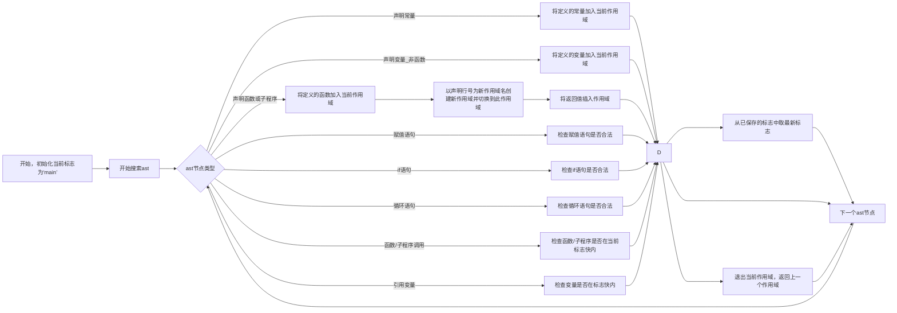
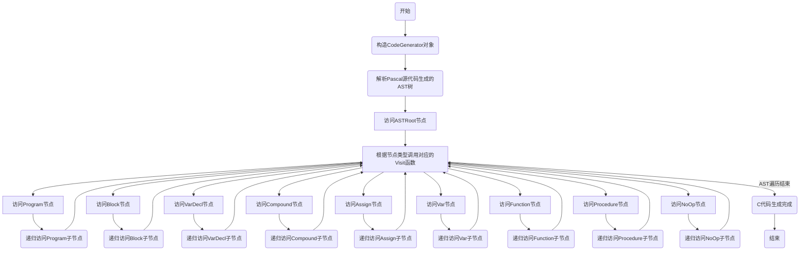

# 详细设计

## 词法分析

### 数据结构说明

接口部分:

- `yylex()`: 词法分析器的主函数, 用于从 stdin 中读取一个 token, 返回 token 的类型。类型是 int，表示 token 的类型。单字符的 token 的类型就是字符本身，例如 `+` 对应 int 值为 `'+'`；多字符的 token 的类型是一个预定义的宏，例如 `PROGRAM` 对应 int 值为 `TOK_PROGRAM`。多字符的预定义宏的值从 257 开始，自动分配。
- `TokenToString(int token)`: 将 token 的类型转换为对应的字符串。
- `yyreset(FILE *in)`: 重置词法分析器，使其从 `in` 中读取 token。
- `yylineno`: 用于保存当前 token 的行数。类型为 int，从 1 开始计数。
- `yycolno`: 用于保存当前 token 的列数。类型为 int，从 1 开始计数。
- `yyerrno`: 用于保存错误类型。类型为 int，用于保存最后一次的错误类型。
- `YYERRMSG`: 用于保存错误类型对应的错误信息。类型为 char**。
- `yytext`: 用于保存当前 token 的文本。类型为 char*，用于 TOK_ID 的词法属性。
- `yylval`: 用于保存当前 token 的值，例如数字的值。类型为 `union { uint32_t intval; double realval; char strval[MAX_STR_LEN]; }`。`intval` 保存整型数的值，`realval` 保存实数的值，`strval` 保存字符串的值。

内部部分:

- `yycolno_next`: 用于保存下一个 token 的列数。类型为 int，从 1 开始计数。
- `cmt_level`: 用于保存注释的嵌套深度。类型为 int，从 0 开始计数。
- `str_start_colno`: 用于保存字符串的起始列数。类型为 int，从 1 开始计数。用于在STRING状态下获得字符串的起始列数。

### 函数、方法说明

```c
// 这个宏会在每次识别出一个 token 时执行, 用于维护列号计数器以及将 token 的文本转换为小写
#define YY_USER_ACTION {                            \
    if (YYSTATE == INITIAL) {                       \
        char* p = yytext;                           \
        for (; *p; ++p) *p = tolower(*p);           \
    }                                               \
    yycolno = yycolno_next; yycolno_next += yyleng; \
}
// ...
// 设定词法分析器遇到 EOF 后直接退出
int yywrap() {
    return 1;
}
// ...
// 返回 token 的字符串描述, 方便输出和调试
char* TokenToString(int token) {
    static char* tokenNames[] = {
        // ...
    };
    return tokenNames[token];
}
```

### 算法描述

#### 处理注释

使用 Flex 提供的词法分析环境, 遇到 `{` 时注释开始, 深度加一, 遇到 `}` 时注释结束, 深度减一, 当深度为 0 时注释结束.

```
    // 声明注释状态
%x COMMENT

    // 开始注释, 初始化 cmt_level
"{"                    {BEGIN(COMMENT); cmt_level = 1;}
    // 嵌套注释, 深度加一
<COMMENT>"{"           {++cmt_level;}
    // 更新列号计数器
<COMMENT>\n            {yycolno_next = 1;}
    // 遇到 EOF, 报错
<COMMENT><<EOF>>       {yyerrno = ERR_EOF_IN_COMMENT; BEGIN(INITIAL); return TOK_ERROR;}
    // 遇到 } 时, 深度减一, 当深度为 0 时注释结束
<COMMENT>"}"           {--cmt_level; if (cmt_level == 0) BEGIN(INITIAL);}
    // 忽略注释中的其他字符
<COMMENT>.
```

#### 处理字符串

1. 遇到单引号（'），进入STRING状态，初始化字符串。
2. 在STRING状态下：
    - 遇到换行符或文件结尾，报告未正常结束的字符串错误。
    - 遇到非转义字符，将它们追加到字符串中。
    - 遇到转义序列，将对应的实际字符追加到字符串中。
    - 遇到其他转义字符，将原始的内容追加到字符串中。
4. 遇到单引号（'），返回到初始状态。
5. 注意使用`str_start_col`维护字符串的起始列号。


```
%x STRING

"'"                {str_start_col = yycolno; BEGIN(STRING); yylval.strval[0] = '\0';}
<STRING>\n         {yycolno = str_start_col; yycolno_next = 1; yyerrno = ERR_UNTERMINATED_STRING; BEGIN(INITIAL); return TOK_ERROR;}
<STRING><<EOF>>    {yyerrno = ERR_UNTERMINATED_STRING; BEGIN(INITIAL); return TOK_ERROR;}
<STRING>[^\\']     {yycolno = str_start_col; strcat(yylval.strval, yytext);}
<STRING>\\n        {yycolno = str_start_col; strcat(yylval.strval, "\n");}
<STRING>\\t        {yycolno = str_start_col; strcat(yylval.strval, "\t");}
<STRING>\\r        {yycolno = str_start_col; strcat(yylval.strval, "\r");}
<STRING>\\'        {yycolno = str_start_col; strcat(yylval.strval, "'");}
<STRING>\\.        {yycolno = str_start_col; strcat(yylval.strval, yytext);}
<STRING>"'"        {yycolno = str_start_col; BEGIN(INITIAL); return TOK_STRING;}
```

#### 处理关键字

直接匹配, 例如 `and {return TOK_AND;}`.

#### 处理标识符

使用正则表达式匹配字母开头, 中间包含字母和数字的字符串. 标识符的值已经在 `yytext` 中, 只需要返回 `TOK_ID` 即可.

```
alpha             [A-Za-z_]
alpha_num         ({alpha}|{digit})
identifier        {alpha}{alpha_num}*

{identifier}         {return TOK_ID;}
```

#### 处理整数

使用正则表达式匹配十进制整数, 并将其转换为整型数. 如果整数过大, 则报错. 用 `strtoul` 函数将字符串转换为整型数, 并将结果保存在 `yylval.intval` 中.

```
digit             [0-9]
unsigned_integer  {digit}+

{unsigned_integer}   {
    if (strlen(yytext) > MAX_INT_LEN) {
        yyerrno = ERR_INTEGER_TOO_LARGE;
        return TOK_ERROR;
    }
    unsigned long int n = strtoul(yytext, NULL, 10);
    if (n > INT_MAX) {
        yyerrno = ERR_INTEGER_TOO_LARGE;
        return TOK_ERROR;
    }
    yylval.intval = n;
    return TOK_INTEGER;
}
```

#### 处理浮点数

使用正则表达式匹配十进制浮点数, 并将其转换为浮点数. 用 `strtod` 函数将字符串转换为浮点数, 并将结果保存在 `yylval.realval` 中.

```
exponent          e[+-]?{digit}+
u                 {unsigned_integer}
real              ({u}\.{u}?|{u}?\.{u}){exponent}?

{real}/[^\.]         {
    yylval.realval = strtod(yytext, NULL);
    return TOK_REAL;
}
```

注意这里需要处理 `..` 作为 `TOK_DOTDOT` 的情况, 因此需要排除浮点数(REAL)后再接`.`的情况.

#### 处理运算符

若是单字符的运算符, 直接返回它的 char 值. 若是多字符的运算符, 返回对应的 token 值.

```
[+\-*/=<>\[\]\.,:;^()]   {return yytext[0];}
"<>"                {return TOK_NEQOP;}
"<="                {return TOK_LEOP;}
">="                {return TOK_GEOP;}
":="                {return TOK_ASSIGNOP;}
".."                {return TOK_DOTDOT;}
```

#### 忽略空白符

```
[ \t]*
```

#### 处理换行

重置列号计数器.

```
\n                 {yycolno_next = 1;}
```

#### 处理其他字符

报告未知字符错误.

```
.                  {yyerrno = ERR_ILLEGAL_INPUT; return TOK_ERROR;}
```

---

## 语法分析

### 概述

语法分析由两部分组成，包括 AST 树部分和语法分析器部分。

* AST 树部分：存储 AST 树，作为语法分析的输出，交给语义分析进一步处理
* 语法分析器部分：使用递归下降法，根据语法规则，将词法分析器输出的 token 序列转换为 AST 树

下面分别对 AST 树部分和语法分析器部分进行详细描述。

### AST 树 

#### 功能描述

存储各类语法结构的信息，包括语法结构的类型、位置、子节点等。 

#### 接口描述

以下接口描述部分将列出提供给其他模块访问 AST 树各节点位置、属性和子节点的接口。

##### class Ast

| 描述     | 接口                                                         | 参数 | 返回值 | 异常 |
| -------- | ------------------------------------------------------------ | ---- | ------ | ---- |
| 获取行号 | const int line() const                                             | 无   | 行号   | 无   |
| 获取列号 | const int column() const                                           | 无   | 列号   | 无   |

##### class Program

| 描述     | 接口                                                         | 参数 | 返回值 | 异常 |
| -------- | ------------------------------------------------------------ | ---- | ------ | ---- |
|  获取指向ProgramHead的指针  |const shared_ptr\<ProgramHead> &program_head() const|无|指向 [ProgramHead](#class-programhead) 的指针|无|
|  获取指向ProgramBody的指针  |const shared_ptr\<ProgramBody> &program_body() const|无|指向 [ProgramBody](#class-programbody) 的指针|无|

##### class ProgramHead

| 描述     | 接口                                                         | 参数 | 返回值 | 异常 |
| -------- | ------------------------------------------------------------ | ---- | ------ | ---- |
|  获取程序名  |const string &id() const|无|程序名|无|
|  获取参数列表  |const shared_ptr\<IdList> &id_list() const|无|指向 [IdList](#class-idlist) 的指针，若为空则表示无参数|无|

##### class ProgramBody

| 描述     | 接口                                                         | 参数 | 返回值 | 异常 |
| -------- | ------------------------------------------------------------ | ---- | ------ | ---- |
|  获取常量声明列表  |const vector\<shared_ptr\<ConstDeclaration>> &const_declarations() const|无|常量声明列表，可以为空，元素为指向 [ConstDeclaration](#class-constdeclaration) 的指针|无|
|  获取变量声明列表  |const vector\<shared_ptr\<VarDeclaration>> &var_declarations() const|无|变量声明列表，可以为空，元素为指向 [VarDeclaration](#class-vardeclaration) 的指针|无|
|  获取子程序声明列表  |const vector\<shared_ptr\<Subprogram>> &subprogram_declarations() const|无|子程序声明列表，可以为空，元素为指向 [Subprogram](#class-subprogram) 的指针|无|
|  获取语句  |const shared_ptr\<Statement> &statements() const|无|指向 [Statement](#class-statement) 的指针|无|

##### class ConstDeclaration

| 描述     | 接口                                                         | 参数 | 返回值 | 异常 |
| -------- | ------------------------------------------------------------ | ---- | ------ | ---- |
|  获取常量名  |const string &id() const|无|常量名|无|
|  获取常量值  |const shared_ptr\<Expression> &const_value() const|无|指向 [Expression](#class-expression) 的指针|无|

##### class VarDeclaration

| 描述     | 接口                                                         | 参数 | 返回值 | 异常 |
| -------- | ------------------------------------------------------------ | ---- | ------ | ---- |
|  获取变量名列表  |const shared_ptr\<IdList> &id_list() const|无|指向 [IdList](#class-idlist) 的指针|无|
| 获取类型  |const shared_ptr\<Type> &type() const|无|指向 [Type](#class-type) 的指针|无|

##### class Subprogram

| 描述     | 接口                                                         | 参数 | 返回值 | 异常 |
| -------- | ------------------------------------------------------------ | ---- | ------ | ---- |
|  获取子程序头  |const shared_ptr\<SubprogramHead> &subprogram_head() const|无|指向 [SubprogramHead](#class-subprogramhead) 的指针|无|
|  获取子程序体  |const shared_ptr\<SubprogramBody> &subprogram_body() const|无|指向 [SubprogramBody](#class-subprogrambody) 的指针|无|

##### class SubprogramHead

| 描述     | 接口                                                         | 参数 | 返回值 | 异常 |
| -------- | ------------------------------------------------------------ | ---- | ------ | ---- |
|  获取子程序名  |const string &id() const|无|子程序名|无|
| 获取返回类型  |const int& return_type() const|无|返回类型，-1表示该子程序为过程，否则为函数，返回值为 TOK_INTEGER_TYPE、 TOK_REAL_TYPE、 TOK_BOOLEAN_TYPE、 TOK_CHAR_TYPE 中的一个|无| 
|  获取参数列表  |const vector\<shared_ptr\<Parameter>> &parameters() const|无|参数列表，可以为空，元素为指向 [Parameter](#class-parameter) 的指针|无|

##### class SubprogramBody

| 描述     | 接口                                                         | 参数 | 返回值 | 异常 |
| -------- | ------------------------------------------------------------ | ---- | ------ | ---- |
|  获取常量声明列表  |const vector\<shared_ptr\<ConstDeclaration>> &const_declarations() const|无|常量声明列表，可以为空，元素为指向 [ConstDeclaration](#class-constdeclaration) 的指针|无|
|  获取变量声明列表  |const vector\<shared_ptr\<VarDeclaration>> &var_declarations() const|无|变量声明列表，可以为空，元素为指向 [VarDeclaration](#class-vardeclaration) 的指针|无|
|  获取语句  |const shared_ptr\<Statement> &statements() const|无|指向 [Statement](#class-statement) 的指针|无|

##### class Parameter

| 描述     | 接口                                                         | 参数 | 返回值 | 异常 |
| -------- | ------------------------------------------------------------ | ---- | ------ | ---- |
| 判断是否为引用参数  |const bool &is_var() const|无|是否为引用参数|无|
| 获取标志符列表 |const shared_ptr\<IdList> &id_list() const|无|指向 [IdList](#class-idlist) 的指针|无|
| 获取标志符类型  |const int &type() const|无|参数类型，返回值为 TOK_INTEGER_TYPE、 TOK_REAL_TYPE、 TOK_BOOLEAN_TYPE、 TOK_CHAR_TYPE 中的一个|无|

##### class IdList

| 描述     | 接口                                                         | 参数 | 返回值 | 异常 |
| -------- | ------------------------------------------------------------ | ---- | ------ | ---- |
| 获取标志符 | const string &operator[](const int index) const | index: 标志符下标 | 标志符 | 无 |
| 获取标志符个数 | const int &Size() const | 无 | 标志符个数 | 无 |

##### class Type

| 描述     | 接口                                                         | 参数 | 返回值 | 异常 |
| -------- | ------------------------------------------------------------ | ---- | ------ | ---- |
| 判断是否为数组类型  |const bool &is_array() const|无|是否为数组类型|无|
| 获取基础类型  |const int &basic_type() const|无|基础类型，返回值为 TOK_INTEGER_TYPE、 TOK_REAL_TYPE、 TOK_BOOLEAN_TYPE、 TOK_CHAR_TYPE 中的一个|无|
| 获取数组范围列表 | const vector\<Period> &periods() const | 无 | 数组范围列表，可以为空，元素为 [Period](#struct-typeperiod) | 无 |

##### struct Type::Period

| 描述     | 名称 |
| -------- | ------------------------------------------------------------ |
| 起始下标 | digits_1 |
| 终止下标 | digits_2 |

##### class Statement
| 描述     | 接口                                                         | 参数 | 返回值 | 异常 |
| -------- | ------------------------------------------------------------ | ---- | ------ | ---- |
| 判断是否为赋值语句  |virtual StatementType GetType() const = 0;|无|具体Statement Type|无|

##### class AssignmentStatement
| 描述     | 接口                                                         | 参数 | 返回值 | 异常 |
| -------- | ------------------------------------------------------------ | ---- | ------ | ---- |
| 获取左值  |const shared_ptr\<Variable> &variable() const|无|指向 ast::Variable 的指针|无|
| 获取右值  |const shared_ptr\<Expression> &expr() const|无|指向 ast::Expression 的指针|无|

##### class IfStatement
| 描述     | 接口                                                         | 参数 | 返回值 | 异常 |
| -------- | ------------------------------------------------------------ | ---- | ------ | ---- |
| 获取条件  |const shared_ptr\<Expression> &condition() const|无|指向 ast::Expression 的指针|无|
| 获取then语句  |const shared_ptr\<Statement> &then() const|无|指向 ast::Statement 的指针|无|
| 获取else语句  |const shared_ptr\<Statement> &else_part() const|无|指向 ast::Statement 的指针|无|

##### class CallStatement
| 描述     | 接口                                                         | 参数 | 返回值 | 异常 |
| -------- | ------------------------------------------------------------ | ---- | ------ | ---- |
| 获取子程序名  |const string &name() const|无|子程序名|无|
| 获取参数列表  |const shared_ptr\<ExpressionList> &expr_list() const|无|vector,每一个元素为一个expr|无|

##### class CompoundStatement
| 描述     | 接口                                                         | 参数 | 返回值 | 异常 |
| -------- | ------------------------------------------------------------ | ---- | ------ | ---- |
| 获取语句列表  |const vector\<shared_ptr\<Statement>> &statements() const|无|语句列表，可以为空，元素为指向 ast::Statement 的指针|无|

##### class ForStatement
| 描述     | 接口                                                         | 参数 | 返回值 | 异常 |
| -------- | ------------------------------------------------------------ | ---- | ------ | ---- |
| 获取循环变量  |const std::string &id() const|无|循环变量的名字|无|
| 获取循环变量的初始值  |const shared_ptr\<Expression> &from() const|无|指向 ast::Expression 的指针|无|
| 获取循环变量的终止值  |const shared_ptr\<Expression> &to() const|无|指向 ast::Expression 的指针|无|

##### class Expression
| 描述     | 接口                                                         | 参数 | 返回值 | 异常 |
| -------- | ------------------------------------------------------------ | ---- | ------ | ---- |
| 获取表达式类型  |virtual ExprType GetType() const = 0;|无|具体Expression Type|无|

##### enum ExprType
定义表示表达式类型的枚举类型，具体定义如下：
```c++
enum ExprType
    {
        INT = 0,
        REAL = 1,
        CHAR = 2,
        BOOLEAN = 3,
        CALL_OR_VAR = 4,
        VARIABLE = 5,
        CALL = 6,
        BINARY = 7,
        UNARY = 8,
        STRING = 9,
    };
```
| 描述     | 名称 |
| -------- | ------------------------------------------------------------ |
| 整数 | INT |
| 实数 | REAL |
| 字符 | CHAR |
| 布尔 | BOOLEAN |
| 变量或者函数调用 | CALL_OR_VAR |
| 变量 | VARIABLE |
| 函数调用 | CALL |
| 二元表达式 | BINARY |
| 一元表达式 | UNARY |
| 字符串 | STRING |

##### class StringValue
该类继承自Expression，表示字符串常量
| 描述     | 接口                                                         | 参数 | 返回值 | 异常 |
| -------- | ------------------------------------------------------------ | ---- | ------ | ---- |
| 获取字符串值  |const string &value() const|无|字符串值|无|

##### class IntegerValue
该类继承自Expression，表示整数常量
| 描述     | 接口                                                         | 参数 | 返回值 | 异常 |
| -------- | ------------------------------------------------------------ | ---- | ------ | ---- |
| 获取整数值  |const int &value() const|无|整数值|无|

##### class RealValue
该类继承自Expression，表示实数常量
| 描述     | 接口                                                         | 参数 | 返回值 | 异常 |
| -------- | ------------------------------------------------------------ | ---- | ------ | ---- |
| 获取实数值  |const double &value() const|无|实数值|无|

##### class CharValue
该类继承自Expression，表示字符常量
| 描述     | 接口                                                         | 参数 | 返回值 | 异常 |
| -------- | ------------------------------------------------------------ | ---- | ------ | ---- |
| 获取字符值  |const char &ch() const|无|字符值|无|

##### class BooleanValue
该类继承自Expression，表示布尔常量
| 描述     | 接口                                                         | 参数 | 返回值 | 异常 |
| -------- | ------------------------------------------------------------ | ---- | ------ | ---- |
| 获取布尔值  |const bool &value() const|无|布尔值|无|

##### class CallOrVar 
该类继承自Expression，表示变量或者函数调用，在语法分析时由于没有符号表信息，故在有些情况下语法分析阶段无法区分变量和函数调用(如`a := Add`，`Add`有可能是函数也有可能是变量)，因此将二者统一表示为CallOrVar，语义分析阶段再根据符号表信息进行区分
| 描述     | 接口                                                         | 参数 | 返回值 | 异常 |
| -------- | ------------------------------------------------------------ | ---- | ------ | ---- |
| 获取变量或者函数调用的名字  |const string &id() const|无|变量或者函数调用的名字|无|

##### class CallValue
该类继承自CallOrVar，表示函数调用，在CallOrVar的基础上增加了参数列表，当碰到形如`Add(1,2)`这样的函数调用时，语法分析阶段会将其解析为CallValue
| 描述     | 接口                                                         | 参数 | 返回值 | 异常 |
| -------- | ------------------------------------------------------------ | ---- | ------ | ---- |
| 获取参数列表  |const shared_ptr\<ExpressionList> &params() const|无|参数列表，每一个元素为一个expr|无|

##### class Variable
该类继承自CallOrVar，表示变量，在CallOrVar的基础上增加了下标列表，当碰到形如`a[1]`这样的变量时，语法分析阶段会将其解析为Variable
| 描述     | 接口                                                         | 参数 | 返回值 | 异常 |
| -------- | ------------------------------------------------------------ | ---- | ------ | ---- |
| 获取下标列表  |const shared_ptr\<ExpressionList> &expr_list() const|无|下标列表，每一个元素为一个expr|无|

##### class BinaryExpr
该类继承自Expression，表示二元表达式，如`a+b`
| 描述     | 接口                                                         | 参数 | 返回值 | 异常 |
| -------- | ------------------------------------------------------------ | ---- | ------ | ---- |
| 获取操作符  |const string &op() const|无|操作符|无|
| 获取左操作数  |const shared_ptr\<Expression> &lhs() const|无|左操作数|无|
| 获取右操作数  |const shared_ptr\<Expression> &rhs() const|无|右操作数|无|

##### class UnaryExpr
该类继承自Expression，表示一元表达式，如`-a`
| 描述     | 接口                                                         | 参数 | 返回值 | 异常 |
| -------- | ------------------------------------------------------------ | ---- | ------ | ---- |
| 获取操作符  |const string &op() const|无|操作符|无|
| 获取操作数  |const shared_ptr\<Expression> &factor() const|无|操作数|无|


#### 数据结构定义

为了完整表示源程序的所有信息，我们为pascal各种语法结构设计了相应的AST节点，各个类的定义均放在`pascal2c::ast`命名空间中，具体定义如下文所述。

##### class Ast

所有AST节点的基类，包含了行号和列号信息

```c++
// Abstract Syntax Tree
class Ast
{
public:
    // param:
    //     line is the line number of the first token of the node
    //     column is the column number of the first token of the node
    Ast(const int line, const int column)
        : line_(line), column_(column){};

    Ast() : line_(1), column_(1){};

    inline void SetLineAndColumn(const int line, const int column)
    {
        line_ = line;
        column_ = column;
    }

    inline virtual const int &line() const { return line_; }

    inline virtual const int &column() const { return column_; }

protected:
    // for test use
    // param:
    //     str_s is the string stream to output to
    //     level is the indentation level
    inline static void
    IndentOutput(std::stringstream &str_s, const int level)
    {
        int temp = level;
        while (temp-- > 0)
            str_s << "    ";
    }

    // for test use
    // param:
    //     str_s is the string stream to output to
    inline void LineColumnOutput(std::stringstream &str_s) const
    {
        str_s << line_ << ":" << column_ << " ";
    }

private:
    int line_;   // line number of the first token of the node
    int column_; // column number of the first token of the node
};
```

##### class Program

AST 树根节点，存有指向 `ProgramHead`、`ProgramBody`的指针

```c++
// Program -> ProgramHead; ProgramBody.
//
// eg. program f(a, b); var a, b; begin a := 1; b := 2; end.
class Program : public Ast
{
public:
    // param:
    //     program_head is the shared pointer of ProgramHead
    //     program_body is the shared pointer of ProgramBody
    Program(const int line, const int column, shared_ptr<ProgramHead> program_head, shared_ptr<ProgramBody> program_body)
        : Ast(line, column), program_head_(std::move(program_head)), program_body_(std::move(program_body)) {}

    inline const shared_ptr<ProgramHead> &program_head() const { return program_head_; }

    inline const shared_ptr<ProgramBody> &program_body() const { return program_body_; }

    // for test use
    // param:
    //     level is the level of indentation that should be applied to the returned string
    // return:
    //     a string represents the statement
    const string ToString(const int level) const;

private:
    shared_ptr<ProgramHead> program_head_; // eg. program f(a, b)
    shared_ptr<ProgramBody> program_body_; // eg. var a, b; begin a := 1; b := 2; end.
};
```

##### class ProgramHead

存储程序头部信息，存有程序名和程序输入参数列表

```c++
// ProgramHead -> program id(IdList) | program id
//
// eg. program f(a, b)
// eg. program f
class ProgramHead : public Ast
{
public:
    // param:
    //     id is the program name
    //     id_list is the parameters of the program
    ProgramHead(const int line, const int column, const string &id, shared_ptr<IdList> id_list)
        : Ast(line, column), id_(id), id_list_(std::move(id_list)) {}

    // param:
    //     id is the program name
    ProgramHead(const int line, const int column, const string &id) : Ast(line, column), id_(id), id_list_(nullptr) {}

    inline const string &id() const { return id_; }

    inline const shared_ptr<IdList> &id_list() const { return id_list_; }

    // check if the program has parameters
    // return:
    //     true if the program has parameters
    inline const bool HasIdList() const { return id_list_ != nullptr; }

    // for test use
    // param:
    //     level is the level of indentation that should be applied to the returned string
    // return:
    //     a string represents the statement
    const string ToString(const int level) const;

private:
    string id_;                  // program name, eg. f
    shared_ptr<IdList> id_list_; // parameters, can be empty, eg. (a, b)
};
```


##### class ProgramBody

存储程序体信息，存有常数声明列表，变量声明列表，子程序列表以及程序内容

```c++
// ProgramBody -> (const const_declarations | ε)
//                (var var_declarations | ε)
//                (subprogram_declarations | ε)
//                statements
// const_declarations -> ConstDeclaration | (const_declarations ; ConstDeclaration)
// var_declarations -> VarDeclaration | var_declarations ; VarDeclaration
// subprogram_declarations -> Subprogram | subprogram_declarations ; Subprogram
//
// eg. const a = 1; b = 2; var c, d : integer; procedure p; begin end; begin end
class ProgramBody : public Ast
{
public:
    ProgramBody(const int line, const int column)
        : Ast(line, column) {}

    inline const vector<shared_ptr<ConstDeclaration>> &const_declarations() const { return const_declarations_; }

    inline const vector<shared_ptr<VarDeclaration>> &var_declarations() const { return var_declarations_; }

    inline const vector<shared_ptr<Subprogram>> &subprogram_declarations() const { return subprogram_declarations_; }

    inline const shared_ptr<Statement> &statements() const { return statements_; }

    inline void AddConstDeclaration(shared_ptr<ConstDeclaration> const_declaration)
    {
        const_declarations_.push_back(std::move(const_declaration));
    }

    inline void AddVarDeclaration(shared_ptr<VarDeclaration> var_declaration)
    {
        var_declarations_.push_back(std::move(var_declaration));
    }

    inline void AddSubprogram(shared_ptr<Subprogram> subprogram)
    {
        subprogram_declarations_.push_back(std::move(subprogram));
    }

    inline void set_statements(shared_ptr<Statement> statements) { statements_ = std::move(statements); }

    // for test use
    // param:
    //     level is the level of indentation that should be applied to the returned string
    // return:
    //     a string represents the statement
    const string ToString(const int level) const;

private:
    vector<shared_ptr<ConstDeclaration>> const_declarations_; // can be empty, eg. const a = 1; b = 2;
    vector<shared_ptr<VarDeclaration>> var_declarations_;     // can be empty, eg. var c, d : integer;
    vector<shared_ptr<Subprogram>> subprogram_declarations_;  // can be empty, eg. procedure p; begin end;
    shared_ptr<Statement> statements_;                        // eg. begin end
};
```

##### class ConstDeclaration

存储常量声明信息， 存有常量名称和值

```c++
// ConstDeclaration -> id= (IntegerValue | RealValue | UnaryExpr | CharValue)
//
// eg. a=1, b=2.0, c=-1, d='a'
class ConstDeclaration : public Ast
{
public:
    // param:
    //     id is the identifier
    //     const_value is the value of the identifier
    ConstDeclaration(const int line, const int column, const string &id, shared_ptr<Expression> const_value)
        : Ast(line, column), id_(id), const_value_(std::move(const_value)) {}

    inline const string &id() const { return id_; }

    inline const shared_ptr<Expression> &const_value() const { return const_value_; }

    // for test use
    // param:
    //     level is the level of indentation that should be applied to the returned string
    // return:
    //     a string represents the statement
    const string ToString(const int level) const;

private:
    string id_;                          // the identifier, eg. a
    shared_ptr<Expression> const_value_; // IntegerValue | RealValue | UnaryExpr | CharValue from expr.h, eg. 1, 2.0, -1, 'a'
}; 
```

##### class VarDeclaration

存储变量声明信息，存有类型名，变量名。

```c++
// VarDeclaration -> IdList : Type
//
// eg. a, b, c : integer
// eg. d, e : array [1..10] of integer
class VarDeclaration : public Ast
{
public:
    // param:
    //     id_list is a list of identifiers
    //     type is the type of the identifiers
    VarDeclaration(const int line, const int column, shared_ptr<IdList> id_list, shared_ptr<Type> type)
        : Ast(line, column), id_list_(std::move(id_list)), type_(std::move(type)) {}

    inline const shared_ptr<IdList> &id_list() const { return id_list_; }

    inline const shared_ptr<Type> &type() const { return type_; }

    // for test use
    // param:
    //     level is the level of indentation that should be applied to the returned string
    // return:
    //     a string represents the statement
    const string ToString(const int level) const;

private:
    shared_ptr<IdList> id_list_; // a list of identifiers, eg. a, b, c
    shared_ptr<Type> type_;      // the type of the identifiers, eg. integer
}; 
```

##### class Subprogram

存储子程序信息，包含子程序头`SubprogramHead`和子程序体`SubprogramBody`

```c++
// Subprogram -> SubprogramHead ; SubprogramBody
//
// eg. function f(a, b : integer) : integer; begin end
// eg. procedure p(var c, d : real); begin end
class Subprogram : public Ast
{
public:
    // param:
    //     subprogram_head is the head of the subprogram
    //     subprogram_body is the body of the subprogram
    Subprogram(const int line, const int column, shared_ptr<SubprogramHead> subprogram_head, shared_ptr<SubprogramBody> subprogram_body)
        : Ast(line, column), subprogram_head_(std::move(subprogram_head)), subprogram_body_(std::move(subprogram_body)) {}

    inline const shared_ptr<SubprogramHead> &subprogram_head() const { return subprogram_head_; }

    inline const shared_ptr<SubprogramBody> &subprogram_body() const { return subprogram_body_; }

    // for test use
    // param:
    //     level is the level of indentation that should be applied to the returned string
    // return:
    //     a string represents the statement
    const string ToString(const int level) const;

private:
    shared_ptr<SubprogramHead> subprogram_head_; // eg. function f(a, b : integer) : integer;
    shared_ptr<SubprogramBody> subprogram_body_; // eg. begin ... end;
}; 
```

##### class SubprogramHead

存储子程序头信息，子程序可能为 function 或 procedure。存有子程序名，子程序参数以及返回值类型。

```c++
// SubprogramHead -> function id (ε | parameters) : (TOK_INTEGER_TYPE | TOK_REAL_TYPE | TOK_BOOLEAN_TYPE | TOK_CHAR_TYPE) | procedure id (ε | parameters)
// parameters -> Parameter | parameters ; Parameter
//
// eg. function f(a, b : integer) : integer
// eg. procedure p(var c, d : real)
class SubprogramHead : public Ast
{
public:
    // param:
    //     id is the name of the subprogram
    //     return_type is the return type of the subprogram, -1 means procedure
    SubprogramHead(const int line, const int column, const string &id, const int return_type = -1)
        : Ast(line, column), id_(id), return_type_(return_type) {}

    inline const string &id() const { return id_; }

    // return:
    //     the return type of the subprogram, -1 means procedure
    inline const int &return_type() const { return return_type_; }

    inline const vector<shared_ptr<Parameter>> &parameters() const { return parameters_; }

    inline void AddParameter(shared_ptr<Parameter> parameter) { parameters_.push_back(std::move(parameter)); }

    inline void set_return_type(const int return_type) { return_type_ = return_type; }

    // return:
    //     true if the subprogram is a function
    inline const bool is_function() const { return return_type_ != -1; }

    // for test use
    // param:
    //     level is the level of indentation that should be applied to the returned string
    // return:
    //     a string represents the statement
    const string ToString(const int level) const;

private:
    string id_;                                // name of the subprogram, eg. f, p
    int return_type_;                          // -1 means procedure,TOK_INTEGER_TYPE | TOK_REAL_TYPE | TOK_BOOLEAN_TYPE | TOK_CHAR_TYPE ,eg. integer, real
    vector<shared_ptr<Parameter>> parameters_; // can be empty, eg. a, b : integer
}; 
```

##### class SubprogramBody

存储子程序体信息，存有常数声明列表，变量声明列表以及子程序内容

```c++
// SubprogramBody -> (const const_declarations | ε)
//                   (var var_declarations | ε)
//                   statements
// const_declarations -> id=ConstValue | const_declarations ; id=ConstValue
// var_declarations -> IdList : Type | var_declarations ; IdList : Type
//
// eg. const a = 1; b = 2; var c, d : integer; begin end
class SubprogramBody : public Ast
{
public:
    SubprogramBody(const int line, const int column) : Ast(line, column) {}

    inline const vector<shared_ptr<ConstDeclaration>> &const_declarations() const
    {
        return const_declarations_;
    }

    inline const vector<shared_ptr<VarDeclaration>> &var_declarations() const { return var_declarations_; }

    inline const shared_ptr<Statement> &statement_list() const { return statements_; }

    inline void AddConstDeclaration(shared_ptr<ConstDeclaration> const_declaration)
    {
        const_declarations_.push_back(std::move(const_declaration));
    }

    inline void AddVarDeclaration(shared_ptr<VarDeclaration> var_declaration)
    {
        var_declarations_.push_back(std::move(var_declaration));
    }

    inline void set_statements(shared_ptr<Statement> statements) { statements_ = std::move(statements); }

    // for test use
    // param:
    //     level is the level of indentation that should be applied to the returned string
    // return:
    //     a string represents the statement
    const string ToString(const int level) const;

private:
    vector<shared_ptr<ConstDeclaration>> const_declarations_; // can be empty, eg. const a = 1; b = 2;
    vector<shared_ptr<VarDeclaration>> var_declarations_;     // can be empty, eg. var c, d : integer;
    shared_ptr<Statement> statements_;                        // eg. begin end
}; 
```

##### class Parameter

存储子程序参数信息，参数可以为值或引用，存有参数名列表，参数类型以及是否为引用。

```c++
// Parameter -> var_parameter | value_parameter
// var_parameter -> var value_parameter
// value_parameter -> id_list : (TOK_INTEGER_TYPE | TOK_REAL_TYPE | TOK_BOOLEAN_TYPE | TOK_CHAR_TYPE)
//
// eg. a, b : integer
// eg. var c, d : real
class Parameter : public Ast
{
public:
    // param:
    //     is_var is true if the parameter is var parameter
    //     id_list is a list of identifiers
    //     type is the type of the identifiers
    Parameter(const int line, const int column, const bool is_var, shared_ptr<IdList> id_list, const int type)
        : Ast(line, column), is_var_(is_var), id_list_(std::move(id_list)), type_(type) {}

    inline const bool &is_var() const { return is_var_; }

    inline const shared_ptr<IdList> &id_list() const { return id_list_; }

    inline const int &type() const { return type_; }

    // for test use
    // param:
    //     level is the level of indentation that should be applied to the returned string
    // return:
    //     a string represents the statement
    const string ToString(const int level) const;

private:
    bool is_var_;                // true if the parameter is var parameter
    shared_ptr<IdList> id_list_; // a list of identifiers, eg. a, b
    int type_;                   // TOK_INTEGER_TYPE | TOK_REAL_TYPE | TOK_BOOLEAN_TYPE | TOK_CHAR_TYPE from lexer, eg. integer, real, boolean, char
}; 
```

##### class IdList

存储标志符列表

```c++
// IdList -> id | IdList , id
//
// eg. a, b, c
class IdList : public Ast
{
public:
    IdList(const int line, const int column) : Ast(line, column) {}

    // param:
    //     id is the identifier
    // return:
    //     the id at the index
    inline const string &operator[](const int index) const { return id_list_[index]; }

    // return:
    //     the number of identifiers
    inline const int Size() const { return id_list_.size(); }

    inline void AddId(const string &id) { id_list_.push_back(id); }

    // for test use
    // param:
    //     level is the level of indentation that should be applied to the returned string
    // return:
    //     a string represents the statement
    const string ToString(const int level) const;

private:
    vector<string> id_list_; // a list of identifiers, eg. a, b, c
};
```

##### class Type

存储类型信息，类型可以为普通类型（integer, real, bool, char）或数组类型，存有基础类型（lexer 输出的 `TOK_INTEGER_TYPE`, `TOK_REAL_TYPE`, `TOK_BOOLEAN_TYPE`, `TOK_CHAR_TYPE`）、是否为数组，若为数组还应包括数组下标范围。

包含 struct `Period`，存储数组下标，存有下标上界和下界。

```c++
// Type -> (TOK_INTEGER_TYPE | TOK_REAL_TYPE | TOK_BOOLEAN_TYPE | TOK_CHAR_TYPE) | array [Period] of (TOK_INTEGER_TYPE | TOK_REAL_TYPE | TOK_BOOLEAN_TYPE | TOK_CHAR_TYPE)
// Period -> digits ... digits | period , digits ... digits
//
// eg. integer, real, boolean, char
// eg. array [1..10] of integer, array [1..10, 20..30] of real
class Type : public Ast
{
public:
    // digits_1 is the lower bound, digits_2 is the upper bound
    //
    // e.g. 1..10
    struct Period
    {
        int digits_1;
        int digits_2;
    };

    // param:
    //     is_array is true if the type is array type
    Type(const int line, const int column, const bool is_array) : Ast(line, column), is_array_(is_array), basic_type_(-1) {}

    // param:
    //     is_array is true if the type is array type
    //     basic_type is the basic type of the array, eg. integer, real, boolean, char
    Type(const int line, const int column, const bool is_array, const int basic_type)
        : Ast(line, column), is_array_(is_array), basic_type_(basic_type) {}

    inline const bool &is_array() const { return is_array_; }

    inline const int &basic_type() const { return basic_type_; }

    inline const vector<Period> &periods() const { return periods_; }

    inline void AddPeriod(const Period &period) { periods_.push_back(period); }

    inline void set_basic_type(const int basic_type) { basic_type_ = basic_type; }

    // for test use
    // param:
    //     level is the level of indentation that should be applied to the returned string
    // return:
    //     a string represents the statement
    const string ToString(const int level) const;

private:
    bool is_array_;          // true if the type is array type
    int basic_type_;         // TOK_INTEGER_TYPE | TOK_REAL_TYPE | TOK_BOOLEAN_TYPE | TOK_CHAR_TYPE from lexer, eg. integer, real, boolean, char
    vector<Period> periods_; // can be empty, eg. [1..10, 20..30]
}; 
```

##### class Statement

该类表示一种pascal中的语句，为各种`Statement`的基类，定义如下

```c++
// base type of statement
class Statement {
public:
    // for test use
    // param:
    //     level is the level of indentation that should be applied to the returned string
    // return:
    //     a string represents the statement
    virtual std::string ToString(int level) const = 0;
    // to get exact statement type of the statement
    // return:
    //     exact type of statement
    virtual StatementType GetType() const = 0;
};
```

其中`StatementType`为枚举类型，其定义如下

```c++
// to identify what type a statement is
enum StatementType{
    ASSIGN_STATEMENT = 1,
    CALL_STATEMENT = 2,
    COMPOUND_STATEMENT = 3,
    IF_STATEMENT = 4,
    FOR_STATEMENT = 5,
};
```

##### class AssignStatement

该类表示一条pascal中的赋值语句，定义如下

```c++
// var_ := expr_
// var_ can be: var_name    var_name[expr_list]  func_id
class AssignStatement : public Statement
{
public:
    // basic constructor
    // param:
    //     var is used to initialize the class member var_
    //     expr is used to initialize the class member expr_
    AssignStatement(std::shared_ptr<Variable> var, std::shared_ptr<Expression> expr) : var_(std::move(var)), expr_(
                                                                                                                    std::move(expr)) {}

    AssignStatement(int line,int col, std::shared_ptr<Variable> var, std::shared_ptr<Expression> expr) :Statement(line,col), var_(std::move(var)), expr_(
            std::move(expr)) {}

    inline StatementType GetType() const override { return ASSIGN_STATEMENT; }

    std::string ToString(int level) const override;

    GETTER(std::shared_ptr<Variable>, var);
    GETTER(std::shared_ptr<Expression>, expr);

private:
    std::shared_ptr<Variable> var_;    // lhs of the assign statement
    std::shared_ptr<Expression> expr_; // rhs of the assign statement
};
```

其中`Variable`类型和`Expression`类型放在后文解释。

##### class CallStatement

该类表示一条pascal中调用子程序(procedure或者function)的语句，定义如下

```c++
// represents procedure and function call
// name_ is procedure name or function name
// expr_list_ is the arguments of procedure or function
// expr_list_ can be empty
// write and read are treated as CallStatement as built-in function
class CallStatement : public Statement
{
public:
    CallStatement(std::string name, vector<std::shared_ptr<Expression>> expr_list) : name_(std::move(name)), expr_list_(std::move(expr_list)) {}
    CallStatement(int line,int col, std::string name, vector<std::shared_ptr<Expression>> expr_list) :
                        Statement(line,col), name_(std::move(name)), expr_list_(std::move(expr_list)) {}
    explicit CallStatement(std::string name) : name_(std::move(name)) {}
    explicit CallStatement(int line,int col,std::string name) :Statement(line,col), name_(std::move(name)) {}


    inline StatementType GetType() const override { return CALL_STATEMENT; }

    std::string ToString(int level) const override;

    GETTER(std::string, name);
    GETTER(vector<std::shared_ptr<Expression>>, expr_list);

private:
    std::string name_; // procedure name or function name

    vector<std::shared_ptr<Expression>> expr_list_; // can be empty:  e.g. procedure_name;   func();
};
```

##### class CompoundStatement

该类表示pascal中以`begin`和`end`包围的一系列语句，定义如下

```c++
// a series of statements
// begin
//    statement1 ;
//    statement2 ;
//    ...
// end
class CompoundStatement : public Statement
{
public:
    explicit CompoundStatement(vector<std::shared_ptr<Statement>> statements) : statements_(std::move(statements)) {}
    explicit CompoundStatement(int line,int col, vector<std::shared_ptr<Statement>> statements) :
                            Statement(line,col), statements_(std::move(statements)) {}

    inline StatementType GetType() const override { return COMPOUND_STATEMENT; }

    std::string ToString(int level) const override;

    GETTER(vector<std::shared_ptr<Statement>>, statements);

private:
    vector<std::shared_ptr<Statement>> statements_; // vector of statement
};
```

##### class  IfStatement

该类表示pascal中的`if`语句，定义如下

```c++
// if condition_ then
//      then_
// else
//      else_part_
class IfStatement : public Statement
{
public:
    IfStatement(std::shared_ptr<Expression> cond, std::shared_ptr<Statement> then,
                std::shared_ptr<Statement> else_part)
        : condition_(std::move(cond)), then_(std::move(then)), else_part_(std::move(else_part)) {}

    IfStatement(int line,int col, std::shared_ptr<Expression> cond, std::shared_ptr<Statement> then,
                std::shared_ptr<Statement> else_part) :
                Statement(line,col), condition_(std::move(cond)), then_(std::move(then)), else_part_(std::move(else_part)) {}

    inline StatementType GetType() const override { return IF_STATEMENT; }

    std::string ToString(int level) const override;

    GETTER(std::shared_ptr<Expression>, condition);
    GETTER(std::shared_ptr<Statement>, then);
    GETTER(std::shared_ptr<Statement>, else_part);

private:
    std::shared_ptr<Expression> condition_; // condition expression
    std::shared_ptr<Statement> then_;       // then part of if statement
    std::shared_ptr<Statement> else_part_;       // else part of if statement, can be empty
};
```

##### class ForStatement

该类表示一条pascal中的`for`语句，定义如下

```c++
// for id_ := from_ to to_ do statement_
class ForStatement : public Statement
{
public:
    ForStatement(std::shared_ptr<Expression> from, std::shared_ptr<Expression> to,
                    std::shared_ptr<Statement> statement)
        : from_(std::move(from)), to_(std::move(to)), statement_(std::move(statement)) {}

    ForStatement(std::string id, std::shared_ptr<Expression> from, std::shared_ptr<Expression> to,
                    std::shared_ptr<Statement> statement)
            :id_(std::move(id)), from_(std::move(from)), to_(std::move(to)), statement_(std::move(statement)) {}

    ForStatement(int line,int col, std::string id, std::shared_ptr<Expression> from, std::shared_ptr<Expression> to,
                    std::shared_ptr<Statement> statement) :
                    Statement(line,col), id_(std::move(id)), from_(std::move(from)), to_(std::move(to)), statement_(std::move(statement)) {}

    inline StatementType GetType() const override { return FOR_STATEMENT; }

    std::string ToString(int level) const override;

    GETTER(std::string, id);
    GETTER(std::shared_ptr<Expression>, from);
    GETTER(std::shared_ptr<Expression>, to);
    GETTER(std::shared_ptr<Statement>, statement);

private:
    std::string id_;
    std::shared_ptr<Expression> from_;
    std::shared_ptr<Expression> to_;
    std::shared_ptr<Statement> statement_;
};
```

##### class Expression

该类表示pascal中一条合法的表达式，由于pascal中表达式有很多个部分构成、有很多种表达式，故统一用一个`Expression`类来做表达式的基类，该类定义如下

```c++
// base class for expression
class Expression : public Ast
{
public:
    // for test use
    // param:
    //     level is the level of indentation that should be applied to the returned string
    // return:
    //     a string represents the statement
    virtual std::string ToString(int level) const = 0;

    // get the exact type of the expression
    // return:
    //     one of ExprType
    virtual ExprType GetType() const = 0;

    Expression() = default;
    Expression(int line, int col) : Ast(line, col) {}
};
```

其中`ExprType`的定义如下

```c++
enum ExprType
{
    INT = 0,
    REAL = 1,
    CHAR = 2,
    BOOLEAN = 3,
    CALL_OR_VAR = 4,
    VARIABLE = 5,
    CALL = 6,
    BINARY = 7,
    UNARY = 8,
    STRING = 9,
};
```

##### class IntegerValue

单独的整数可以作为合法的pascal表达式，定义表示一个整数的节点如下

```c++
// leaf node of an expression
// this node represents an integer value in pascal
// e.g. 123  482
// value_ stores the value of the integer
class IntegerValue : public Expression
{
public:
    explicit IntegerValue(int value) : value_(value) {}
    IntegerValue(int line, int col, int value) : Expression(line, col), value_(value) {}

    std::string ToString(int level) const override;
    inline ExprType GetType() const override { return INT; }

    GETTER(int, value);

private:
    int value_;
};
```

##### Class RealValue

单独的实数可以作为合法的pascal表达式，定义表示一个实数的节点如下

```c++
// leaf node of an expression
// this node represents a real value in pascal
// e.g. 12.34
// value_ stores the value of the real number
class RealValue : public Expression
{
public:
    explicit RealValue(double value) : value_(value) {}
    RealValue(int line, int col, double value) : Expression(line, col), value_(value) {}

    std::string ToString(int level) const override;
    inline ExprType GetType() const override { return REAL; }

    GETTER(double, value);

private:
    double value_;
};
```

##### class CharValue

该类表示一个字符，形如`'a'`，表示该类型值的节点如下

```c++
// leaf node
// represent a character
// e.g. 'a'
// ch_ store the ascii code of the character
class CharValue : public Expression
{
public:
    explicit CharValue(int ch) : ch_(ch) {}
    CharValue(int line,int col, int ch) :Expression(line, col), ch_(ch) {}

    std::string ToString(int level) const override;
    inline ExprType GetType() const override { return CHAR; }

    GETTER(int, ch);
private:
    int ch_;
};
```

##### class BooleanValue

该类表示一个`bool`值，可以为`true`或`false`，定义如下

```c++
// leaf node
// represent a boolean value
// e.g. true  false
// value_ store the value
class BooleanValue : public Expression
{
public:
    explicit BooleanValue(bool value) : value_(value) {}
    BooleanValue(int line, int col, bool value) : Expression(line, col), value_(value) {}

    std::string ToString(int level) const override;
    inline ExprType GetType() const override { return BOOLEAN; }

    GETTER(bool, value);
private:
    bool value_;
};
```
##### class CallOrVar

该类表示一个函数调用或者一个变量，定义如下

```c++
// when we met some statement like var1 := A;
// we don't know whether var1 is a variable or a function call,
// so we use this node to represent it
class CallOrVar : public Expression
{
public:
    explicit CallOrVar(std::string id) : id_(std::move(id)) {}
    CallOrVar(int line, int col, std::string id) : Expression(line, col), id_(std::move(id)) {}

    std::string ToString(int level) const override;
    inline virtual ExprType GetType() const override { return CALL_OR_VAR; }

    GETTER(std::string, id);
protected:
    // id_ is the name of the variable or function
    // in the example of var1 := A;
    // id_ is "A"
    // and we do not need an expression list since no matter
    // it is a variable or a function call, it has no parameters
    std::string id_;
};
```

##### class CallValue

该类表示调用一个函数产生的值，如`add(1,2)`，其中`add`为一个函数，返回值为整数。该类节点定义如下

```c++
// represent a function call
// e.g. add(3+4,5)
// params_ is a vector of expressions used as parameters of the function
// params_ can be empty
class CallValue : public CallOrVar
{
public:
    explicit CallValue(std::string func_name) : CallOrVar(std::move(func_name)) {}
    CallValue(int line, int col, std::string func_name) : CallOrVar(line, col, std::move(func_name)) {}
    CallValue(std::string func_name, vector<std::shared_ptr<Expression>> params) : CallOrVar(std::move(func_name)) , params_(std::move(params)) {}
    CallValue(int line, int col, std::string func_name, vector<std::shared_ptr<Expression>> params) :
                                    CallOrVar(line, col, std::move(func_name)), params_(std::move(params)) {}

    void AddParam(std::shared_ptr<Expression> expr);

    std::string ToString(int level) const override;
    inline ExprType GetType() const override { return CALL; }

    GETTER(vector<std::shared_ptr<Expression>>, params);

private:
    // id is defined in CallOrValue base class
    // std::string id_;
    vector<std::shared_ptr<Expression>> params_;
};
```

##### class Variable

该类表示一个pascal变量，如`num[3] v[i+1,j]`具体定义如下

```c++
// represent variable in pascal
// e.g. count  num[3+i]  pos[3,4]
// in the example of pos[3,4] the elements of expr_list_ is 3 and 4
// expr_list_ can be empty
class Variable : public CallOrVar
{
public:
    explicit Variable(std::string id) : CallOrVar(std::move(id)) {}
    Variable(int line, int col, std::string id) : CallOrVar(line, col, std::move(id)) {}
    Variable(std::string id, vector<std::shared_ptr<Expression>> expr_list) : CallOrVar(std::move(id)) , expr_list_(
                                                                                                        std::move(expr_list)) {}
    Variable(int line, int col, std::string id, vector<std::shared_ptr<Expression>> expr_list) :
            CallOrVar(line, col, std::move(id)), expr_list_(std::move(expr_list)) {}

    void AddExpr(std::shared_ptr<Expression> expr);

    std::string ToString(int level) const override;
    inline ExprType GetType() const override { return VARIABLE; }

    GETTER(vector<std::shared_ptr<Expression>>, expr_list);

private:
    // id is defined in CallOrValue base class
    // std::string id_;
    vector<std::shared_ptr<Expression>> expr_list_;
};
```

##### class BinaryExpr

该类表示一个二元运算表达式，具体定义如下
```c++
// represent binary expression
// e.g. 3 + 4 + 5    3 * ((6 + 7) - 2)
// in the example of 3 + 4 + 5, lhs_ is 3 + 4 ,rhs_ is 5 and op_ is '+'
class BinaryExpr : public Expression
{
public:
    BinaryExpr(int op, std::shared_ptr<Expression> lhs, std::shared_ptr<Expression> rhs) : op_(op), lhs_(std::move(lhs)), rhs_(std::move(rhs)) {}
    BinaryExpr(int line, int col, int op, std::shared_ptr<Expression> lhs, std::shared_ptr<Expression> rhs) :
            Expression(line, col), op_(op), lhs_(std::move(lhs)), rhs_(std::move(rhs)) {}

    std::string ToString(int level) const override;
    inline ExprType GetType() const override { return BINARY; }

    GETTER(int, op);
    GETTER(std::shared_ptr<Expression>, lhs);
    GETTER(std::shared_ptr<Expression>, rhs);

private:
    int op_;                                // operator
    std::shared_ptr<Expression> lhs_, rhs_; // two operands
};
```

##### class UnaryExpr

该类表示一个一元运算，如`-3  not true  not abc`等等，具体定义如下

```c++
// represent unary expression
// e.g. -3
// in the above example, op_ is '-' and factor is 3
class UnaryExpr : public Expression
{
public:
    UnaryExpr(int op, std::shared_ptr<Expression> factor) : op_(op), factor_(std::move(factor)) {}
    UnaryExpr(int line, int col, int op, std::shared_ptr<Expression> factor) :
            Expression(line, col), op_(op), factor_(std::move(factor)) {}

    std::string ToString(int level) const override;
    inline ExprType GetType() const override { return UNARY; }

    GETTER(int, op);
    GETTER(std::shared_ptr<Expression>, factor);

private:
    int op_;
    std::shared_ptr<Expression> factor_;
};
```

### Parser

#### 功能描述

以token为输入，解析Pascal-S中的各种语法结构，如表达式、语句、常量声明、变量声明、子查询定义等。在对符合语法的输入进行解析后生成对应的抽象语法树(AST)，该抽象语法树能完整的表达源码包含的信息，语法分析器生成AST后将交由语义分析模块处理。


#### 接口描述

##### class Parser
| 描述                                               | 接口             | 参数                    | 返回值      | 异常                                                       |
| -------------------------------------------------- | ---------------- | ----------------------- | ----------- | ---------------------------------------------------------- |
| 构造函数                                           | Parser(FILE *in)           | in : 输入文件 | 无          | 无                                                         |
| 获取错误信息列表 | const vector\<std::string> &err_msg() const | 无 | 错误信息列表，元素为错误信息字符串 | 无 |
| 获取语法错误列表 | const vector\<SyntaxErr> &syntax_errs() const | 无 | 语法错误列表，元素为 [SyntaxErr](#class-syntaxerr) | 无 |
| 对输入文件进行语法分析 | std::shared_ptr\<ast::Program> Parse() | 无 | 指向 [Program](#class-program) 的指针 | 无 |

##### class SyntaxErr

| 描述     | 接口 | 参数 | 返回值 | 异常 |
| -------- | ---- | ---- | ------ | ---- |
| 获取错误信息 | const std::string &err_msg() const | 无 | 错误信息字符串 | 无 |
| 获取错误行号 | int &line() const | 无 | 错误行号 | 无 |
| 获取错误列号 | int &column() const | 无 | 错误列号 | 无 |


#### Parser 数据结构定义

`Parser`的构造函数接收一个`FILE *`，即输入文件。各个成员变量作用:

- `token_`:当前token
- `lexer_errno_`:若获取下一个token时出现了词法错误，则该变量存着错误号
- `line_`:当前token在源文件的行数
- `column_`:当前token在源文件中的列数
- `text_`:当前token对应的字符串
- `err_msg_`:当出现语法错误时，错误信息均存在这里面

成员中形如`next_***_`的变量为下一个token对应的信息，再做语法分析时有时多看一个token对确定产生式有帮助，故有`next_***_`成员变量。

parser类的定义如下

```c++
// parser class
// parse the pascal program
// usage:
//     Parser parser = new Parser(file_ptr);
//     std::shared_ptr<ast::Program> program = std::move(parser.Parse());
class Parser
{
public:
    // param:
    //     in is the input file
    explicit Parser(FILE *in);

    GETTER(vector<std::string>, err_msg);
    GETTER(vector<SyntaxErr>, syntax_errs);

    // parse the whole program
    // return:
    //     the ast of the program
    inline std::shared_ptr<ast::Program> Parse()
    {
        return ParseProgram();
    }

private:
    int token_, next_token_; // current token and next token

    // if a lex error occur, error number will be stored in this variable
    int lexer_errno_;

    // token value
    YYSTYPE tok_value_, next_tok_value_;
    int line_, next_line_;     // line number of token in the input file
    int column_, next_column_; // column number of token in the input file
    std::string text_, next_text_;

    vector<std::string> err_msg_; // error massages
    vector<SyntaxErr>   syntax_errs_; // syntax error

    std::shared_ptr<ast::Expression> (Parser::*prefix_parser_[500])();

    void AddSyntaxErr(SyntaxErr &err);

    // get next token
    // return:
    //     the next token
    int NextToken();

    // match token and get next token (only skip current token if it matches)
    // param:
    //     token is the token to match
    // throw:
    //     SyntaxErr if token not match
    void Match(int token);

    // match token and get next token (only skip current token if it matches)
    // param:
    //     token is the token to match
    //     err_msg is the error message that is going to be thrown if token not match
    // throw:
    //     SyntaxErr if token not match
    void Match(int token,const std::string& err_msg);

    // match tokens and get next token (only skip current token if it matches)
    // param:
    //     tokens are the tokens to match
    //     expected_token is the primary expected token in the err_msg
    // return:
    //     the matched token or the unexpected token
    // throw:
    //     SyntaxErr if token not match
    int Match(const std::set<int> &tokens, const std::string &expected_token);

    // Check if the token is matched,
    // if not, get next token until either the expected token or the delimiters or the end of the file is found
    // Note:
    //     the current token will skip to the next token of the expected token if the expected token is found
    //     otherwise, the current token will jump to the position of the delimiters or the end of the file
    // param:
    //     token is the token to match
    //     delimiters is the end symbols to stop finding the expected token, that is the expected token of the next part
    // return:
    //     the matched token or the delimiters or end of the file
    int CheckMatch(const int token, const std::set<int> &delimiters);

    // Check if the token is matched,
    // if not, get next token until either the expected tokens or the delimiters or the end of the file is found
    // Note:
    //     the current token will skip to the next token of the expected token only if the expected token is found
    //     otherwise, the current token will jump to the position of the delimiters or the end of the file
    // param:
    //     tokens are the tokens to match
    //     expected_token is the primary expected token in the err_msg
    //     delimiters is the end symbols to stop finding the expected token, that is the expected token of the next part
    // return:
    //     the matched token or the delimiters or end of the file
    int CheckMatch(const std::set<int> &tokens, const std::string &expected_token, const std::set<int> &delimiters);

    // get the error message of lexer
    // return:
    //     the error message
    std::string GetLexerErrMsg() const;

    // parse the whole program
    // e.g. program p; const a = 1; var b : integer; function f(a : integer) : integer; begin end; begin end.
    // return:
    //     the ast of the program
    std::shared_ptr<ast::Program> ParseProgram();

    // parse the program head
    // eg. program p(a, b, c);
    // return:
    //     the ast of the program head
    std::shared_ptr<ast::ProgramHead> ParseProgramHead();

    // parse the program body
    // e.g. const a = 1; var b : integer; function f(a : integer) : integer; begin end; begin end
    // return:
    //     the ast of the program body
    std::shared_ptr<ast::ProgramBody> ParseProgramBody();

    // parse the const declaration
    // eg. const a = 1;
    // return:
    //     the ast of the const declaration
    std::shared_ptr<ast::ConstDeclaration> ParseConstDeclaration();

    // parse the var declaration
    // eg. var a : integer;
    // return:
    //     the ast of the var declaration
    std::shared_ptr<ast::VarDeclaration> ParseVarDeclaration();

    // parse the subprogram declaration
    // eg. function f(a : integer) : integer; begin end;
    // eg. procedure p(a : integer); begin end;
    // return:
    //     the ast of the subprogram declaration
    std::shared_ptr<ast::Subprogram> ParseSubprogram();

    // parse the subprogram head
    // eg. function f(a : integer) : integer;
    // eg. procedure p(a : integer);
    // return:
    //     the ast of the subprogram head
    std::shared_ptr<ast::SubprogramHead> ParseSubprogramHead();

    // parse the subprogram body
    // eg. begin end
    // return:
    //     the ast of the subprogram body
    std::shared_ptr<ast::SubprogramBody> ParseSubprogramBody();

    // parse the id list
    // eg. a, b, c
    // return:
    //     the ast of the id list
    std::shared_ptr<ast::IdList> ParseIdList();

    // parse the type
    // eg. integer
    // eg. array[1..10] of integer
    // return:
    //     the ast of the type
    std::shared_ptr<ast::Type> ParseType();

    // parse the period
    // eg. 1..10
    // return:
    //     the ast of the period
    ast::Type::Period ParsePeriod();

    // parse the parameter
    // eg. a : integer
    // eg. var a : integer
    // return:
    //     the ast of the parameter
    std::shared_ptr<ast::Parameter> ParseParameter();

    // parse the expression
    // eg. a + b
    // return:
    //     the ast of the expression
    std::shared_ptr<ast::Expression> ParseExpr();

    // parse the expression
    // param:
    //     prec is the precedence of the operator
    // return:
    //     the ast of the expression
    std::shared_ptr<ast::Expression> ParseExpr(int prec);

    // parse the expression list
    // return:
    //     the ast of the expression list
    vector<std::shared_ptr<ast::Expression>> ParseExprList();

    // parse the primary unit of expression
    // return:
    //     the ast of the primary unit of expression
    std::shared_ptr<ast::Expression> ParsePrimary();

    // parse the parenthesis
    // return:
    //     the ast of the parenthesis
    std::shared_ptr<ast::Expression> ParseParen();

    // parse the prefix
    // return:
    //     the ast of the prefix
    std::shared_ptr<ast::Expression> ParsePrefix();

    // parse integer or real number
    // return:
    //     the integer or real number ast node
    std::shared_ptr<ast::Expression> ParseNumber();

    // parse the variable and call ast node such as a[10] or f(a, b)
    // return:
    //  if meet the variable, return the Variable ast node
    //  if meet the call, return the Call ast node
    //  if we can't determine whether it is variable or call, return CallOrVar ast node
    std::shared_ptr<ast::Expression> ParseVariableAndCall();

    // parse the string and char when meet something like 'abc' or 'a'
    // return:
    //   String ast node if meet 'aaf'
    //   Char ast node if meet 'a'
    std::shared_ptr<ast::Expression> ParseStringAndChar();

    // parse the boolean value
    // return:
    //   Boolean ast node
    std::shared_ptr<ast::Expression> ParseBoolean();

    // parse the statement
    // include: if statement, for statement, compound statement, assign and call statement
    // return:
    //     the ast of the statement
    std::shared_ptr<ast::Statement> ParseStatement();

    // parse the if statement
    // return:
    //     the ast of the if statement
    std::shared_ptr<ast::Statement> ParseIFStatement();

    // parse the for statement
    // return:
    //     the ast of the for statement
    std::shared_ptr<ast::Statement> ParseForStatement();

    // parse the compound statement
    // this function will not throw exception
    // all the exception occur when parsing statement
    // will be handled in this function
    // return:
    //     the ast of the compound statement
    std::shared_ptr<ast::Statement> ParseCompoundStatement() noexcept;

    // parse the assign and call statement
    // return:
    //     the ast of the assign statement if meet the assign statement
    //     the ast of the call statement if meet the call statement
    std::shared_ptr<ast::Statement> ParseAssignAndCallStatement();
};
```

#### 算法描述

##### 语法分析

我们采用递归下降的方式来实现语法分析，对于每种语法成分，均编写对应方法进行解析，在这个过程中还会用到一些辅助方法，具体方法描述如下表

|             方法              |                                                   描述                                                    |
| :---------------------------: | :-------------------------------------------------------------------------------------------------------: |
|        ParseProgram()         |                                                 语法分析                                                  |
|      ParseProgramHead()       |                                                分析程序头                                                 |
|      ParseProgramBody()       |                                               分析程序主体                                                |
|   ParseConstDeclarations()    |                                               分析常量声明                                                |
|    ParseVarDeclarations()     |                                               分析变量声明                                                |
| ParseSubprogramDeclarations() |                                                分析子程序                                                 |
|     ParseSubprogramHead()     |                                               分析子程序头                                                |
|     ParseSubprogramBody()     |                                              分析子程序主体                                               |
|   ParseCompoundStatement()    |                                               分析复合语句                                                |
|       ParseStatement()        |                                解析任意一种`statement`，返回Statement指针                                 |
|      ParseIfStatement()       |                                     解析`if`语句，返回`Statement`指针                                     |
|      ParseForStatement()      |                                    解析`for`语句，返回`Statement`指针                                     |
| ParseAssignAndCallStatement() | 解析赋值语句或函数、过程调用语句，返回`Statement`指针。两种语句放在一起解析是因为两种语句均以`TOK_ID`开头 |
|          ParseExpr()          |                                   解析一个表达式，返回`Expression`指针                                    |
|      ParseExpr(int prec)      |          解析运算符等级不小于`prec`的表达式，用该函数可以简化表达式解析难度，正确处理结合性问题           |
|        ParsePrimary()         |                            解析一个表达式的基本单元，如整数、实数、函数调用等                             |

主要的分析过程顺序图如下：


对于多数的语法结构解析，均可以根据产生式编写对应的一个解析该语法结构的方法来进行解析，但是对于**表达式解析**，若完全按照产生式来写会较为繁琐，因为表达式中有单目运算符、双目运算符、括号等很多元素，在解析时需要考虑运算符的优先级和结合性问题，若采用传统的方法，需要为每一个优先级的运算符写一个函数解析对应优先级，还要消除左递归，较繁琐，故在本项目中采用`pratt parser`的方式来进行表达式解析，对应伪代码如下

```
parse_expression()
    return parse_expression_1(parse_primary(), 0)

parse_expression_1(lhs, min_precedence)
    lookahead := peek next token
    while lookahead is a binary operator whose precedence is >= min_precedence
        op := lookahead
        advance to next token
        rhs := parse_primary ()
        lookahead := peek next token
        while lookahead is a binary operator whose precedence is greater
                 than op's, or a right-associative operator
                 whose precedence is equal to op's
            rhs := parse_expression_1 (rhs, precedence of op + (1 if lookahead precedence is greater, else 0))
            lookahead := peek next token
        lhs := the result of applying op with operands lhs and rhs
    return lhs
```

##### 错误处理

进行**错误处理**时，将采取如下策略:

- 在解析过程中碰到语法错误时抛出异常
- 在本层或较高层捕获异常，将错误信息存入`err_msg_` 和 `syntax_errs_`
- 继续解析的两种处理策略:
  - 碰到异常后，跳过若干`token`直到碰到想要的`token` 或分隔符（如';', 'TOK_EOF'等）或后一部分可能的语法开头的`token`
  - 碰到异常后，忽略一些`token`接着解析
  
    如`ParseExpr`和`ParseStatement`在碰到语法错误时直接抛出异常，`ParseCompoundStatement`调用`ParseStatement`来解析一系列语句，若捕获异常，则记录下异常，并不断跳过`token`直到遇到`;`或者可能的语句开头的`token`再接着进行析。`ParseCompoundStatement`在碰到缺少`begin`的错误时，记录错误并忽略`begin`直接进行statement的解析操作。
---

## 语义分析

### 符号表设计

#### 数据结构说明

- `enum ItemType;`表示检查类型所需的基本类型，包括INT、CHAR、BOOL等；
- `class MegaType;`表示检查类型所需的全部类型，相比基本类型主要添加了处理指针相关类型的方法；
- `class SymbolTableItem;`记录检查表达式类型所需的信息，如表达式名、类型、参数等；
- `class SymbolTablePara;`表示表达式参数的所需信息。仅包含其类型、是否可传引用及是否为函数调用；
- `class SymbolTableBlock;`表示一个作用域对应的符号表。内有符号表的查询、插入方法以及一个表示访问链的指针；
- `enum ERROR_TYPE;`定义了语义分析返回的所有错误类型。

在作用域的内部，采用`std::map`和`std::set`容器来完成符号表的查询、插入工作。

#### 函数、方法说明

- `SymbolTablePara`重载了`<`和`==`运算符以完成对`SymbolTableItem`的类型检查；
- `SymbolTableItem`重载了`<`和`==`运算符以完成符号表中对`SymbolTableItem`的查询与类型检查；
- `ERROR_TYPE SymbolTableBlock::AddItem(const SymbolTableItem &x)`方法为向当前作用域的符号表中插入一个新的变量/函数，返回值为错误类型；
- `ERROR_TYPE SymbolTableBlock::Query(SymbolTableItem &x)`方法为在当前作用域的符号表中查询该变量/函数是否存在，并将该变量/函数的类型、参数等信息填充回原地址，返回值为错误类型；
- `void SymbolTableBlock::Locate(std::shared_ptr<SymbolTableBlock> nowfather);`为符号表的定位操作，为当前作用域的符号表指定其访问链指向的作用域；
- 符号表的重定位操作由`std::shared_ptr`智能指针支持的指针自动析构特性在程序结束运行时完成全部符号表的析构操作。

#### 错误类型及处理方案

由于pascal中变量和函数不能重名，变量与函数的冲突规则也不同，所以先提取出对象的名称，先根据名称索引其属于变量还是函数。

##### 插入时

- 对象名称首次出现：无错误，将对象插入符号表中并标记其名字对应的属性。
- 对象名称在符号表中出现过：
	- 对象与符号表中同名对象的属性不匹配，返回错误；
	- 如果对象为变量，返回重定义错误；
	- 如果对象为函数，则在符号表中查询是否存在参数完全一致的函数，若有则返回重定义错误。
- 其他情况下成功插入，返回无错误。

##### 查询时

沿着访问链递归向上在符号表中查询：
- 在某一层符号表中第一次查询到对象名称出现：
	- 对象与符号表中同名对象的属性不匹配，返回错误；
	- 如果对象为变量，检查其参数长度是否小于等于定义时参数长度，参数是否全为INT类型，若检查通过则填充其对应的（指针）类型。例：
		- 定义`a[0..5,0..5]`，调用为`a[1,1,1]`，返回错误；
		- 定义`a[0..5,0..5]:integer`，调用`a[1]`的类型为`Array[0..5] of INT`，无错误。
	- 如果对象为函数，在符号表中查询是否存在参数完全一致的函数，若有则进一步检查参数的传引用属性是否匹配。
- 如果在符号表中查询不到名称，额外特殊检查其是否为pascal内置的`read`、`readln`、`write`、`writeln`。

由于pascal中函数的返回值与函数本身重名，其行为与通用的pascal对象不符，如下面这个例子，同名的函数调用与函数返回值同时存在：
```pascal
function f(x:integer):integer;
begin
    f:=x;
    if f>1 then f:=f*f(f-1);
end;
```
所以需要特殊处理函数返回值问题，定义时将其同时标记为变量和函数以解决这个问题。

### 语义分析器设计

#### 数据结构说明

语义分析器中使用vector容器存储调用链，nowblockName存储当前程序块的名称。
nameTable中使用map容器存储程序块名称和符号表Block的对应关系。

#### 函数、方法说明

|        方法         |                             描述                             |
| :-----------------: | :----------------------------------------------------------: |
|  nameTable::Add();  |                    向name添加对应的block                     |
| nameTable::Query(); |                     查询name对应的block                      |
|       init();       |                        初始化语义分析                        |
|       Find();       |      给定数据模板，从当前作用域开始查找，返回查找结果。      |
|      Insert();      |       给定Item数据并插入当前的作用域中，返回插入结果。       |
|    BlockExit();     |                        退出当前作用域                        |
|     BlockIn();      |          进入新作用域，将其与上一个作用域连接并命名          |
|     XToItem();      | 转换pascal2c::ast中的X类为symbol_table中的SymbolTableItem类  |
|       DoX();        |                   处理pascal2c::ast中的X类                   |
|     MaxType();      | 判断两类型是否可以进行运算，如果可以返回运算结果，如果不行返回symbol_table::ERROR |
|    ExprIsVar();     |                判断ast::Expression是否为变量                 |
|   GetExprType();    |    给定ast::Expression返回其对应的symbol_table::MetaType     |
| ParameterToPara();  | 处理函数参数列表的函数，将其参数列表整合为vector<Para>并将其参数插入当前作用域。 |

### ast 处理

针对ast的分析算法大致处理如下图所示



支持的四个基本类型real,boolean,char,integer中，在赋值语句和调用传参是要求类型严格相等。其中，仅有real和integer可以进行四则运算，运算后结果为real。

---

## 代码生成

代码生成部分大致划分为三个任务: AST转换, 代码优化和代码生成. 该环节的任务是将将前面语法分析生成的AST结合语义分析的符号表添加必要信息, 再由Pascal代码生成的AST进行遍历, 生成对应的 C 代码. 将遵循以下详细设计步骤：

1. 定义需求：
   代码生成器的主要任务是遍历Pascal源代码的抽象语法树（AST），并根据每个节点的类型和属性生成相应的C语言代码。在生成过程中，代码生成器需要处理Pascal和C语言之间的差异，例如数据类型、控制结构、函数调用等。

2. 设计阶段：
   代码生成部分包括如下几个方面:

    a. 与语法分析和语义分析的 AST 接口

    为了方便各部分的并行开发, 设计一套AST接口(ast_adapter), 将代码生成部分的内部设计与前面模块的接口隔离开来, 方便并行开发的同时, 避免了依赖模块的接口变动带来的影响。
   
    b. 将语法分析得到的AST结合语义分析的符号表信息, 转换到本模块的AST接口. 在转换规则中, 需要添加以下信息:
   
    * 函数调用中变量的引用/返回值信息;
    * 函数声明中变量的引用/返回值信息;
    以及其他的需要注意的转换规则.

    c. 代码生成：根据转换规则先序遍历 AST，并将每个节点转换为等价的 C 语言结构。在这个过
    程中，需要确保生成的代码具有良好的可读性, 例如合理的缩进、注释和变量命名, 并且能
    够产生与源Pascal代码相同的行为。
   
    为了将 Pascal 代码转换为等价的 C 代码，需要定义一系列的转换规则，这些规则将在 AST 上执行。例如：
   
    * 将 Pascal 的 `begin` 和 `end` 转换为 C 语言中的 `{` 和 `}`；
    * 将Pascal的Declaration部分转为全局变量;
    * 正确处理生成C代码的缩进;
    * 多维数组的翻译;
    * For循环的翻译, 包括循环变量, 循环停止条件等;
    * If条件语句的翻译;
    * 将Pascal的Subprogram转换为返回值`void`的函数;
    * 将Pascal的function转换为C中对应返回值类型的函数, 并添加具有`ret_+函数名`命名的同返回值类型变量用于存储返回值, 并正确返回;
    * 通过将引用使用对应的指针类型替换的方式, 正确处理Pascal中的传引用参数函数的声明和调用;
    * 将Pascal中的write和writeln转换为C中的printf, 并正确生成`%d%c%s%f`等占位符构成的形式化字符串;
    * 将 Pascal 的 `:=` 转换为 C 语言中的 `=`;
    * 将 Pascal 的 `div` 和 `mod` 转换为 C 语言中的 `/` 和 `%`;
    * 将 Pascal 的数组下标从 1 开始转换为 C 语言中从 0 开始;
    * 将 Pascal 中的数组定义从任意两个正整数定义上下界转换为C语言中的数组长度定义;
    以及其他的需要注意的转换规则.


1. 测试和验证：
   使用GoogleTest编写测试用例，确保转换后的 C 代码具有与输入的 Pascal 代码相同的功能。对于不同的输入，检查转换后的 C 代码是否符合预期，并在时间允许的情况下提高其执行性能。
   
   测试分为单元测试, 集成测试和整体测试.

   单元测试包含内容如下:
   **数组测试** 测试数组的声明(array_test.cc), 测试多维数组的下标访问(function_test.cc);
   **Program测试** 测试Program的翻译(code_generation_test.cc);
   **Const Declaration测试** 测试Const Declaration的翻译(const_declaration_test.cc);
   **For Statement测试** 测试For循环的正确翻译(for_statement_test.cc);
   **If Statement测试** 测试If语句翻译的正确性(if_statement_test.cc);
   **Subprogram 测试** 测试Subprogram声明翻译的正确性(subprogram_test.cc);
   **SymbolTable测试** 测试SymbolTableAdapter是否工作正常. 为此首先实现了一个SymbolTable Mock类(symbol_table_mock.h), 然后对其功能测试(symbol_table_test.cc);
   **AST转换测试** 测试使用语法分析的AST结合语义分析的符号表转换AST的过程(transformer_test.cc)
   TODO: **代码优化测试** 

1. 文档和维护：
   为了确保代码的可维护性和可扩展性，需要编写详细的文档，包括设计决策、转换规则、已知限制和示例。同时，为了确保代码质量，需要遵循良好的编码实践，例如代码审查和持续集成。

1. 优化和改进：
   在实现了基本功能之后，可以对转换器进行优化和改进，以提高生成代码的性能和可读性。
   例如，可以使用优化算法来消除冗余代码、优化循环结构等。改进后, 确保仍旧能够通过测
   试, 以尽量确保改进的等价性.

1. 错误处理和恢复：
   在遍历AST树并生成C代码的过程中，需要考虑各种可能的错误情况，如语法错误、未定义的
   变量等。为了提高用户体验，当发生这些错误时，转换器将尝试恢复没有二义性的错误, 对
   其他的错误, 提供有关错误的详细信息和友好提示，以帮助用户识别和解决问题。

### 数据结构说明

首先介绍与前面的语法分析和语义分析部分接驳的AST接口的定义.

#### AST接口部分说明

##### ASTNode 类
`ASTNode` 是一个抽象基类，表示抽象语法树（AST）的一个节点。这个类继承自 `std::enable_shared_from_this<ASTNode>`，允许从 ASTNode 派生的类能够获得其 `shared_ptr` 智能指针。其中包含一个纯虚函数 `Accept`，它接受一个访问者对象并将其传递给访问者模式(**Visitor Pattern**)中的相关方法。

```cpp
// ASTNode 是抽象语法树节点的基类，所有其他 AST 节点类型都应从这个类派生
class ASTNode : public std::enable_shared_from_this<ASTNode> {
  public:
    ASTNode() = default;
    virtual ~ASTNode() = default;
    virtual void Accept(Visitor &visitor) = 0;
};

// ASTRoot 是 ASTNode 的类型别名，表示抽象语法树的根节点
typedef ASTNode ASTRoot;
```

##### Compound 类
`Compound` 类表示一个复合语句，继承自 ASTNode。它包含一个表示子节点的 std::vector<std::shared_ptr<ASTNode>> 类型的私有成员 children_。Compound 类有两个构造函数，一个默认构造函数和一个接受子节点的向量作为参数的构造函数。Accept 方法用于接受访问者对象。AddChild 方法用于向 children_ 向量中添加一个子节点。GetChildren 方法返回一个包含子节点的常量引用。

```cpp
class Compound : public ASTNode {
  public:
    Compound(){};
    virtual ~Compound() = default;
    explicit Compound(const std::vector<std::shared_ptr<ASTNode>> &children)
        : children_(children) {}
    void Accept(Visitor &visitor) override;
    void AddChild(shared_ptr<ASTNode> node);
    const vector<shared_ptr<ASTNode>> &GetChildren() const { return children_; }

  private:
    vector<shared_ptr<ASTNode>> children_;
};
```

##### Declaration 类
Declaration 类表示一个声明语句，继承自 ASTNode。它包含一个表示声明的 std::vector<std::shared_ptr<ASTNode>> 类型的私有成员 declaration_。Declaration 类有两个构造函数，一个默认构造函数和一个接受声明向量作为参数的构造函数。Accept 方法用于接受访问者对象。GetDeclarations 方法返回一个包含声明的常量引用。
```cpp
class Declaration : public ASTNode {
  public:
    Declaration() : declaration_() {}
    Declaration(const vector<shared_ptr<ASTNode>> &declarations)
        : declaration_(declarations) {}
    virtual ~Declaration() = default;
    void Accept(Visitor &visitor) override;
    const vector<shared_ptr<ASTNode>> &GetDeclarations() const {
        return declaration_;
    }

  private:
    vector<shared_ptr<ASTNode>> declaration_;
};
```

##### Block 类
Block 类表示一个程序块，继承自 ASTNode。它包含两个私有成员，declarations_（表示声明）和 compound_statement_（表示复合语句），它们都是 std::shared_ptr 类型。Block 类有两个构造函数，一个接受一个复合语句作为参数，另一个接受声明和复合语句作为参数。Accept 方法用于接受访问者对象。GetDeclaration 和 GetCompoundStatement 分别用于获取声明和复合语句的常量引用。

```cpp
class Block : public ASTNode {
  public:
    Block(shared_ptr<Compound> &compound_statement)
        : declarations_(std::make_shared<Declaration>()),
          compound_statement_(compound_statement) {}
    Block(const shared_ptr<Declaration> &declarations,
          const shared_ptr<Compound> &compound_statement)
        : declarations_(declarations), compound_statement_(compound_statement) {
    }
    virtual ~Block() = default;
    void Accept(Visitor &visitor) override;
    const shared_ptr<Declaration> &GetDeclaration() const {
        return declarations_;
    }
    const shared_ptr<Compound> &GetCompoundStatement() const {
        return compound_statement_;
    }

  private:
    shared_ptr<Declaration> declarations_;
    shared_ptr<Compound> compound_statement_;
};
```

##### Num 类
Num 类表示一个数字字面量，继承自 ASTNode。它包含一个私有成员 value_，表示该数字的值。Num 类有一个构造函数，接受一个表示数字的 Token 类型的智能指针作为参数。Accept 方法用于接受访问者对象。GetValue 方法返回该数字的值。
```cpp
class Num : public ASTNode {
  public:
    Num(const shared_ptr<Token> &token)
        : value_(std::stoi(token->GetValue())) {}
    virtual ~Num() = default;
    void Accept(Visitor &visitor) override;
    int GetValue() const { return (value_); }

  private:
    int value_;
};
```
##### Bool类
`Bool` 类继承自 `ASTNode`，表示布尔值的抽象语法树节点。它用于存储布尔值 (`true` 或 `false`) 作为其值。`Bool` 类还提供了一个接受访问者对象的方法，以便在访问者模式下遍历抽象语法树。

公共成员函数
- `Bool(const shared_ptr<Token> &token)`: 构造函数，使用指向 Token 类的共享指针初始化 Bool 对象。Token 的值将被转换为整数，用于表示布尔值。
- `Bool(const int value = 0)`: 构造函数，使用整数值初始化 Bool 对象。整数值 0 表示 false，非零值表示 true。
- `virtual ~Bool() = default;`: 虚析构函数，允许子类正确地析构。
- `void Accept(Visitor &visitor) override;`: 接受访问者方法，允许访问者对象访问此 Bool 节点。这是实现访问者模式的关键组成部分。
- `int GetValue() const;`: 返回 Bool 对象的整数值。整数值 0 表示 false，非零值表示 true。

私有成员变量
`int` `value_`;: 存储布尔值的整数。整数值 0 表示 `false`，非零值表示 `true`。

使用示例
```cpp
// 使用 Token 构造 Bool 对象
    auto token = std::make_shared<Token>(TokenType::INTEGER, "1");
    Bool bool_node(token);

    // 使用整数值构造 Bool 对象
    Bool bool_node2(1);

    // 获取 Bool 对象的值
    int value = bool_node.GetValue(); // value = 1 (true)

    // 接受访问者
    MyVisitor visitor;
    bool_node.Accept(visitor);
```

##### String 类
`String` 类表示一个字符串字面量，继承自 `ASTNode`。它包含一个私有成员 `value_`，表示该字符串的值。`String` 类有一个构造函数，接受一个表示字符串的 `Token` 类型的智能指针作为参数。`Accept` 方法用于接受访问者对象。`GetValue` 方法返回该字符串的值。

```cpp
class String : public ASTNode {
  public:
    String(const shared_ptr<Token> &token)
        : value_(std::move(token->GetValue())) {}
    virtual ~String() = default;
    void Accept(Visitor &visitor) override;
    const string GetValue() const { return value_; };

  private:
    string value_;
};
```

##### Real 类
`Real` 类表示一个实数字面量，继承自 `ASTNode`。它包含一个私有成员 `value_`，表示该实数的值。`Real` 类有一个构造函数，接受一个表示实数的 `Token` 类型的智能指针作为参数。`Accept` 方法用于接受访问者对象。`GetValue` 方法返回该实数的值。
```cpp
class Real : public ASTNode {
  public:
    Real(const shared_ptr<Token> &token)
        : value_(std::move(token->GetValue())) {}
    virtual ~Real() = default;
    void Accept(Visitor &visitor) override;
    const string GetValue() const { return value_; }

  private:
    string value_;
};
```

##### Char 类
`Char` 类表示一个字符字面量，继承自 `ASTNode`。它包含一个私有成员 `value_`，表示该字符的值。`Char` 类有一个构造函数，接受一个表示字符的 `Token` 类型的智能指针作为参数。`Accept` 方法用于接受访问者对象。`GetValue` 方法返回该字符的值。
```cpp
class Char : public ASTNode {
  public:
    Char(const shared_ptr<Token> &token)
        : value_(std::move(token->GetValue())) {}
    virtual ~Char() = default;
    void Accept(Visitor &visitor) override;
    const string GetValue() const { return value_; }

  private:
    string value_;
};
```

##### IVar 类
`IVar` 类是一个抽象基类，表示一个标识符（变量），继承自 `ASTNode`。它包含一个纯虚函数 `Accept`，用于接受访问者对象。还包含两个纯虚函数 `GetName` 和 `GetVarType`，分别用于获取标识符的名称和变量类型。
```cpp
class IVar : public ASTNode {
  public:
    virtual ~IVar() = default;
    virtual void Accept(Visitor &visitor) = 0;
    virtual const string GetName() const = 0;
    virtual const VarType GetVarType() const = 0;
};
```

##### Var 类
`Var` 类表示一个变量，继承自 `IVar`。它包含四个私有成员：`name_`（表示变量名），`is_reference_`（表示是否为引用类型），`is_return_var_`（表示是否为返回变量），和 `var_type_`（表示变量类型）。`Var` 类有两个构造函数，分别接受一个表示变量名的 `Token` 类型的智能指针和一个表示变量名的字符串作为参数。`Accept` 方法用于接受访问者对象。`GetName` 方法返回该变量的名称。`IsReference` 方法返回该变量是否为引用类型。`IsReturnVar` 方法返回该变量是否为返回变量。`GetVarType` 方法返回该变量的类型。
```cpp
class Var : public IVar {
  public:
    explicit Var(const shared_ptr<Token> &token, bool is_reference = false,
                 bool is_return_var = false,
                 VarType var_type = VarType::UNDEFINED)
        : name_(token->GetValue()), is_reference_(is_reference),
          is_return_var_(is_return_var), var_type_(var_type) {}
    explicit Var(const string &name, bool is_reference = false,
                 bool is_return_var = false ,
                 VarType var_type = VarType::UNDEFINED)
        : name_(name), is_reference_(is_reference), 
          is_return_var_(is_return_var) , var_type_(var_type){}
    virtual ~Var() = default;
    void Accept(Visitor &visitor) override;
    virtual const string GetName() const override { return name_; }
    const bool IsReference() const { return is_reference_; }
    const bool IsReturnVar() const { return is_return_var_; }
    const VarType GetVarType() const override { return var_type_; }

  private:
    string name_;
    bool is_reference_;
    bool is_return_var_;
    VarType var_type_;
};
```

##### IType 类
`IType` 类是一个抽象基类，表示一个类型节点，继承自 `ASTNode`。它包含一个纯虚函数 `Accept`，用于接受访问者对象。还包含一个纯虚函数 `GetType`，用于获取类型节点的类型。
```cpp
class IType : public ASTNode {
  public:
    virtual ~IType() = default;
    virtual void Accept(Visitor &visitor) = 0;
    virtual const string GetType() const = 0;
};
```

##### Type 类
`Type` 类表示一个类型节点，继承自 `IType`。它包含一个私有成员 `type_`，表示类型的字符串。`Type` 类有一个构造函数，接受一个表示类型的 `Token` 类型的智能指针作为参数。`Accept` 方法用于接受访问者对象。`GetType` 方法返回该类型节点的类型。
```cpp
class Type : public IType {
  public:
    Type(const shared_ptr<Token> &token, bool is_reference = false)
        : type_(token->GetValue()) {}
    virtual ~Type() = default;
    void Accept(Visitor &visitor) override;
    const string GetType() const override { return type_; }

  private:
    string type_;
};
```

##### ConstType 类
`ConstType` 类表示一个常量类型节点，继承自 `IType`。它包含一个私有成员 `type_`，表示常量类型的字符串。`ConstType` 类有一个构造函数，接受一个表示常量类型的 `Token` 类型的智能指针作为参数。`Accept` 方法用于接受访问者对象。`GetType` 方法返回该常量类型节点的类型。
```cpp
class ConstType : public IType {
  public:
    ConstType(const shared_ptr<Token> &token) : type_(token->GetValue()) {}
    virtual ~ConstType() = default;
    void Accept(Visitor &visitor) override;
    const string GetType() const override { return type_; }

  private:
    string type_;
};
```

##### VarDeclaration 类
`VarDeclaration` 类表示一个变量声明节点，继承自 `ASTNode`。它包含三个私有成员：`left_node_`（表示变量名的节点），`type_node_`（表示类型节点），和 `right_node_`（表示变量初始值的节点）。`VarDeclaration` 类有一个构造函数，接受两个 `ASTNode` 类型的智能指针和一个 `Type` 类型的智能指针作为参数。`Accept` 方法用于接受访问者对象。`GetLeftNode`、`GetRightNode` 和 `GetTypeNode` 方法分别返回变量名节点、初始值节点和类型节点。
```cpp
class VarDeclaration : public ASTNode {
  public:
    VarDeclaration(const shared_ptr<ASTNode> &left_node,
                   const shared_ptr<Type> &type_node,
                   const shared_ptr<ASTNode> &right_node = nullptr)
        : left_node_(left_node), type_node_(type_node),
          right_node_(right_node){};
    virtual ~VarDeclaration() = default;
    void Accept(Visitor &visitor) override;
    const shared_ptr<ASTNode> &GetLeftNode() const { return left_node_; }
    const shared_ptr<ASTNode> &GetRightNode() const { return right_node_; }
    const shared_ptr<Type> &GetTypeNode() const { return type_node_; }

  private:
    shared_ptr<ASTNode> left_node_;
    shared_ptr<ASTNode> right_node_;
    shared_ptr<Type> type_node_;
};
```

##### ConstDeclaration 类
`ConstDeclaration` 类表示一个常量声明节点，继承自 `ASTNode`。它包含三个私有成员：`left_node_`（表示常量名的节点），`type_node_`（表示常量类型节点），和 `right_node_`（表示常量初始值的节点）。`ConstDeclaration` 类有一个构造函数，接受两个 `ASTNode` 类型的智能指针和一个 `ConstType` 类型的智能指针作为参数。`Accept` 方法用于接受访问者对象。`GetLeftNode`、`GetRightNode` 和 `GetTypeNode` 方法分别返回常量名节点、初始值节点和常量类型节点。
```cpp
class ConstDeclaration : public ASTNode {
  public:
    ConstDeclaration(const shared_ptr<ASTNode> &left_node,
                     const shared_ptr<ConstType> &type_node,
                     const shared_ptr<ASTNode> &right_node = nullptr)
        : left_node_(left_node), type_node_(type_node),
          right_node_(right_node) {}
    virtual ~ConstDeclaration() = default;
    void Accept(Visitor &visitor) override;
    const shared_ptr<ASTNode> &GetLeftNode() const { return left_node_; }
    const shared_ptr<ASTNode> &GetRightNode() const { return right_node_; }
    const shared_ptr<ConstType> &GetTypeNode() const { return type_node_; }

  private:
    shared_ptr<ASTNode> left_node_;
    shared_ptr<ASTNode> right_node_;
    shared_ptr<ConstType> type_node_;
};
```

##### ArrayType 类
`ArrayType` 类表示一个数组类型节点，继承自 `IType`。它包含两个私有成员：`type_`（表示元素类型的 `Type` 类型智能指针）和 `bounds_`（表示数组的边界，由一系列整数对组成）。`ArrayType` 类有一个构造函数，接受一个 `Type` 类型的智能指针和一个整数对向量作为参数。`Accept` 方法用于接受访问者对象。`GetType` 方法返回数组元素的类型。`GetBounds` 方法返回数组边界。
```cpp
class ArrayType : public IType {
  public:
    ArrayType(const shared_ptr<Type> &type,
              vector<std::pair<int, int>> const bounds)
        : type_(type), bounds_(bounds) {}
    virtual ~ArrayType() = default;
    void Accept(Visitor &visitor) override;
    const string GetType() const override { return type_->GetType(); }
    const std::vector<std::pair<int, int>> &GetBounds() const {
        return bounds_;
    }

  private:
    shared_ptr<Type> type_;
    vector<std::pair<int, int>> bounds_;
};
```

##### Array 类
`Array` 类表示一个数组变量节点，继承自 `IVar`。它包含三个私有成员：`var_`（表示变量名的 `Var` 类型智能指针），`bounds_`（表示数组的边界，由一系列整数对组成）和 `var_type_`（表示变量类型的枚举值）。`Array` 类有一个构造函数，接受一个 `Var` 类型的智能指针、一个整数对向量和一个变量类型枚举值作为参数。`Accept` 方法用于接受访问者对象。`GetName` 方法返回数组变量的名称。`GetVarNode`、`GetVarType` 和 `GetBounds` 方法分别返回变量名节点、变量类型和数组边界。
```cpp
class Array : public IVar {
  public:
    Array(const shared_ptr<Var> &var, vector<std::pair<int, int>> bounds,
          VarType var_type = VarType::UNDEFINED)
        : var_(var), bounds_(std::move(bounds)), var_type_(var_type) {}
    virtual ~Array() = default;
    void Accept(Visitor &visitor) override;
    const string GetName() const override { return var_->GetName(); }
    const shared_ptr<Var> &GetVarNode() const { return var_; }
    const VarType GetVarType() const override { return var_type_; }
    const vector<std::pair<int, int>> GetBounds() const { return bounds_; }

  private:
    shared_ptr<Var> var_;
    VarType var_type_;
    vector<std::pair<int, int>> bounds_;
};
```

##### ArrayDeclaration 类
`ArrayDeclaration` 类表示一个数组声明节点，继承自 `ASTNode`。它包含两个私有成员：`array_node_`（表示数组变量节点）和 `type_node_`（表示数组类型节点）。`ArrayDeclaration` 类有一个构造函数，接受一个 `Array` 类型的智能指针和一个 `ArrayType` 类型的智能指针作为参数。`Accept` 方法用于接受访问者对象。`GetArrayNode` 和 `GetTypeNode` 方法分别返回数组变量节点和数组类型节点。
```cpp
class ArrayDeclaration : public ASTNode {
  public:
    ArrayDeclaration(const shared_ptr<Array> &array_node,
                     const shared_ptr<ArrayType> &type_node)
        : array_node_(array_node), type_node_(type_node) {}
    virtual ~ArrayDeclaration() = default;
    void Accept(Visitor &visitor) override;
    const shared_ptr<Array> &GetArrayNode() const { return array_node_; }
    const shared_ptr<ArrayType> &GetTypeNode() const { return type_node_; }

  private:
    shared_ptr<Array> array_node_;
    shared_ptr<ArrayType> type_node_;
};
```

##### ArrayAccess 类
`ArrayAccess` 类表示一个数组访问节点，继承自 `IVar`。它包含三个私有成员：`array_`（表示数组变量的 `Array` 类型智能指针），`indices_`（表示访问数组元素的索引节点向量）和 `var_type_`（表示变量类型的枚举值）。`ArrayAccess` 类有一个构造函数，接受一个 `Array` 类型的智能指针、一个 `ASTNode` 类型的智能指针向量和一个变量类型枚举值作为参数。`Accept` 方法用于接受访问者对象。`GetArray`、`GetIndices`、`GetName`、`GetVarType` 和 `GetBounds` 方法分别返回数组变量节点、索引节点向量、数组变量名、变量类型和数组边界。
```cpp
class ArrayAccess : public IVar {
  public:
    ArrayAccess(const shared_ptr<Array> &array,
                const vector<shared_ptr<ASTNode>> &indices,
                VarType var_type = VarType::UNDEFINED)
        : array_(array), indices_(indices), var_type_(var_type) {}
    virtual ~ArrayAccess() = default;
    void Accept(Visitor &visitor) override;
    const shared_ptr<Array> &GetArray() const { return array_; }
    const vector<shared_ptr<ASTNode>> &GetIndices() const { return indices_; }
    const string GetName() const override { return array_->GetName(); }
    const VarType GetVarType() const override { return var_type_; }
    const vector<std::pair<int, int>> GetBounds() const {
        return array_->GetBounds();
    }

  private:
    shared_ptr<Array> array_;
    vector<shared_ptr<ASTNode>> indices_;
    VarType var_type_;
};
```

##### Argument 类
`Argument` 类表示一个函数参数节点，继承自 `ASTNode`。它包含三个私有成员：`variable_`（表示参数变量的 `IVar` 类型智能指针），`type_`（表示参数类型的 `IType` 类型智能指针）和 `is_reference_`（表示参数是否是引用类型的布尔值）。`Argument` 类有一个构造函数，接受一个 `IVar` 类型的智能指针、一个 `IType` 类型的智能指针和一个布尔值作为参数。`Accept` 方法用于接受访问者对象。`GetVariable` 方法返回参数变量节点。`GetType` 方法返回参数类型节点。`IsReference` 方法返回参数是否为引用类型的布尔值。
```cpp
class Argument : public ASTNode {
  public:
    explicit Argument(const shared_ptr<IVar> &variable,
                      const shared_ptr<IType> &type, bool is_reference = false)
        : variable_(variable), type_(type), is_reference_(is_reference) {}
    virtual ~Argument() = default;
    void Accept(Visitor &visitor) override;
    const shared_ptr<IVar> &GetVariable() const { return variable_; }
    const shared_ptr<IType> &GetType() const { return type_; }
    const bool IsReference() const { return is_reference_; }

  private:
    shared_ptr<IVar> variable_;
    shared_ptr<IType> type_;
    bool is_reference_;
};
```

##### Subprogram 类
`Subprogram` 类表示子程序（例如过程或函数）的抽象语法树节点。它有三个私有成员：`name_`（表示子程序名称的字符串），`args_`（表示子程序参数的 `Argument` 类型智能指针向量）和 `block_`（表示子程序代码块的 `Block` 类型智能指针）。`Subprogram` 类有一个构造函数，接受一个字符串、一个 `Argument` 类型智能指针向量和一个 `Block` 类型智能指针作为参数。`Accept` 方法用于接受访问者对象。`GetName` 方法返回子程序名称。`GetArgs` 方法返回子程序参数列表。`GetBlock` 方法返回子程序代码块。
```cpp
class Subprogram : public ASTNode {
  public:
    Subprogram(const string &name, const vector<shared_ptr<Argument>> &args,
               const shared_ptr<Block> &block)
        : name_(name), args_(args), block_(block) {}
    virtual ~Subprogram() = default;
    void Accept(Visitor &visitor) override;
    const string GetName() const { return name_; }
    const vector<shared_ptr<Argument>> &GetArgs() const { return args_; }
    const shared_ptr<Block> &GetBlock() const { return block_; }

  private:
    string name_;
    vector<shared_ptr<Argument>> args_;
    shared_ptr<Block> block_;
};
```

##### Function 类
`Function` 类表示抽象语法树中的函数节点。它有五个私有成员：`name_`（表示函数名称的字符串），`return_var_`（表示返回变量的 `Var` 类型智能指针），`return_type_`（表示返回类型的 `Type` 类型智能指针），`args_`（表示函数参数的 `Argument` 类型智能指针向量）和 `block_`（表示函数代码块的 `Block` 类型智能指针）。`Function` 类有一个构造函数，接受一个字符串、一个 `Type` 类型智能指针、一个 `Argument` 类型智能指针向量和一个 `Block` 类型智能指针作为参数。`Accept` 方法用于接受访问者对象。`GetName` 方法返回函数名称。`GetReturnVar` 方法返回返回变量。`GetReturnType` 方法返回返回类型。`GetArgs` 方法返回函数参数列表。`GetBlock` 方法返回函数代码块。
```cpp
class Function : public ASTNode {
  public:
    Function(const string &name, const shared_ptr<Type> &return_type,
             const vector<shared_ptr<Argument>> &args,
             const shared_ptr<Block> &block)
        : name_(name), return_type_(return_type), args_(args), block_(block),
          return_var_(std::make_shared<Var>(
              std::make_shared<Token>(TokenType::IDENTIFIER, name), false,
              true)) {}
    virtual ~Function() = default;
    void Accept(Visitor &visitor) override;
    const string GetName() const { return name_; }
    const shared_ptr<Var> GetReturnVar() const { return return_var_; }
    const string GetReturnType() const { return return_type_->GetType(); }
    const vector<shared_ptr<Argument>> &GetArgs() const { return args_; }
    const shared_ptr<Block> &GetBlock() const { return block_; }

  private:
    string name_;
    shared_ptr<Var> return_var_;
    shared_ptr<Type> return_type_;
    vector<shared_ptr<Argument>> args_;
    shared_ptr<Block> block_;
};
```

##### Program 类
`Program` 类表示抽象语法树中的程序节点。它有三个私有成员：`name_`（表示程序名称的字符串），`global_declarations_`（表示全局声明的 `ASTNode` 类型智能指针向量）和 `block_`（表示程序代码块的 `Block` 类型智能指针）。`Program` 类有两个构造函数，分别接受一个字符串和一个 `Block` 类型智能指针，以及一个字符串、一个 `Block` 类型智能指针和一个 `ASTNode` 类型智能指针向量作为参数。`Accept` 方法用于接受访问者对象。`GetName` 方法返回程序名称。`GetBlock` 方法返回程序代码块。`GetGlobalDeclarations` 方法返回全局声明列表。
```cpp
class Program : public ASTNode {
  public:
    Program(const string &name, const shared_ptr<Block> &block)
        : name_(name), block_(block){};
    Program(const string &name, const shared_ptr<Block> &block,
            vector<shared_ptr<ASTNode>> &global_declarations)
        : name_(name), block_(block),
          global_declarations_(global_declarations){};
    virtual ~Program() = default;
    void Accept(Visitor &visitor) override;
    const string GetName() const { return name_; }
    const shared_ptr<Block> &GetBlock() const { return block_; }
    const vector<shared_ptr<ASTNode>> &GetGlobalDeclarations() const {
        return global_declarations_;
    }

  private:
    string name_;
    vector<shared_ptr<ASTNode>> global_declarations_;
    shared_ptr<Block> block_;
};
```

##### Assignment 类
`Assignment` 类表示抽象语法树中的赋值节点。它有两个私有成员：`left_`（表示左侧 `ASTNode` 类型智能指针）和 `right_`（表示右侧 `ASTNode` 类型智能指针）。`Assignment` 类有一个构造函数，接受两个 `ASTNode` 类型智能指针作为参数, `Accept` 方法用于接受访问者对象。`GetLeft` 方法返回赋值左侧的节点。`GetRight` 方法返回赋值右侧的节点。
```cpp
class Assignment : public ASTNode {
  public:
    Assignment(const shared_ptr<ASTNode> &left,
               const shared_ptr<ASTNode> &right)
        : left_(left), right_(right){};
    virtual ~Assignment() = default;
    void Accept(Visitor &visitor) override;
    const shared_ptr<ASTNode> &GetLeft() const { return left_; }
    const shared_ptr<ASTNode> &GetRight() const { return right_; }

  private:
    shared_ptr<ASTNode> left_;
    shared_ptr<ASTNode> right_;
};
```

##### Oper 类
`Oper` 类表示抽象语法树中的操作符节点（如 '+', '-', 等）。它有一个私有成员：`oper_`（表示操作符的字符串）。`Oper` 类有一个构造函数，接受一个 `Token` 类型智能指针作为参数。`Accept` 方法用于接受访问者对象。`GetOper` 方法返回操作符字符串。
```cpp
// Operators, like '+', '-', etc.
class Oper : public ASTNode {
  public:
    Oper(const shared_ptr<Token> &oper) : oper_(oper->GetValue()) {}
    virtual ~Oper() = default;
    void Accept(Visitor &visitor) override;
    const string GetOper() { return oper_; };

  private:
    string oper_;
};
```

##### UnaryOperation 类
`UnaryOperation` 类表示抽象语法树中的一元操作节点。它有三个私有成员：`oper_`（表示操作符的 `Oper` 类型智能指针），`var_node_`（表示操作数的 `ASTNode` 类型智能指针）和 `var_type_`（表示操作结果类型的 `VarType` 枚举值）。`UnaryOperation` 类有一个构造函数，接受一个 `Oper` 类型智能指针、一个 `ASTNode` 类型智能指针和一个 `VarType` 枚举值作为参数。`Accept` 方法用于接受访问者对象。`GetOper` 方法返回操作符。`GetVarNode` 方法返回操作数节点。`GetVarType` 方法返回操作结果类型。
```cpp
class UnaryOperation : public IVar {
  public:
    UnaryOperation(const shared_ptr<Oper> &oper,
                   const shared_ptr<ASTNode> &var_node, VarType var_type)
        : oper_(oper), var_node_(var_node), var_type_(var_type) {}
    virtual ~UnaryOperation() = default;
    void Accept(Visitor &visitor) override;
    const shared_ptr<Oper> GetOper() const { return oper_; }
    const shared_ptr<ASTNode> GetVarNode() const { return var_node_; }
    const VarType GetVarType() const override { return var_type_; }

  private:
    shared_ptr<Oper> oper_;
    shared_ptr<ASTNode> var_node_;
    VarType var_type_;
};
```

##### BinaryOperation 类
`BinaryOperation` 类表示抽象语法树中的二元操作节点。它有四个私有成员：`left_`（表示左操作数的 `ASTNode` 类型智能指针），`oper_`（表示操作符的 `Oper` 类型智能指针），`right_`（表示右操作数的 `ASTNode` 类型智能指针）和 `var_type_`（表示操作结果类型的 `VarType` 枚举值）。`BinaryOperation` 类有一个构造函数，接受一个 `ASTNode` 类型智能指针、一个 `Oper` 类型智能指针、一个 `ASTNode` 类型智能指针和一个 `VarType` 枚举值作为参数。`Accept` 方法用于接受访问者对象。`GetLeft` 方法返回左操作数节点。`GetOper` 方法返回操作符。`GetRight` 方法返回右操作数节点。`GetVarType` 方法返回操作结果类型。`GetName` 方法返回 "`binary_operation`" 字符串。
```cpp
class BinaryOperation : public IVar {
  public:
    explicit BinaryOperation(const shared_ptr<ASTNode> &left,
                             const shared_ptr<Oper> &oper,
                             const shared_ptr<ASTNode> &right,
                             VarType var_type = VarType::UNDEFINED)
        : left_(left), oper_(oper), right_(right), var_type_(var_type) {}
    virtual ~BinaryOperation() = default;
    void Accept(Visitor &visitor) override;
    const shared_ptr<ASTNode> &GetLeft() { return left_; }
    const shared_ptr<Oper> &GetOper() { return oper_; }
    const shared_ptr<ASTNode> &GetRight() { return right_; }
    const VarType GetVarType() const override { return var_type_; }
    const string GetName() const override { return "binary_operation"; }

  private:
    shared_ptr<ASTNode> left_;
    shared_ptr<Oper> oper_;
    shared_ptr<ASTNode> right_;
    VarType var_type_;
};
```

##### NoOp 类
`NoOp` 类表示抽象语法树中的一个空操作节点，它不执行任何操作。这个类只有一个构造函数和一个 `Accept` 方法，用于接受访问者对象。
```cpp
class NoOp : public ASTNode {
  public:
    NoOp(){};
    virtual ~NoOp() = default;
    void Accept(Visitor &visitor) override;
};
```

##### Statement 类
`Statement` 类表示抽象语法树中的一个带有分号的语句节点。它有一个私有成员：`node_`（表示 `ASTNode` 类型的智能指针）。`Statement` 类有一个构造函数，接受一个 `ASTNode` 类型智能指针作为参数。`Accept` 方法用于接受访问者对象。`GetNode` 方法返回语句节点。
```cpp
/**
 * @brief Statement with a ';'
 * Pseudo-code example:
 * a;
 * add(1, 2);
 */
class Statement : public ASTNode {
  public:
    Statement(const shared_ptr<ASTNode> &node) : node_(node) {}
    virtual ~Statement() = default;
    void Accept(Visitor &visitor) override;
    const shared_ptr<ASTNode> &GetNode() const { return node_; }

  private:
    shared_ptr<ASTNode> node_;
};
```

##### IfStatement 类
`IfStatement` 类表示抽象语法树中的一个条件语句节点。它有三个私有成员：`condition_`（表示条件的 `ASTNode` 类型智能指针），`then_branch_`（表示条件为真时执行的代码块的 `Compound` 类型智能指针）和 `else_branch_`（表示条件为假时执行的代码块的 `Compound` 类型智能指针，如果没有 `else` 分支，则为 `nullptr`）。`IfStatement` 类有一个构造函数，接受一个 `ASTNode` 类型智能指针、一个 `Compound` 类型智能指针和一个 `Compound` 类型智能指针作为参数。`Accept` 方法用于接受访问者对象。`GetCondition` 方法返回条件节点。`GetThenBranch` 方法返回 `then` 分支代码块。`GetElseBranch` 方法返回 `else` 分支代码块。
```cpp
class IfStatement : public ASTNode {
  public:
    IfStatement(const shared_ptr<ASTNode> &condition,
                const shared_ptr<Compound> &then_branch,
                const shared_ptr<Compound> &else_branch = nullptr)
        : condition_(condition), then_branch_(then_branch),
          else_branch_(else_branch) {}
    virtual ~IfStatement() = default;
    void Accept(Visitor &visitor) override;
    const shared_ptr<ASTNode> &GetCondition() const { return condition_; }
    const shared_ptr<Compound> &GetThenBranch() const { return then_branch_; }
    const shared_ptr<Compound> &GetElseBranch() const { return else_branch_; }

  private:
    shared_ptr<ASTNode> condition_;
    shared_ptr<Compound> then_branch_;
    shared_ptr<Compound> else_branch_;
};
```

##### ForStatement 类
`ForStatement` 类表示抽象语法树中的一个循环语句节点。它有四个私有成员：`variable_`（表示循环变量的 `Var` 类型智能指针），`start_`（表示循环起始值的 `ASTNode` 类型智能指针），`end_`（表示循环终止值的 `ASTNode` 类型智能指针）和 `body_`（表示循环体的 `Compound` 类型智能指针）。`ForStatement` 类有一个构造函数，接受一个 `Var` 类型智能指针、一个 `ASTNode` 类型智能指针、一个 `ASTNode` 类型智能指针和一个 `Compound` 类型智能指针作为参数。`Accept` 方法用于接受访问者对象。`GetVariable` 方法返回循环变量。`GetStart` 方法返回循环起始值。`GetEnd` 方法返回循环终止值。`GetBody` 方法返回循环体。
```cpp
class ForStatement : public ASTNode {
  public:
    ForStatement(const shared_ptr<Var> &variable,
                 const shared_ptr<ASTNode> &start,
                 const shared_ptr<ASTNode> &end,
                 const shared_ptr<Compound> &body)
        : variable_(variable), start_(start), end_(end), body_(body) {}
    virtual ~ForStatement() = default;
    void Accept(Visitor &visitor) override;
    const shared_ptr<Var> &GetVariable() const { return variable_; }
    const shared_ptr<ASTNode> &GetStart() const { return start_; }
    const shared_ptr<ASTNode> &GetEnd() const { return end_; }
    const shared_ptr<Compound> &GetBody() const { return body_; }

  private:
    shared_ptr<Var> variable_;
    shared_ptr<ASTNode> start_;
    shared_ptr<ASTNode> end_;
    shared_ptr<Compound> body_;
};
```

##### FunctionCall 类
`FunctionCall` 类表示抽象语法树中的一个函数调用节点。它有四个私有成员：`name_`（表示函数名的字符串），`parameters_`（表示函数参数的 `ASTNode` 类型智能指针向量），`is_reference_`（表示参数是否为引用的位集合）和 `return_type_`（表示函数返回类型的 `VarType` 枚举值）。`Function Call` 类有两个构造函数，一个接受函数名、参数向量、引用位集和返回类型作为参数，另一个仅接受函数名。`Accept` 方法用于接受访问者对象。`GetName` 方法返回函数名。`GetParameters` 方法返回参数向量。`SetIsReference`方法接受一个整数`pos`，将位集合中相应位置的标志设置为 `true`，表示该位置的参数是引用。`GetIsReference`方法接受一个整数`pos`，返回位集合中相应位置的标志（如果为 `true`，表示该位置的参数是引用）。`GetReturnType`` 方法返回函数返回类型。
```cpp
class FunctionCall : public ASTNode {
  public:
    FunctionCall(const string &name,
                 const vector<shared_ptr<ASTNode>> parameters,
                 const bitset<k_max_parameters> ref_set,
                 VarType return_type = VarType::VOID)
        : name_(name), parameters_(std::move(parameters)),
          is_reference_(std::move(ref_set)), return_type_(return_type) {}
    FunctionCall(const string &name) : name_(name), parameters_() {}
    virtual ~FunctionCall() = default;
    void Accept(Visitor &visitor) override;
    const string GetName() const { return name_; }
    const vector<shared_ptr<ASTNode>> &GetParameters() { return parameters_; }
    void SetIsReference(int pos) {
        is_reference_.set(static_cast<size_t>(pos), true);
    }
    bool GetIsReference(int pos) { return is_reference_.test(pos); }
    const VarType GetReturnType() const { return return_type_; }

  private:
    string name_;
    // Params align from begin() to end()
    vector<shared_ptr<ASTNode>> parameters_;
    // Params align from little endian to big endian
    bitset<k_max_parameters> is_reference_;
    VarType return_type_;
};
```

##### 总结

`Call` 类有两个构造函数，一个接受函数名、参数向量、引用位集和返回类型作为参数，另一个仅接受函数名。`Accept` 方法用于接受访问者对象。`GetName` 方法返回函数名。`GetParameters` 方法返回参数向量。`SetIsReference`方法接受一个整数`pos`，将位集合中相应位置的标志设置为 `true`，表示该位置的参数是引用。`GetIsReference`方法接受一个整数`pos`，返回位集合中相应位置的标志（如果为 `true`，表示该位置的参数是引用）。`GetReturnType` 方法返回函数返回类型。

### 函数、方法说明

#### 设计模式说明
`Code` `Generator`使用了访问者模式(`Visitor` `Pattern`)来设计和遍历`AST`树，以便在不修改`AST`节点类的情况下，可以方便地添加新的操作，例如优化、代码生成等。以下是关于`AST`设计和遍历方法的详细文档。

##### AST的访问者模式设计
访问者模式是一种将算法与其所操作的对象结构分离的设计模式。在本例中，访问者模式用于遍历`AST`。每个节点类都实现了一个`Accept`方法，该方法接受一个访问者对象作为参数, 可以根据需要执行例如优化、代码生成、错误检查等。要遍历`AST`，只需调用根节点（通常为`Program`节点）的`Accept`方法，并将访问者对象作为参数传递, 而不需要频繁的对`AST`进行修改.

##### 遍历方法
首先编写`Visitor`虚基类, 所有的使用访问者模式的类都需要继承并实现该虚基类中的所有方法. `Visitor` 类是一个抽象基类，用于遍历和处理抽象语法树（`AST`）的节点。它定义了用于访问各种类型节点的虚拟方法。通过实现这些方法，可以对 `AST` 节点执行各种操作，例如语法检查、优化或代码生成。

以下是对Visit抽象类中的各个访问方法的简要说明:
`Visit(const shared_ptr<ASTNode> &node, bool indent = false)`：访问 ASTNode 类型的节点，indent 参数表示是否应缩进打印输出。
`VisitArgument(const shared_ptr<Argument> &node)`：访问表示函数或子程序参数的 Argument 类型节点。
`VisitProgram(const shared_ptr<Program> &node)`：访问表示整个程序的 Program 类型节点。
`VisitSubprogram(const shared_ptr<Subprogram> &node)`：访问表示子程序（如过程）的 Subprogram 类型节点。
`VisitFunction(const shared_ptr<Function> &node)`：访问表示函数的 Function 类型节点。
`VisitBlock(const shared_ptr<Block> &node)`：访问表示块结构的 Block 类型节点。
`VisitDeclaration(const shared_ptr<Declaration> &node)`：访问表示声明的 Declaration 类型节点。
`VisitConstDeclaration(const shared_ptr<ConstDeclaration> &node)`：访问表示常量声明的 ConstDeclaration 类型节点。
`VisitArrayType(const shared_ptr<ArrayType> &node)`：访问表示数组类型的 ArrayType 类型节点。
`VisitArray(const shared_ptr<Array> &node)`：访问表示数组的 Array 类型节点。
`VisitArrayDeclaration(const shared_ptr<ArrayDeclaration> &node)`：访问表示数组声明的 ArrayDeclaration 类型节点。
`VisitArrayAccess(const shared_ptr<ArrayAccess> &node)`：访问表示数组访问的 ArrayAccess 类型节点。
`VisitVarDecl(const shared_ptr<VarDeclaration> &node)`：访问表示变量声明的 VarDeclaration 类型节点。
`VisitCompound(const shared_ptr<Compound> &node)`：访问表示复合语句的 Compound 类型节点。
`VisitBinOp(const shared_ptr<BinaryOperation> &node)`：访问表示二元操作的 BinaryOperation 类型节点。
`VisitUnaryOperation(const shared_ptr<UnaryOperation> &node)`：访问表示一元操作的 UnaryOperation 类型节点。
`VisitOper(const shared_ptr<Oper> &node)`：访问表示操作符（如加法、减法等）的 Oper 类型节点。
`VisitNum(const shared_ptr<Num> &node)`：访问表示整数值的 Num 类型节点。
`VisitString(const shared_ptr<String> &node)`：访问表示字符串值的 String 类型节点。
`VisitReal(const shared_ptr<Real> &node)`：访问表示实数值的 Real 类型节点。
`VisitChar(const shared_ptr<Char> &node)`：访问表示字符值的 Char 类型节点。
`VisitType(const shared_ptr<Type> &node)`：访问表示类型的 Type 类型节点。
`VisitConstType(const shared_ptr<ConstType> &node)`：访问表示常量类型的 ConstType 类型节点。
`VisitAssign(const shared_ptr<Assignment> &node)`：访问表示赋值操作的 Assignment 类型节点。
`VisitVar(const shared_ptr<Var> &node)`：访问表示变量的 Var 类型节点。
`VisitNoOp(const shared_ptr<NoOp> &node)`：访问表示无操作的 NoOp 类型节点。
`VisitStatement(const shared_ptr<Statement> &node)`：访问表示语句的 Statement 类型节点。
`VisitIfStatement(const shared_ptr<IfStatement> &node)`：访问表示 if 语句的 IfStatement 类型节点。
`VisitForStatement(const shared_ptr<ForStatement> &node)`：访问表示 for 循环语句的 ForStatement 类型节点。
`VisitFunctionCall(const shared_ptr<FunctionCall> &node)`：访问表示函数调用的 FunctionCall 类型节点。
```cpp
class Visitor {
  public:
    virtual void Visit(const shared_ptr<ASTNode> &node,
                       bool indent = false) = 0;
    virtual void VisitExitStatement(const shared_ptr<ExitStatement> &node) = 0;
    virtual void VisitArgument(const shared_ptr<Argument> &node) = 0;
    virtual void VisitProgram(const shared_ptr<Program> &node) = 0;
    virtual void VisitSubprogram(const shared_ptr<Subprogram> &node) = 0;
    virtual void VisitFunction(const shared_ptr<Function> &node) = 0;
    virtual void VisitBlock(const shared_ptr<Block> &node) = 0;
    virtual void VisitDeclaration(const shared_ptr<Declaration> &node) = 0;
    virtual void
    VisitConstDeclaration(const shared_ptr<ConstDeclaration> &node) = 0;
    virtual void VisitArrayType(const shared_ptr<ArrayType> &node) = 0;
    virtual void VisitArray(const shared_ptr<Array> &node) = 0;
    virtual void
    VisitArrayDeclaration(const shared_ptr<ArrayDeclaration> &node) = 0;
    virtual void VisitArrayAccess(const shared_ptr<ArrayAccess> &node) = 0;
    virtual void VisitVarDecl(const shared_ptr<VarDeclaration> &node) = 0;
    virtual void VisitCompound(const shared_ptr<Compound> &node) = 0;
    virtual void VisitBinOp(const shared_ptr<BinaryOperation> &node) = 0;
    virtual void
    VisitUnaryOperation(const shared_ptr<UnaryOperation> &node) = 0;
    virtual void VisitOper(const shared_ptr<Oper> &node) = 0;
    virtual void VisitNum(const shared_ptr<Num> &node) = 0;
    virtual void VisitString(const shared_ptr<String> &node) = 0;
    virtual void VisitReal(const shared_ptr<Real> &node) = 0;
    virtual void VisitChar(const shared_ptr<Char> &node) = 0;
    virtual void VisitType(const shared_ptr<Type> &node) = 0;
    virtual void VisitConstType(const shared_ptr<ConstType> &node) = 0;
    virtual void VisitAssign(const shared_ptr<Assignment> &node) = 0;
    virtual void VisitVar(const shared_ptr<Var> &node) = 0;
    virtual void VisitNoOp(const shared_ptr<NoOp> &node) = 0;
    virtual void VisitStatement(const shared_ptr<Statement> &node) = 0;
    virtual void VisitIfStatement(const shared_ptr<IfStatement> &node) = 0;
    virtual void VisitForStatement(const shared_ptr<ForStatement> &node) = 0;
    virtual void
    VisitWhileStatement(const shared_ptr<WhileStatement> &node) = 0;
    virtual void VisitFunctionCall(const shared_ptr<FunctionCall> &node) = 0;
};
```

##### 访问者模式如何使用
要使用 `Visitor` 模式，首先需要创建一个具体的 `Visitor` 类(在本部分中为`CodeGenerator`)，该类继承自 `Visitor` 基类并实现所有的访问方法。然后，可以通过将具体的 `Visitor` 对象传递给 `AST` 节点的 `Accept`() 方法来遍历和处理 `AST`。在具体的 `Visitor` 类中实现的访问方法将根据节点类型自动调用。

`Visitor` 模式允许在不修改 `AST` 节点类的情况下添加新的操作。这使得 `AST` 节点类和操作它们的算法之间保持解耦，从而提高了代码的可扩展性和可维护性。

#### 代码生成CodeGenerator

`CodeGenerator` 类用于将给定的 Pascal 代码的抽象语法树转换为等价的 C 代码。它包含了访问不同类型 AST 节点的成员函数，以生成相应的 C 代码。类还维护一个输出流，用于保存生成的 C 代码，以及当前缩进级别，以生成格式化的 C 代码。

`CodeGenerator` 类是一个具体的 Visitor，用于将源代码中的抽象语法树 (AST) 转换为 C 语言代码。它包含以下方法：

构造函数 `CodeGenerator(const shared_ptr<ISymbolTable> &symbol_table = nullptr)`：创建一个新的 `CodeGenerator` 实例。可以选择传入一个符号表 `symbol_table。默认情况下，不需要传入符号表。`

`Interpret(const shared_ptr<ASTRoot> &node)`：遍历给定的 AST，并生成相应的 C 代码。

`GetCCode() const`：返回生成的 C 代码。

私有方法：这些方法重写了 `Visitor` 基类中定义的虚拟方法。这些方法实现了 AST 中各种类型节点的具体访问逻辑，以生成相应的 C 代码。

此外，CodeGenerator 还包含以下辅助方法：

`IsReferenceArg(const shared_ptr<Var> &node) const`：检查给定的变量是否在当前作用域中以引用方式传递。

`IsReturnVar(const shared_ptr<Var> &node) const`：检查给定的变量是否为返回变量。

`PrintfFormatString(const shared_ptr<FunctionCall> &node, bool new_line = false)`：为给定的 FunctionCall 节点生成 C 语言 printf 格式字符串。可选择在字符串末尾添加换行符。

`Indent() const`：返回当前缩进级别对应的空白字符串。

`IncIndent()`：增加缩进级别。

`DecIndent()`：减少缩进级别。

`SymbolToC(const string &pascal_type) const`：将给定的 Pascal 类型字符串转换为对应的 C 类型字符串。

在使用 CodeGenerator 时，首先创建一个 CodeGenerator 实例，然后调用其 Interpret() 方法遍历 AST。最后，调用 GetCCode() 方法获取生成的 C 代码。这种方法将源代码的 AST 转换为目标语言（C 语言）的代码，从而实现了源代码的编译。

##### API文档

###### 构造函数
```cpp
CodeGenerator(const shared_ptr<ISymbolTable> &symbol_table = nullptr)
```
创建一个新的 CodeGenerator 实例。可以选择传入一个符号表 symbol_table。默认情况下，不需要传入符号表即可使用全部功能。

###### 成员函数

Interpret
```cpp
void Interpret(const shared_ptr<ASTRoot> &node);
```
遍历给定的 AST，并生成相应的 C 代码。

GetCCode
```cpp
const string GetCCode() const;
```
返回生成的 C 代码。

###### 示例

```cpp
#include <iostream>
#include <memory>
#include "code_generator.h"
#include "visitor.h"
#include "ast_adapter.h"

using namespace ::pascal2c::code_generation;

int main() {
    // 构建 AST
    auto ast_root = std::make_shared<Program>();

    // 创建 CodeGenerator 实例
    CodeGenerator code_generator;

    // 解释 AST
    code_generator.Interpret(ast_root);

    // 获取生成的 C 代码
    std::string c_code = code_generator.GetCCode();

    // 输出 C 代码
    std::cout << c_code;

    return 0;
}
```
在这个示例中，我们首先构建了一个 AST (ast_root)，然后创建了一个 CodeGenerator 实例 code_generator。接着，我们调用了 Interpret() 方法遍历 AST。最后，我们使用 GetCCode() 方法获取生成的 C 代码并输出。

`CodeGenerator`的流程图如下.


```cpp
class CodeGenerator : Visitor {
  public:
    CodeGenerator(const shared_ptr<ISymbolTable> &symbol_table = nullptr)
        : indent_level_(0), type_tool_kit_() {}
    void Interpret(const shared_ptr<ASTRoot> &node);
    const string GetCCode() const;

  private:
    virtual void Visit(const shared_ptr<ASTNode> &node,
                       bool indent = false) override;
    virtual void
    VisitExitStatement(const shared_ptr<ExitStatement> &node) override;
    virtual void VisitArgument(const shared_ptr<Argument> &node) override;
    virtual void VisitProgram(const shared_ptr<Program> &node) override;
    virtual void VisitSubprogram(const shared_ptr<Subprogram> &node) override;
    virtual void VisitFunction(const shared_ptr<Function> &node) override;
    virtual void VisitBlock(const shared_ptr<Block> &node) override;
    virtual void VisitDeclaration(const shared_ptr<Declaration> &node) override;
    virtual void VisitVarDecl(const shared_ptr<VarDeclaration> &node) override;
    virtual void
    VisitConstDeclaration(const shared_ptr<ConstDeclaration> &node) override;
    virtual void VisitArrayType(const shared_ptr<ArrayType> &node) override;
    virtual void VisitArray(const shared_ptr<Array> &node) override;
    virtual void
    VisitArrayDeclaration(const shared_ptr<ArrayDeclaration> &node) override;
    virtual void VisitArrayAccess(const shared_ptr<ArrayAccess> &node) override;
    virtual void VisitCompound(const shared_ptr<Compound> &node) override;
    virtual void VisitBinOp(const shared_ptr<BinaryOperation> &node) override;
    virtual void
    VisitUnaryOperation(const shared_ptr<UnaryOperation> &node) override;
    virtual void VisitOper(const shared_ptr<Oper> &node) override;
    virtual void VisitNum(const shared_ptr<Num> &node) override;
    virtual void VisitString(const shared_ptr<String> &node) override;
    virtual void VisitReal(const shared_ptr<Real> &node) override;
    virtual void VisitChar(const shared_ptr<Char> &node) override;
    virtual void VisitType(const shared_ptr<Type> &node) override;
    virtual void VisitConstType(const shared_ptr<ConstType> &node) override;
    virtual void VisitAssign(const shared_ptr<Assignment> &node) override;
    virtual void VisitVar(const shared_ptr<Var> &node) override;
    virtual void VisitNoOp(const shared_ptr<NoOp> &node) override;
    virtual void VisitStatement(const shared_ptr<Statement> &node) override;
    virtual void VisitIfStatement(const shared_ptr<IfStatement> &node) override;
    virtual void
    VisitForStatement(const shared_ptr<ForStatement> &node) override;
    virtual void
    VisitWhileStatement(const shared_ptr<WhileStatement> &node) override;
    virtual void
    VisitFunctionCall(const shared_ptr<FunctionCall> &node) override;

    // Get Symbol Table's current scope name
    // const string GetCurrentScope() const {
    // return symbol_table_->GetCurrentScope();
    // }

    // Set symbol table's current scope by name
    // void SetCurrentScope(const string &scope_name) const {
    //     symbol_table_->SetCurrentScope(scope_name);
    // }

    // Is this var passed-by-reference or passed-by-value in current scope
    bool IsReferenceArg(const shared_ptr<Var> &node) const;
    // Is return variable
    bool IsReturnVar(const shared_ptr<Var> &node) const;

    void PrintfFormatString(const shared_ptr<FunctionCall> &node,
                            bool new_line = false);

    // Get current indent blank string based on current indent level
    const string Indent() const;
    // Increase indent level
    void IncIndent();
    // Decrease indent level
    void DecIndent();
    const string SymbolToC(const string &pascal_type) const;
    const string eol_ = ";\n";

    // Symbol table
    // shared_ptr<ISymbolTable> symbol_table_;
    // ostream
    std::stringstream ostream_;
    // Current indent level
    int indent_level_;

    // TypeToolKit for type conversion
    const TypeToolKit type_tool_kit_;
};
```

#### 代码生成过程

##### 算法说明

`CodeGenerator` 是一个从 `Pascal` 的抽象语法树 (`AST`) 生成 `C` 代码的代码生成器。它基于访问者设计模式，对抽象语法树中的每个节点进行逐个访问和处理，最终将 `Pascal` 代码转换为等效的 `C` 代码。以下是算法设计的概述：

1. `CodeGenerator` 类包含一个输出流对象 `ostream_`，用于将生成的 `C` 代码写入输出流。同时，还有一些辅助函数和变量，例如缩进级别（`indent_level_`），用于管理生成代码的格式。

1. 对于每个节点类型，例如 `Assignment`、`Var`、`Type` 等，`CodeGenerator` 类都有相应的 `Visit` 函数。这些函数在访问 `AST` 时被调用，并负责生成相应的 `C` 代码。

1. 在访问 `AST` 的过程中，`CodeGenerator` 会根据节点的类型和结构来生成 `C` 代码。例如，对于 `Assignment` 节点，它首先访问左侧变量，生成变量名，然后生成等号，接着访问右侧表达式，生成表达式的 `C` 代码，最后生成一个分号和换行符。

1. 某些特殊的节点类型，如 `FunctionCall`，可能需要进行特殊处理。例如，`Pascal` 中的 `writeln` 和 `write` 函数在 `C` 中对应于 `printf` 函数。因此，当 `CodeGenerator` 遇到这些节点时，它会根据情况生成适当的 `C` 函数名称和参数。

1. 对于一些需要类型转换的情况，`CodeGenerator` 会使用辅助函数（如 `SymbolToC`）将 `Pascal` 类型转换为等效的 `C` 类型。

1. 在生成 `C` 代码的过程中，`CodeGenerator` 还会使用一些辅助函数，如 `IncIndent` 和 `DecIndent`，来增加和减少缩进级别，以确保生成的代码具有良好的格式。

总之，`CodeGenerator` 的设计目标是通过访问 `Pascal` `AST` 中的每个节点，生成相应的 `C` 代码，并利用辅助函数和变量来管理生成过程中的代码格式和类型转换。这种基于访问者模式的设计使得代码生成器易于扩展和维护，能够适应各种不同的 `Pascal` 语言特性和结构。

借助`Visitor` `Pattern`, 将`CodeGenerator`和`ASTNode`的实现分离解耦开来. 每个`ASTNode`只需设计一个`Accept`函数, 即可接受不同`Visitor`的操作, 方便且易于扩展. 如下为`Program`节点的`Accept`函数示例.

`Program::Accept` 函数用于接受一个访问者对象并将其引导到当前 Program 节点。
```cpp
// Program
void Program::Accept(Visitor &visitor) {
    visitor.VisitProgram(dynamic_pointer_cast<Program>(shared_from_this()));
}
```

**参数**
- `visitor`：一个实现了 `Visitor` 接口的对象，用于遍历和处理抽象语法树（AST）中的节点。

**示例**
以下代码演示了如何创建一个 `Visitor` 实例并使用 `Program::Accept` 函数让访问者访问 `Program` 节点。

```cpp
 // 创建一个 Program 节点
    shared_ptr<Program> program_node = std::make_shared<Program>(...);

    // 创建一个访问者实例
    MyVisitor visitor;

    // 让访问者访问 Program 节点
    program_node->Accept(visitor);
```

##### Interpret 方法
`Interpret` 函数用于将传入的 AST 节点转换为 C 语言代码。它通过调用 `Visit` 函数遍历 AST 中的节点并生成相应的 C 代码。


```cpp
void CodeGenerator::Interpret(const shared_ptr<ASTNode> &node) { Visit(node); }
```

**参数**
- `node`：一个指向 AST 节点的智能指针，通常是一个 `Program` 节点。


##### GetCCode 方法
`GetCCode` 函数用于获取由 `CodeGenerator` 生成的 C 语言代码。
```cpp
const string CodeGenerator::GetCCode() const;
```

**返回值**
- 返回一个字符串，表示生成的 C 语言代码。

##### Visit 方法
`Visit` 函数用于访问传入的 AST 节点并根据其类型生成相应的 C 代码。当 `indent` 参数为 `true` 时，会在生成的 C 代码前添加适当的缩进。
```cpp
void CodeGenerator::Visit(const shared_ptr<code_generation::ASTNode> &node,
                          bool indent) {
    if (indent)
        ostream_ << Indent();
    node->Accept(*this);
}
```
**参数**
- `node`：一个指向 AST 节点的智能指针。
- `indent`：一个布尔值，表示是否在生成的 C 代码前添加缩进。默认值为 false。

##### VisitExitStatement 方法
`VisitExitStatement` 函数用于访问传入的 `ExitStatement` 节点并生成相应的 C 代码。
```cpp
void CodeGenerator::VisitExitStatement(const shared_ptr<ExitStatement> &node) {
    ostream_ << Indent() << "return";
    if (node->GetFunctionName().length()) {
        ostream_ << " ret_" << node->GetFunctionName();
    }
    ostream_ << eol_;
}
```

**参数**
- `node`：一个指向 `ExitStatement` 节点的智能指针。

##### VisitArgument 方法
`VisitArgument` 函数用于访问传入的 `Argument` 节点并生成相应的 `C` 代码。
```cpp
void CodeGenerator::VisitArgument(const shared_ptr<Argument> &node) {
    if (node->IsReference()) {
        ostream_ << "/* Is Reference */";
    }
    Visit(node->GetType());

    // Generate array bounds code if type is ArrayType
    auto array_type = dynamic_pointer_cast<ArrayType>(node->GetType());
    if (array_type) {
        // Array bounds
        auto bounds = array_type->GetBounds();
        auto dims = bounds.size();
        for (auto i = 0; i < dims; i++) {
            auto b = bounds.at(i);
            ostream_ << '[' << (b.second - b.first + 1) << ']';
        }
    }

    ostream_ << (node->IsReference() ? " *" : " ");
    // When visiting variable, will lookup variable in Symbol table, and add '*'
    // if variable is passed-by-reference or is a pointer
    Visit(node->GetVariable());
}
```

**参数**
`node`：一个指向 `Argument` 节点的智能指针。

##### VisitProgram 方法
`VisitProgram` 函数用于访问传入的 `Program` 节点并生成相应的 `C` 代码。
```cpp
void CodeGenerator::VisitProgram(
    const shared_ptr<code_generation::Program> &node) {
    ostream_ << "#include <stdio.h>" << endl
             << "#include <stdlib.h>" << endl
             << endl;

    auto program_block = node->GetBlock();
    Visit(program_block->GetDeclaration());

    ostream_ << "// " << node->GetName() << endl;
    ostream_ << "int main(int argc, char* argv[]) {" << endl;

    IncIndent();
    Visit(program_block->GetCompoundStatement());
    ostream_ << Indent() << "return 0;" << endl;
    DecIndent();
    ostream_ << "}\n";
}
```

**参数**
`node`：一个指向 `Subprogram` 节点的智能指针。

##### VisitSubprogram 方法
`VisitSubprogram` 函数用于访问传入的 `Subprogram` 节点并生成相应的 `C` 代码。
```cpp
void CodeGenerator::VisitSubprogram(const shared_ptr<Subprogram> &node) {
    // Store parent scope name, return to this scope after visiting
    // subprogram.
    // string parent_scope_name = GetCurrentScope();
    // SetCurrentScope(node->GetName());

    ostream_ << Indent() << "void " << node->GetName() << "(";
    for (auto i = 0; i < node->GetArgs().size(); i++) {
        const auto &arg = node->GetArgs().at(i);
        Visit(arg);
        if (i < node->GetArgs().size() - 1) {
            ostream_ << ", ";
        }
    }
    ostream_ << ") {\n";
    IncIndent();
    Visit(node->GetBlock());
    DecIndent();
    ostream_ << Indent() << "}\n";
    // Return to parent symbol scope
    // SetCurrentScope(parent_scope_name);
}
```

**参数**
`node`：一个指向 `Subprogram` 节点的智能指针。

##### VisitFunction 方法
`VisitFunction` 函数用于访问传入的 `Function` 节点并生成对应的C代码.

```cpp
void CodeGenerator::VisitFunction(const shared_ptr<Function> &node) {
    // Get parent symbol scope name for returning after visiting function
    // string parent_scope_name = GetCurrentScope();
    // SetCurrentScope(node->GetName());

    ostream_ << node->GetReturnType() << ' ' << node->GetName() << '(';
    for (int i = 0; i < node->GetArgs().size(); i++) {
        const auto &arg = node->GetArgs().at(i);
        Visit(arg);
        if (i < node->GetArgs().size() - 1) {
            ostream_ << ", ";
        }
    }
    ostream_ << ") {\n";
    IncIndent();
    // Declare return variable
    ostream_ << Indent() << node->GetReturnType() << ' ';
    Visit(node->GetReturnVar());
    ostream_ << ";/* Auto Generated */\n";
    Visit(node->GetBlock());
    // Return statement
    ostream_ << Indent() << "return ";
    Visit(node->GetReturnVar());
    ostream_ << ";/* Auto Generated */\n";
    DecIndent();
    ostream_ << Indent() << "}\n";
    // Return to parent scope
    // SetCurrentScope(parent_scope_name);
}
```

**参数**
- node: 一个指向`Function`节点的智能指针

##### VisitBlock 方法
`VisitBlock` 函数用于访问传入的`Block`节点并生成对应的C代码.
```cpp
void CodeGenerator::VisitBlock(const shared_ptr<code_generation::Block> &node) {
    Visit(node->GetDeclaration());
    Visit(node->GetCompoundStatement());
}
```

**参数**
- node: 一个指向 `Block` 节点的智能指针

##### VisitDeclaration 方法
`VisitDeclaration` 函数用于访问传入的 `Declaration` 节点并生成相应的 `C` 代码。

```cpp
void CodeGenerator::VisitDeclaration(const shared_ptr<Declaration> &node) {
    for (const auto &it : node->GetDeclarations()) {
        // auto var_decl = dynamic_pointer_cast<VarDeclaration>(it);
        // if (var_decl == nullptr) {
        //     throw runtime_error(
        //         "Failed to cast Declaration ASTNode into VarDecl");
        // }
        Visit(it, true);
    }
}
```

**参数**
`node`：一个指向 `Declaration` 节点的智能指针。

##### VisitVarDecl 方法
`VisitVarDecl` 函数用于访问传入的 `VarDeclaration` 节点并生成相应的 `C` 代码。
```cpp
void CodeGenerator::VisitVarDecl(
    const shared_ptr<code_generation::VarDeclaration> &node) {
    Visit(node->GetTypeNode());
    ostream_ << ' ';
    Visit(node->GetLeftNode());
    if (node->GetRightNode()) {
        ostream_ << " = ";
        Visit(node->GetRightNode());
    }
    ostream_ << eol_;
}
```

**参数**
`node`：一个指向 `VarDeclaration` 节点的智能指针。

##### VisitConstDeclaration 方法
`VisitConstDeclaration` 函数用于访问传入的 `ConstDeclaration` 节点并生成相应的 `C` 代码。
```cpp
void CodeGenerator::VisitConstDeclaration(
    const shared_ptr<ConstDeclaration> &node) {
    Visit(node->GetTypeNode());
    ostream_ << ' ';
    Visit(node->GetLeftNode());
    if (node->GetRightNode()) {
        ostream_ << " = ";
        Visit(node->GetRightNode());
    }
    ostream_ << eol_;
}
```

**参数**
`node`：一个指向 `ConstDeclaration` 节点的智能指针。

##### VisitArrayType 方法
`VisitArrayType` 函数用于访问传入的 `ArrayType` 节点并生成相应的 `C` 代码。
```cpp
void CodeGenerator::VisitArrayType(const shared_ptr<ArrayType> &node) {
    ostream_ << SymbolToC(node->GetType());
}
```

**参数**
node：一个指向 ArrayType 节点的智能指针。

##### VisitArray 方法
VisitArray 函数用于访问传入的 Array 节点并生成相应的 C 代码。
```cpp
void CodeGenerator::VisitArray(const shared_ptr<Array> &node) {
    Visit(node->GetVarNode());
}
```

**参数**
`node`：一个指向 `Array` 节点的智能指针。

##### VisitArrayDeclaration 方法
`VisitArrayDeclaration` 函数用于访问传入的 `ArrayDeclaration` 节点并生成相应的 `C` 代码。
```cpp
void CodeGenerator::VisitArrayDeclaration(
    const shared_ptr<ArrayDeclaration> &node) {
    Visit(node->GetTypeNode());
    ostream_ << ' ';
    Visit(node->GetArrayNode());
    auto bounds = node->GetTypeNode()->GetBounds();
    for (auto &b : bounds) {
        ostream_ << '[' << b.second - b.first + 1 << ']';
    }
    ostream_ << eol_;
}
```

**参数**
`node`：一个指向 `ArrayDeclaration` 节点的智能指针。

##### VisitArrayAccess 方法
`VisitArrayAccess` 函数用于访问传入的 `ArrayAccess` 节点并生成相应的 `C` 代码。
```cpp
void CodeGenerator::VisitArrayAccess(const shared_ptr<ArrayAccess> &node) {
    Visit(node->GetArray());
    auto bounds = node->GetBounds();
    auto indices = node->GetIndices();
    for (int i = 0; i < node->GetIndices().size(); i++) {
        auto b = bounds.at(i);
        auto index = indices.at(i);
        ostream_ << '[';
        Visit(index);
        ostream_ << " - ";
        ostream_ << b.first;
        ostream_ << ']';
    }
}
```

**参数**
`node`：一个指向 `ArrayAccess` 节点的智能指针。

##### VisitCompound 方法
`VisitCompound` 函数用于访问传入的 `Compound` 节点并生成相应的 `C` 代码。
```cpp
void CodeGenerator::VisitCompound(
    const shared_ptr<code_generation::Compound> &node) {
    for (const auto &child : node->GetChildren()) {
        Visit(child);
    }
}
```

**参数**
`node`：一个指向 `Compound` 节点的智能指针。

##### VisitAssign 方法
`VisitAssign` 函数用于访问传入的 `Assignment` 节点并生成相应的 `C` 代码。具体来说，它会访问左侧变量并将其赋值为右侧表达式的值。
```cpp
void CodeGenerator::VisitAssign(
    const shared_ptr<code_generation::Assignment> &node) {
    Visit(node->GetLeft(), true);
    ostream_ << " = ";
    Visit(node->GetRight());
    ostream_ << eol_;
}
```

**参数**
`node`：一个指向 `Assignment` 节点的智能指针。


##### VisitVar 方法
`VisitVar` 函数用于访问传入的 `Var` 节点并生成相应的 `C` 代码。在访问变量时，它会查找符号表，根据变量是否是引用或指针来添加相应的前缀。
```cpp
void CodeGenerator::VisitVar(const shared_ptr<code_generation::Var> &node) {
    if (IsReferenceArg(node)) {
        ostream_ << "*";
    }
    if (IsReturnVar(node)) {
        ostream_ << "ret_";
    }
    ostream_ << node->GetName();
}
```

**参数**
`node`：一个指向 `Var` 节点的智能指针。


##### VisitType 方法
`VisitType` 函数用于访问传入的 `Type` 节点并生成相应的 `C` 代码。它将 `Pascal` 类型转换为 `C` 类型并输出。
```cpp
void CodeGenerator::VisitType(const shared_ptr<code_generation::Type> &node) {
    ostream_ << SymbolToC(node->GetType());
}
```

**参数**
`node`：一个指向 `Type` 节点的智能指针。

##### VisitConstType 方法
`VisitConstType` 函数用于访问传入的 `ConstType` 节点并生成相应的 `C` 代码。它将输出 `const` 修饰符，然后将 `Pascal` 类型转换为 `C` 类型并输出。
```cpp
void CodeGenerator::VisitConstType(const shared_ptr<ConstType> &node) {
    ostream_ << "const " << SymbolToC(node->GetType());
}
```

**参数**
`node`：一个指向 `ConstType` 节点的智能指针。

##### VisitNoOp 方法
`VisitNoOp` 函数用于访问传入的 `NoOp` 节点并生成相应的 `C` 代码。它输出一个分号和换行符，表示空操作。

```cpp
void CodeGenerator::VisitNoOp(const shared_ptr<code_generation::NoOp> &node) {
    ostream_ << ";" << endl;
}
```

**参数**
`node`：一个指向 `NoOp` 节点的智能指针。

##### VisitUnaryOperation 方法
`VisitUnaryOperation` 函数用于访问传入的 `UnaryOperation` 节点并生成相应的 `C` 代码。具体来说，它会访问运算符节点，然后访问变量节点。
```cpp
void CodeGenerator::VisitUnaryOperation(
    const shared_ptr<UnaryOperation> &node) {
    Visit(node->GetOper());
    Visit(node->GetVarNode());
}
```

**参数**
`node`：一个指向 `UnaryOperation` 节点的智能指针。

##### VisitBinOp 方法
`VisitBinOp` 函数用于访问传入的 `BinaryOperation` 节点并生成相应的 `C` 代码。具体来说，它会访问左侧表达式节点，运算符节点，然后访问右侧表达式节点。
```cpp
void CodeGenerator::VisitBinOp(
    const shared_ptr<code_generation::BinaryOperation> &node) {
    ostream_ << '(';
    if (node->TestCastToFloat()) {
        ostream_ << "(float) ";
    }
    Visit(node->GetLeft());
    ostream_ << ' ';
    Visit(node->GetOper());
    ostream_ << ' ';
    Visit(node->GetRight());
    ostream_ << ')';
}
```

**参数**
`node`: 一个指向`BinaryOperation`节点的智能指针.

##### VisitOper方法
`VisitOper` 函数用于访问传入的 `Oper` 节点并生成相应的 `C` 代码。它将 `Pascal` 运算符转换为 `C` 运算符并输出。

```cpp
void CodeGenerator::VisitOper(const shared_ptr<Oper> &node) {
    ostream_ << SymbolToC(node->GetOper());
}
```

**参数**
`node`：一个指向 `Oper` 节点的智能指针。


##### VisitNum 方法
`VisitNum` 函数用于访问传入的 `Num` 节点并生成相应的 `C` 代码。它将输出节点中的数值。

```cpp
void CodeGenerator::VisitNum(const shared_ptr<Num> &node) {
    ostream_ << node->GetValue();
}
```
**参数**
`node`：一个指向 `Num` 节点的智能指针。

##### VisitBool 方法
`VisitBool` 是 `CodeGenerator` 类的成员函数，用于处理 `Bool` 类型的抽象语法树节点。此函数是访问者模式的一部分，用于遍历抽象语法树并将其转换为 `C` 代码。

```cpp
void CodeGenerator::VisitBool(const shared_ptr<Bool> &node) {
    ostream_ << (node->GetValue() ? "true" : "false");
}
```

**参数**
- `const shared_ptr<Bool> &node`: 指向 Bool 类的共享指针，表示布尔值节点。

**功能**
`VisitBool` 函数根据传入的 `Bool` 节点的值在输出流 (`ostream_`) 中写入 "`true`" 或 "`false`"。这样，当生成 `C` 代码时，`Pascal` 语言中的布尔值将被正确地转换为 `C` 语言中的布尔值。

##### VisitString 方法
`VisitString` 函数用于访问传入的 `String` 节点并生成相应的 `C` 代码。它将输出节点中的字符串值，包含在双引号中。

```cpp
void CodeGenerator::VisitString(const shared_ptr<String> &node) {
    ostream_ << "\"" << node->GetValue() << "\"";
}
```
**参数**
`node`：一个指向 `String` 节点的智能指针。

##### VisitReal 方法
`VisitReal` 函数用于访问传入的 `Real` 节点并生成相应的 `C` 代码。它将输出节点中的浮点数值。

```cpp
void CodeGenerator::VisitReal(const shared_ptr<Real> &node) {
    ostream_ << node->GetValue();
}
```
**参数**
`node`：一个指向 `Real` 节点的智能指针。

##### VisitChar 方法
`VisitChar` 函数用于访问传入的 `Char` 节点并生成相应的 `C` 代码。它将输出节点中的字符值。

```cpp
void CodeGenerator::VisitChar(const shared_ptr<Char> &node) {
    ostream_ << node->GetValue();
}
```
**参数**
`node`：一个指向 `Char` 节点的智能指针。

##### VisitStatement 方法
`VisitStatement` 函数用于访问传入的 `Statement` 节点并生成相应的 `C` 代码。它将访问节点中的子节点，然后输出一个分号和换行符。

```cpp
void CodeGenerator::VisitStatement(const shared_ptr<Statement> &node) {
    Visit(node->GetNode(), true);
    ostream_ << ";\n";
}
```

**参数**
`node`：一个指向 `Statement` 节点的智能指针。

##### VisitIfStatement 方法
`VisitIfStatement` 函数用于访问传入的 `IfStatement` 节点并生成相应的 `C` 代码。它将生成 `if` 语句的条件、`then` 分支和可选的 `else` 分支。

```cpp
void CodeGenerator::VisitIfStatement(const shared_ptr<IfStatement> &node) {
    ostream_ << Indent() << "if (";
    Visit(node->GetCondition());
    ostream_ << ") {\n";
    IncIndent();
    Visit(node->GetThenBranch());
    DecIndent();
    ostream_ << Indent() << "}";
    if (node->GetElseBranch()) {
        IncIndent();
        ostream_ << " else {\n";
        Visit(node->GetElseBranch());
        DecIndent();
        ostream_ << Indent() << "}";
    }
    ostream_ << "\n";
}
```
**参数**
`node`：一个指向 `IfStatement` 节点的智能指针。

##### VisitForStatement 方法
`VisitForStatement` 函数用于访问传入的 `ForStatement` 节点并生成相应的 `C` 代码。它将生成 `for` 循环的初始化，条件和递增部分，然后访问循环体。

```cpp
void CodeGenerator::VisitForStatement(const shared_ptr<ForStatement> &node) {
    ostream_ << Indent() << "for (";
    Visit(node->GetVariable());
    ostream_ << " = ";
    Visit(node->GetStart());
    ostream_ << "; ";
    Visit(node->GetVariable());
    ostream_ << " <= ";
    Visit(node->GetEnd());
    ostream_ << "; ";
    Visit(node->GetVariable());
    ostream_ << "++) {\n";
    IncIndent();
    Visit(node->GetBody());
    DecIndent();
    ostream_ << Indent() << "}\n";
}
```
**参数**
`node`：一个指向 `ForStatement` 节点的智能指针。

##### VisitWhileStatement 方法
`VisitWhileStatement` 函数用于访问传入的 `WhileStatement` 节点并生成相应的 `C` 代码。它将生成 `while` 语句的条件部分，然后访问循环体。

```cpp
void CodeGenerator::VisitWhileStatement(
    const shared_ptr<WhileStatement> &node) {
    ostream_ << Indent() << "while (";
    Visit(node->GetCondition());
    ostream_ << ") {\n";
    IncIndent();
    Visit(node->GetBody());
    DecIndent();
    ostream_ << Indent() << "}\n";
}
```

**参数**
`node`：一个指向 `WhileStatement` 节点的智能指针。

##### VisitFunctionCall 方法
`VisitFunctionCall` 函数用于遍历抽象语法树中的 `FunctionCall` 节点，并将其转换为 `C` 语言代码。函数会根据传入的函数名对其进行重命名，例如将 `writeln` 和 `write` 函数名更改为 `printf`，将 `read` 函数名更改为 `scanf`。此外，函数还会为特定函数生成格式化字符串，并正确处理参数是否为引用。
```cpp
void CodeGenerator::VisitFunctionCall(const shared_ptr<FunctionCall> &node) {
    // Rename function when meet writeln or write
    auto func_name = node->GetName();
    if (func_name == "writeln" || func_name == "write")
        func_name = "printf";
    else if (func_name == "read")
        func_name = "scanf";

    ostream_ << func_name << "(";
    // print Format string
    if (func_name != node->GetName()) {
        PrintfFormatString(node, node->GetName());
    }

    // Print parameters
    for (int i = 0; i < node->GetParameters().size(); i++) {
        // Is reference or not
        auto r = node->GetIsReference(i);
        if (r || func_name == "scanf")
            ostream_ << "&";

        // Visit parameter
        auto p = node->GetParameters().at(i);
        Visit(p);
        if (i < node->GetParameters().size() - 1) {
            ostream_ << ", ";
        }
    }

    ostream_ << ")";
}
```

**参数**
`node`：一个指向 `FunctionCall` 节点的智能指针。

**功能**
1. 对特定的函数名进行重命名，例如将 `writeln` 和 `write` 函数名更改为 `printf`，将 `read` 函数名更改为 `scanf`。
1. 将重命名后的函数名写入输出流 `ostream_`。
1. 如果函数名已更改，调用 `PrintfFormatString` 函数为其生成格式化字符串。
1. 遍历 `FunctionCall` 节点的参数列表。对于每个参数：
1. 如果参数为引用或函数名为 `scanf`，则在输出流 `ostream_` 中添加 & 符号。
1. 调用 `Visit` 函数访问参数节点。
1. 如果当前参数不是最后一个参数，向输出流 `ostream_` 中添加逗号和空格。
1. 将右括号 ) 写入输出流 `ostream_` 以结束函数调用。

##### 对Visitor访问者函数的总结
这些函数都是访问者模式下的访问者函数，它们的功能是遍历抽象语法树（AST）的各种节点，并生成对应的 C 代码。在遍历过程中，函数根据节点类型调用相应的访问者函数。这种设计模式使得代码生成器能够轻松扩展，以支持新的节点类型和语言构造。

##### PrintFormatString 方法
`PrintfFormatString` 函数用于为传入的 `FunctionCall` 节点生成 `printf` 格式字符串。该格式字符串根据节点的参数类型生成相应的格式化占位符（如 `%d`、`%f`、`%s` 和 `%c`）。可选参数 `new_line` 控制是否在格式字符串的末尾添加换行符。

```cpp
// Print "%d%c%s%d..."
void CodeGenerator::PrintfFormatString(const shared_ptr<FunctionCall> &node,
                                       const string &function_name) {
    vector<string> specifiers;
    auto BaseCast = [&](const shared_ptr<ASTNode> &p) -> void {
        if (auto dp = dynamic_pointer_cast<Num>(p)) {
            specifiers.push_back("%d");
        } else if (auto dp = dynamic_pointer_cast<Real>(p)) {
            specifiers.push_back("%lf");
        } else if (auto dp = dynamic_pointer_cast<String>(p)) {
            specifiers.push_back("%s");
        } else if (auto dp = dynamic_pointer_cast<Char>(p)) {
            specifiers.push_back("%c");
        } else {
            specifiers.push_back("%s");
        }
    };

    auto CastByVarType = [&](const VarType vt) -> void {
        if (vt == VarType::INT)
            specifiers.push_back("%d");
        else if (vt == VarType::REAL)
            specifiers.push_back("%lf");
        else if (vt == VarType::STRING)
            specifiers.push_back("%s");
        else if (vt == VarType::CHAR)
            specifiers.push_back("%c");
        else
            specifiers.push_back("%s");
    };

    auto IVarCast = [&](const shared_ptr<IVar> &p) -> void {
        CastByVarType(p->GetVarType());
    };

    auto FuncCallCast = [&](const shared_ptr<FunctionCall> &p) -> void {
        CastByVarType(p->GetReturnType());
    };

    auto params = node->GetParameters();
    for (auto &p : params) {
        if (auto dp = dynamic_pointer_cast<IVar>(p))
            IVarCast(dp);
        else if (auto dp = dynamic_pointer_cast<FunctionCall>(p))
            FuncCallCast(dp);
        else
            BaseCast(p);
    }
    ostream_ << '"';
    for (auto &s : specifiers) {
        ostream_ << s;
    }
    ostream_ << ((function_name == "writeln") ? "\\n\", " : "\", ");
}
```
**参数**
- `node`：一个指向 `FunctionCall` 节点的智能指针。

**功能**
- 定义各种类型节点的类型转换函数，如 `BaseCast`、`CastByVarType`、`IVarCast` 和 `FuncCallCast`。这些函数根据节点类型生成相应的格式化占位符。
- 遍历 `FunctionCall` 节点的参数列表，对每个参数调用相应的类型转换函数，并将结果存储在 `specifiers` 向量中。
- 将 `specifiers` 中的格式化占位符写入输出流 `ostream_`。如果 `node->GetName()` 为 `writeln`，则在格式字符串末尾添加换行符。
- 没有参数的`writeln`翻译为仅输出`\n`的`printf`语句.

##### IsReferenceArg 方法
`IsReferenceArg` 函数用于判断抽象语法树中的 `Var` 节点是否为引用参数。

```cpp
bool CodeGenerator::IsReferenceArg(const shared_ptr<Var> &node) const {
    return node->IsReference();
}
```
**参数**
`node`：一个指向 `Var` 节点的智能指针。

**返回**
如果 `Var` 节点为引用参数，则返回 `true`；否则返回 `false`。

##### IsReturnVar 方法
`IsReturnVar` 函数用于判断抽象语法树中的 `Var` 节点是否为返回值变量。

```cpp
bool CodeGenerator::IsReturnVar(const shared_ptr<Var> &node) const {
    return node->IsReturnVar();
}
```

**参数**
`node`：一个指向 `Var` 节点的智能指针。

**返回**
如果 `Var` 节点为返回值变量，则返回 `true`；否则返回 `false`。

##### Indent 方法
`Indent` 函数用于生成当前缩进级别下的缩进字符串。

```cpp
const string CodeGenerator::Indent() const {
    return string(indent_level_ * 4, ' ');
}
```
**返回**
返回一个表示缩进的字符串，每个缩进级别包含 4 个空格字符。

##### IncIndent 方法
`IncIndent` 函数用于增加缩进级别。
```cpp
void CodeGenerator::IncIndent() { indent_level_++; }
```

##### DecIndent 方法
`DecIndent` 函数用于减少缩进级别。

```cpp
void CodeGenerator::DecIndent() { indent_level_--; }
```

##### SymbolToC 方法
`SymbolToC` 函数用于将 `Pascal` 类型符号转换为 `C` 类型符号。

**参数**
`pascal_type`：一个表示 `Pascal` 类型的字符串。

**返回**
返回一个表示 C  


### AST树转换类 Transformer
在**Pascal2C**编译系统中，前端（词法、语法）和后端（代码生成）均维护了一棵AST树，前端部分维护的AST树更贴近Pascal语言的风格，后端部分维护的AST的树更贴近C语言的风格。这有利于化简开发流程，也使得两部分工作可以同步进行。也因此需要引入一个AST树转换类对两种风格的树进行对应的转换。


```c++
#pragma once
#include "opti_common.h"


#include <unordered_map>
#include <optional>
#include <regex>

namespace pascal2c::code_generation {

class Transformer {
public : 
    /**
     * @attention It need analysis::init() has been executed.
    */
	explicit Transformer(std::shared_ptr<ast::Ast> root);
    Transformer() = delete;
    auto GetASTRoot() const {return ast_root;}

private :
	std::shared_ptr<ASTRoot> ast_root;
    analysiser::nameTable* table; // TODO : singleton
    std::shared_ptr<symbol_table::SymbolTableBlock> sym_block;
    std::shared_ptr<TypeToolKit> type_kit;

    shared_ptr<Program> transProgram(shared_ptr<ast::Program> cur);
    shared_ptr<ASTNode>
        transSubprogram(shared_ptr<ast::Subprogram> cur);

    /**
     * @brief Handle Program
    */
    template<typename T>
    shared_ptr<Block> transBody(shared_ptr<T> cur);
    template<typename T>
    shared_ptr<Declaration> transDeclaration(shared_ptr<T> body);
    shared_ptr<ConstDeclaration>
        transConstDeclaration(shared_ptr<ast::ConstDeclaration> cur);
    vector<shared_ptr<ASTNode>> 
        transVarDeclaration(shared_ptr<ast::VarDeclaration> cur);

    /**
     * @brief Handle Expressions
    */
    shared_ptr<ASTNode>
        transExpression(shared_ptr<ast::Expression> cur);
    std::pair<shared_ptr<ASTNode> , VarType>
        passExpr(shared_ptr<ast::Expression> cur);
    /**
     * @brief Handle Statements
    */
    shared_ptr<ASTNode>
        transStatement(shared_ptr<ast::Statement> cur);
    shared_ptr<Compound>
        transCompoundStatement(shared_ptr<ast::CompoundStatement> cur);
    shared_ptr<Assignment> 
        transAssignStatement(shared_ptr<ast::AssignStatement> cur);
    shared_ptr<Statement>
        transCallStatement(shared_ptr<ast::CallStatement> cur);
    shared_ptr<IfStatement>
        transIfStatement(shared_ptr<ast::IfStatement> cur);
    shared_ptr<ForStatement>
        transForStatement(shared_ptr<ast::ForStatement> cur);
    shared_ptr<ExitStatement>
        transExitStatement(shared_ptr<ast::ExitStatement> cur);
    shared_ptr<WhileStatement>
        transWhileStatement(shared_ptr<ast::WhileStatement> cur);


    std::tuple<bool ,bool , bool , bool , bool , symbol_table::ItemType>
        checkIdType(const string& id);
    std::optional<std::pair<symbol_table::ItemType , std::vector<std::pair<int , int>>>>
        checkArrayType(const string& id);
    string checkExprType(shared_ptr<ast::Expression> cur);

    bool checkIdTypeIfVar(const string& id);
    bool checkIdTypeIfConst(const string& id);   
    bool checkIdTypeIfFunc(const string& id);
    bool checkIdTypeIfRetVar(const string& id);
    bool checkIdTypeIfRef(const string& id);
};

} // End namespace 
```
#### Transformer 成员变量
1. 存储生成的的支持Ast Adapter的AST树的根节点
```cpp
	std::shared_ptr<ASTRoot> ast_root;
```

2. 来自语义分析阶段的符号表
```cpp
analysiser::nameTable* table; // TODO : singleton
```

3. 用于查询语义分析阶段的符号表。记录当前函数域对应的表。
```cpp
std::shared_ptr<symbol_table::SymbolTableBlock> sym_block;
```
4. 用于语义分析、语法分析阶段类型转换至代码生成支持类型的工具
```cpp
std::shared_ptr<TypeToolKit> type_kit;
```

#### Transformer 成员函数

##### 翻译`Program`和`SubProgram`
```cpp
shared_ptr<Program> transProgram(shared_ptr<ast::Program> cur);

shared_ptr<ASTNode>
    transSubprogram(shared_ptr<ast::Subprogram> cur);
```

* 翻译程序体。因为`Program`和`SubProgram`相似，使用模板做泛型统一处理。
```cpp
template<typename T>
shared_ptr<Block> transBody(shared_ptr<T> cur);
```
函数功能为先处理声明语句，再处理语句。

* 翻译声明语句。包括常量声明和变量声明和函数声明
```cpp
template<typename T>
shared_ptr<Declaration> transDeclaration(shared_ptr<T> body);
```
因为`Program`和`SubProgram`相似，该函数同样采用模板统一处理。对于`Program`类型额外处理函数声明。
三种声明的处理顺序为`const -> var -> function`

* 翻译常量声明。将`ast::ConstDeclaration`翻译为`ConstDeclaration`
```cpp
shared_ptr<ConstDeclaration>
    transConstDeclaration(shared_ptr<ast::ConstDeclaration> cur);
```

* 翻译变量声明。包括基本类型和数组类型的翻译。
```cpp
vector<shared_ptr<ASTNode>> 
    transVarDeclaration(shared_ptr<ast::VarDeclaration> cur);
```
由于AST树的差异，这里将`id_list`拆分成多个单独的声明，因此返回值为一个vector


##### 翻译表达式`Expression`

* 表达式的翻译主要通过`passExpr()`函数递归遍历AST树，返回值为转换后的节点指针和表达式的类型信息。
```cpp
shared_ptr<ASTNode>
    transExpression(shared_ptr<ast::Expression> cur);
std::pair<shared_ptr<ASTNode> , VarType>
    passExpr(shared_ptr<ast::Expression> cur);
```
具体的处理时，`INT` `REAL` `CHAR` `BOOLEAN` `STRING`基本类型将直接翻译。
`VALUE` 变量类型 将进行符号表的查询工作，检查是否为引用类型、是否时函数返回标识符；数组类型将查询每一维度的范围。
`CALL_OR_VAL`无法区分的调用和变量标识符 将进行符号表的查询进行判断。
`UNARY` `BINARY` 一元/二元运算 将进行类型的合并工作。
`CALL`函数调用 将检查返回值类型和参数的引用情况

##### 翻译语句`Statement`

对于具体语句的翻译，支持如下几种语句。
```cpp
shared_ptr<ASTNode>
    transStatement(shared_ptr<ast::Statement> cur);
shared_ptr<Compound>
    transCompoundStatement(shared_ptr<ast::CompoundStatement> cur);
shared_ptr<Assignment> 
    transAssignStatement(shared_ptr<ast::AssignStatement> cur);
shared_ptr<Statement>
    transCallStatement(shared_ptr<ast::CallStatement> cur);
shared_ptr<IfStatement>
    transIfStatement(shared_ptr<ast::IfStatement> cur);
shared_ptr<ForStatement>
    transForStatement(shared_ptr<ast::ForStatement> cur);
shared_ptr<ExitStatement>
    transExitStatement(shared_ptr<ast::ExitStatement> cur);
shared_ptr<WhileStatement>
    transWhileStatement(shared_ptr<ast::WhileStatement> cur);
```

##### 符号表增强与适配

* 为了适配符号表的查询和支持查询参数的引用情况，这里记录节点遍历栈的情况，并使用哈希表的方式记录当前函数域的名称
、节点和符号表索引值。
```cpp
static struct {
	string func_line;
	string func_name;
	shared_ptr<ast::Subprogram> func_node;
} las , now;

static std::unordered_map <string , // Scope Line Number, Name
		shared_ptr<ast::SubprogramHead>> func_name_table;

```
当处理到SubprogramHead的时候会进行更新
```cpp
	las = now;
	now = {
		std::to_string(cur->subprogram_head()->line()) ,
		cur->subprogram_head()->id() ,
		cur
	};
```
处理Body部分结束后进行返回
```cpp
	now = las;
```
在声明阶段会将函数节点插入到哈希表种
```cpp
	func_name_table[now.func_name] = (cur->subprogram_head());
```

* 查询函数调用时，参数的引用类型，使得可以生成取地址符，返回bitet
```cpp
    static auto getParamRefs(const string& func_name);
```
实现方式为查询哈希表`func_name_table`

* 获取参数在函数声明列表中的位置，便于函数体内引用信息查询
```cpp
bool Transformer::checkIdTypeIfRef(const string& id)
static size_t getParamIndex(shared_ptr<ast::SubprogramHead> node ,const string& id)
```

* 查询返回标识符的类型信息，对符号表的查询封装
```cpp
/**
 * @return is_val | is_func | is_ref | is_ret | is_const
*/
std::tuple<bool , bool , bool , bool , bool , symbol_table::ItemType>
Transformer::checkIdType(const string& id)
```

* 查询数组的类型信息，，对符号表的查询封装
```cpp
std::optional<std::pair<symbol_table::ItemType , std::vector<std::pair<int , int>>>>
    checkArrayType(const string& id);
```

5.  格式化：为生成的C代码添加适当的缩进和换行，以提高代码的可读性。

以下是一个简单的伪代码实现：

```python
def generate_c_code(ast):
    output_code = ""

    def visit(node):
        nonlocal output_code
        if node.type == 'declaration':
            output_code += generate_declaration_code(node)
        elif node.type == 'assignment':
            output_code += generate_assignment_code(node)
        # ... handle other node types ...

    def generate_declaration_code(node):
        # return C code for the declaration node
        pass

    def generate_assignment_code(node):
        # return C code for the assignment node
        pass

    # ... implement other code generation functions ...

    visit(ast.root)
    return output_code
```
