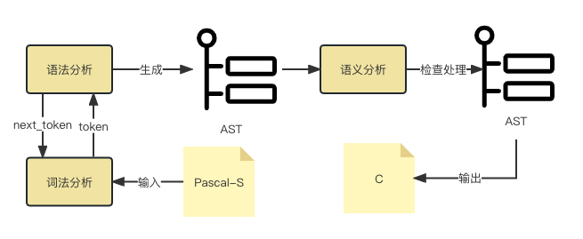
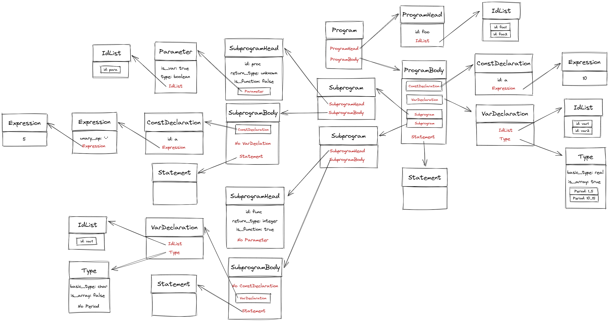

## 4 总体设计

### 4.0 模块划分

本项目实现的编译器包含如下几个模块:

- **词法分析器**(`lexer`)：用于将输入的字符序列转换为一个个的词法单元（token）。在编译器中，词法分析器是编译器的第一步，用于将源代码转换为一个个的词法单元，供后续的语法分析器使用。
- **语法分析器**(`parser`)：以token为输入，解析Pascal-S中的各种语法结构，如表达式、语句、常量声明、变量声明、子查询定义等。在对符合语法的输入进行解析后生成对应的抽象语法树(AST)，该抽象语法树能完整的表达源码包含的信息，语法分析器生成AST后将交由语义分析模块处理。
- **语义分析**：该模块以AST为输入，通过AST检查输入源码中是否存在语义错误，如类型错误、函数参数不匹配等。该模块将检查处理过后的AST交给代码生成模块。
- **代码生成**：该模块以语义分析输出的AST作为输入，通过遍历AST生成对应的C语言代码。

编译器模块架构图如下所示



### 4.1 词法分析

#### 4.1.1 总体设计

我们使用 Flex 来实现词法分析器。

Flex 是一个用于生成词法分析器的工具，它可以将用户定义的正则表达式和处理规则转换为词法分析器程序。Flex 生成的词法分析器是一个 C 语言程序，可以直接编译为可执行文件。

Flex 通常结构如下：

```lex
%{
Declarations
%}
Definitions
%%
Rules
%%
User Subroutines
```

其中, `Declarations` 和 `User Subroutines` 部分与普通的 C 语言类似. `Definitions` 部分用于定义词法单元的正则表达式，`Rules` 部分用于定义词法单元的处理规则。

对于 token 列表, 我们使用一个头文件 `token.h` 来定义 token 的类型, 这个头文件也进一步被 parser 使用.

#### 4.1.2 接口概览

- `yylex()`: 词法分析器的主函数, 用于从 stdin 中读取一个 token, 返回 token 的类型.
- `TokenToString(int token)`: 将 token 的类型转换为对应的字符串.
- `yyreset(FILE *in)`: 重置词法分析器, 使其从 `in` 中读取 token.
- `yylineno`: 用于保存当前 token 的行数.
- `yycolno`: 用于保存当前 token 的列数.
- `yyerrno`: 用于保存错误类型.
- `YYERRMSG`: 用于保存错误类型对应的错误信息.
- `yytext`: 用于保存当前 token 的文本.
- `yylval`: 用于保存当前 token 的值, 例如数字的值.

---

### 4.2 语法分析

#### 4.2.1 数据结构

语法分析包含两个部分，分别是 AST 树部分和语法分析器 Parser 部分。

* AST 树部分：存储 AST 树，作为语法分析的输出，交给语义分析进一步处理
* 语法分析器 Parser 部分：使用递归下降法，根据语法规则，将词法分析器输出的 token 序列转换为 AST 树

##### 4.2.1.1 AST 树

AST 树是一种树状的数据结构，用于表示源代码的结构。AST 树的每个节点都是一个语法单元，包含了该语法单元的类型和属性。具体语法单元结构如下：

|语法单元|属性|子语法单元|
|:---:|:---:|:---:|
|程序 Program||程序头 ProgramHead<br>程序体 ProgramBody|
|程序头 ProgramHead|程序名 id|参数标志符列表 IdList|
|程序体 ProgramBody||常量声明 ConstDeclaration1, ConstDeclaration2, ...<br>变量声明 VarDeclaration1, VarDeclaration2, ...<br>子程序声明 Subprogram1, Subprogram2, ...<br>复合语句 Statement|
|常量声明 ConstDeclaration|常量名 id|常量值 Expression|
|变量声明 VarDeclaration||标志符列表 IdList<br>类型 Type|
|子程序声明 Subprogram||子程序头 SubprogramHead<br>子程序体 SubprogramBody|
|子程序头 SubprogramHead|子程序名 id<br>返回类型 return_type<br>是否为函数 is_function|参数 Parameter1, Parameter2, ...|
|子程序体 SubprogramBody||常量声明 ConstDeclaration1, ConstDeclaration2, ...<br>变量声明 VarDeclaration1, VarDeclaration2, ...<br>复合语句 Statement|
|参数 Parameter|类型 type<br>是否为引用 is_var|标志符列表 IdList|
|类型 Type|基础类型 base_type<br>是否为数组 is_array<br>下标范围 period1(下界 lower_bound, 上界 upper_bound), period2, ...||
|标志符列表 IdList|标志符 id1, id2, ...||

其中，属性使用非指针的方式存储，子语法单元使用智能指针 `std::shared_ptr` 存储。


##### 4.2.1.2 语法分析器 Parser

语法分析器 Parser 是一个递归下降的语法分析器，其输入为一个 Pascal 程序文件指针，通过不断调用词法分析器，对其输出的 token 进行分析，最终输出一颗 AST 树。其内部包含分析各类 AST 节点的成员函数，同时还包含一些辅助函数，用于处理错误和调试。

#### 4.2.2 接口说明

- **输入**:在语法分析阶段，语法分析器 Parser 的输入是一个 pascal 程序文件，可以通过构造函数将文件指针传入 Parser 内部，并调用 Parse 成员函数对其进行分析，返回包含整个 AST 树的根节点指针。	
  	Parser 函数将不断调用词法分析器获取文件内容处理后的 `token`，用于语法分析生成 AST 树。例如对于以下 Pascal 程序源代码：

	```pascal

	program foo(foo1, foo2);
	const a=10;
	var var1, var2: array[1..5, 10..15] of real;
	procedure proc(var para: boolean);
	const a=-5;
	begin
	end;
	function func() : integer;
	var var1: char;
	begin
	end;
	begin
	end.

	```

	对于上面这段源代码，词法分析器将依次输出以下 token 序列：

	```
	PROGRAM  ID(foo)  '('  ID(foo1)  ','  ID(foo2)  ')' ';' CONST ID(a) '=' INTEGER(10) ';' VAR ID(var1) ',' ID(var2) ':' ARRAY '[' INTEGER(1) DOTDOT INTEGER(5) ',' INTEGER(10) DOTDOT INTEGER(15) ']' OF REAL_TYPE ';' PROCEDURE ID(proc) '(' VAR ID(para) ':' BOOLEAN_TYPE ')' ';' CONST ID(a) '=' '-' INTEGER(5) ';' BEGIN END ';' FUNCTION ID(func) '(' ')' ':' INTEGER_TYPE ';' VAR ID(var1) ':' CHAR_TYPE ';' BEGIN END ';' BEGIN END '.'
	```


- **输出**:若输入满足pascal-S语法，则语法分析器将产生一颗能表示源程序结构的抽象语法树，如对于上面的输入，可能产生一颗形如下图的 AST 树

	

	每一个 AST 节点的属性与子节点指针都可以通过相应的 Getter 函数获取。

- **错误处理**:语法分析器在遇到错误时，将会抛出异常，异常的类型为自定义`SyntaxError`，其包含了错误的类型和错误的位置信息。语法分析抛出的异常将会在内部自己处理，并继续进行语法分析生成 AST 树。
  
	但语法分析器会保留所有遇到的错误信息 `SyntaxError`，并存储在在一个顺序容器中，所有语法错误同样可以通过相应的 Getter 函数获取。


---

### 4.3 语义分析

为了在AST上进行语义分析，需要建立符号表，并在遍历AST时在符号表中创建相应的条目。

#### 4.3.1 符号表设计

本节说明符号表设计相关工作。

##### 4.3.1.1 符号表逻辑结构设计

符号表逻辑结构包括变量/函数的名称、类型。对于变量，记录其是否为数组，若是数组则记录维数及每维的上下界；对于函数，记录其参数个数及类别。

符号表逻辑结构依附于AST的实现。每个作用域拥有自己的符号表，在当前符号表中查询不到的符号将递归向父亲查询。

参考结构如下：


##### 4.3.1.2 符号表物理结构设计

计划采用哈希表实现符号表。具体表示变量/函数的数据结构需要与语法分析对接。

#### 4.3.2 符号表管理

- 查询操作：在哈希表中查询；未查询到则递归向上查询。若查询不到则调用错误处理部分。
- 插入操作：在哈希表中插入。
- 定位操作：在进入当前作用域时执行，新建一个哈希表代表当前作用域。
- 重定位操作：在退出当前作用域时执行，删除哈希表中所有记录并释放内存使用。

---

### 4.4 代码生成

对于具体的语句翻译设计，有如下讨论：

1. 程序体

```pascal
	program name (filelist...);
	{ defination here }

	begin { main program block starts }
	...
	end. { the end of main program block }
```

作为`Pascal`程序的标识与入口，可将其翻译为C语言中`main()`。需要注意的是在该块定义的变量为全局变量。另外可能需要语义分析阶对主程序块进行额外标注，以实现在C语言中对入口函数的翻译。

2. 定义语句

```pascal
  var A_variable, B_variable ... : variable_type;
```

`Pascal`语言的变量定义语句，它与C语言的最大区别在于定义变量标识符的后置，这同样可能需要在AST中进行标记。

3. 常量语句

```pascal
  const identifier = constant_value;
```

`Pascal`中的常量定义语句并不显式的声明常量的类型，这需要语义分析阶段进行类型分析工作。

4. 数组类型

```pascal
  type array-identifier = array[index-type] of element-type;
```

`Pascal`中的数组类型与C语言有较大区别，他的索引值拥有一个独立的类型，它可以是除实数以外的任何标量数据类型。值得一提的是可以是负数和`Pascal`独特的区间类型`Period(Subrange)`。因此初步考虑，在处理数组类型时，可能需要语义分析阶段额外标记区间类型的开始值和数组长度,便于处理C语言数组指针的偏移。E.g.:

```pascal
	var a : array[-10..100] of integer;
	writeln(a[-5]);
```

= Translate To =>

```c
	int a[110];
	printf("%d\n" , (a-(-10))[-5]);
```

5. 函数/过程

```pascal
	{function defination}
	function name(argument(s): type1; argument(s): type2; ...): function_type;
	{local declarations}

	begin
	...
	name := expression;  {return value}
	end;
```

```pascal
	{procedure defination}
	procedure name(argument(s): type1, argument(s): type2, ... );
	{local declarations}
	begin
	...
	end;
```

`Pascal`中的函数与过程相类似，其中定义的变量为局部变量。另外`Pascal`中局部变量和全局变量的优先级关系和作用域关系一致，可以直接进行翻译。
对于过程的嵌套定义仍需要注意，由于C语言不允许在函数内定义函数，而过程是允许的。因此需要对符号表做出一定的更改，如增加前缀等方式。

6. 基本类型

```pascal
	integer | real | boolean | char
```

对于给定的`Pascal-S`的基本类型:

* `integer`为4 Bytes,等价于C语言中的`signed int`；
* `real`为单精度浮点值,等价为C语言中的`float`；
* `boolean`为布尔值，只有`true`和`false`两种值，但是在原生C中并没有这一数据类型，可以考虑引入`<stdbool.h>`或者改为映射到整数;
* `char`为一个字节，等价于C中同名类型。

7. 参数列表与引用传参

```pascal
  procedure min3(x, y, z: integer; var m: integer); 
  { Finds the minimum of the 3 values }

  begin
    if x < y then
        m := x
    else
        m := y;

    if z < m then
        m := z;
  end; { end of procedure findMin }  

```

在上述过程的例子中，展示了`Pascal`使用复制传参和引用传参的方式。显然，该过程原型可以翻译成如下的C语言代码：

```c
void min3(int x , int y , int z , int *m);
/*...*/
min3(_x , _y , _z , &_m); // Call
```

这可能需要依赖语法分析阶段在处理参数列表语法时，分析并区分出复制传参的符号列表和引用传参的符号列表。

8. For-to-do循环

```pascal
	for variable-name := initial_value to [downto] final_value do 
```

对于for循环的翻译比较固定，它可以使用下面的C形式进行代换：

```c
	for(type variable-name = initial_value ; variable-name <= final_value ; i++)
	for(type variable-name = initial_value ; variable-name >= final_value ; i--)
```

需要注意的是

* 迭代变量的类型需要在语法分析阶段确定，必须是顺序类型的标量，例如整型或字符型，不能为实型。
* 在使用for-to-do时，初始值和结束值必须满足选择的迭代模式，否则循环不会执行
* 不能在循环体内修改索引值，否则会造成编译错误。
* 不能更改开始与结束值。

9. IO or Library

```pascal
	read() | write() | ...
```

这是比较棘手的一部分，涉及到输入输出有关的函数调用，`Pascal`与C语言的库函数有较大差别，这里无法确定一个标准的形式，需要结合实际情况分析。